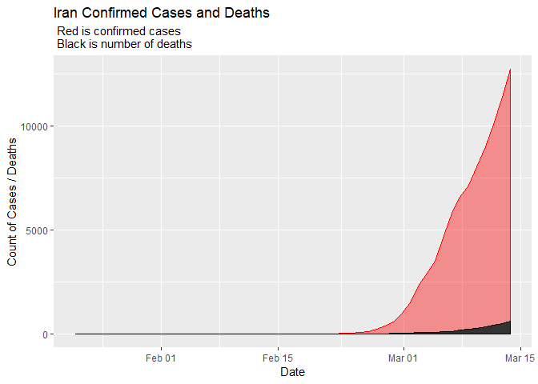

## COVID Data Exploration


### Date Parsing and Formatting

Including the code below as it's nearly boilerplate for date formatting. In some cases the strsplit will need to be adjusted, but I find it much more efficient to parse and reformat a date each time than try to accomodate different date formats across datasets. 


```r
# Date to char for parsing and conversion
data$date <- as.character(data$date)

# Parse the date
data$year<-sapply(data$date, function(x) as.numeric(strsplit(x,"/")[[1]][3]))
data$month<-sapply(data$date, function(x) as.numeric(strsplit(x,"/")[[1]][1]))
data$day<-sapply(data$date, function(x) as.numeric(strsplit(x,"/")[[1]][2]))

# Put us back in the year 2000
data$year <- (data$year + 2000)

# Reformat date into y-m-d 
data$date<-as.Date(paste0(data$year,'-',data$month,'-',data$day), format="%Y-%m-%d")

# Add some weekdays for good measure
data$weekday <- weekdays(as.Date(data$date))

# Put weekdays in order
data$weekday <- ordered(data$weekday, levels=c("Monday", "Tuesday", "Wednesday", "Thursday", "Friday", "Saturday", "Sunday"))


# Set X axis limits ------------------------------------------------------------------------------- Must update with data refresh
time <- as.POSIXct(strptime(c("2020-01-22","2020-03-15"), format = "%y-%m-%d"))
```


## Time Series Heat Plot 

At present, with China as a large confirmed case outlier (over 80,000), I rescaled the confirmed cases using a limit of 10,000 to give greater visibility to lower and emerging counts. 

<!-- -->


<br>
<br>

## Confirmed Cases Trend

Using ggplotly for an interactive plot, here are the Country/Region's in the top 20 for confirmed cases plotted since the pandemic started.

<!--html_preserve--><div id="htmlwidget-84634a9a6849482c4fc4" style="width:960px;height:768px;" class="plotly html-widget"></div>
<script type="application/json" data-for="htmlwidget-84634a9a6849482c4fc4">{"x":{"data":[{"x":[1579651200,1579737600,1579824000,1579910400,1579996800,1580083200,1580169600,1580256000,1580342400,1580428800,1580515200,1580601600,1580688000,1580774400,1580860800,1580947200,1581033600,1581120000,1581206400,1581292800,1581379200,1581465600,1581552000,1581638400,1581724800,1581811200,1581897600,1581984000,1582070400,1582156800,1582243200,1582329600,1582416000,1582502400,1582588800,1582675200,1582761600,1582848000,1582934400,1583020800,1583107200,1583193600,1583280000,1583366400,1583452800,1583539200,1583625600,1583712000,1583798400,1583884800,1583971200,1584057600,1584144000],"y":[0,0,0,0,4,5,5,6,9,9,12,12,12,13,13,14,15,15,15,15,15,15,15,15,15,15,15,15,15,15,19,22,22,22,22,22,23,23,25,27,30,39,52,55,60,63,76,91,107,128,128,200,250],"text":["as.POSIXct(date): 2020-01-21 18:00:00<br />count:     0<br />Country/Region: Australia","as.POSIXct(date): 2020-01-22 18:00:00<br />count:     0<br />Country/Region: Australia","as.POSIXct(date): 2020-01-23 18:00:00<br />count:     0<br />Country/Region: Australia","as.POSIXct(date): 2020-01-24 18:00:00<br />count:     0<br />Country/Region: Australia","as.POSIXct(date): 2020-01-25 18:00:00<br />count:     4<br />Country/Region: Australia","as.POSIXct(date): 2020-01-26 18:00:00<br />count:     5<br />Country/Region: Australia","as.POSIXct(date): 2020-01-27 18:00:00<br />count:     5<br />Country/Region: Australia","as.POSIXct(date): 2020-01-28 18:00:00<br />count:     6<br />Country/Region: Australia","as.POSIXct(date): 2020-01-29 18:00:00<br />count:     9<br />Country/Region: Australia","as.POSIXct(date): 2020-01-30 18:00:00<br />count:     9<br />Country/Region: Australia","as.POSIXct(date): 2020-01-31 18:00:00<br />count:    12<br />Country/Region: Australia","as.POSIXct(date): 2020-02-01 18:00:00<br />count:    12<br />Country/Region: Australia","as.POSIXct(date): 2020-02-02 18:00:00<br />count:    12<br />Country/Region: Australia","as.POSIXct(date): 2020-02-03 18:00:00<br />count:    13<br />Country/Region: Australia","as.POSIXct(date): 2020-02-04 18:00:00<br />count:    13<br />Country/Region: Australia","as.POSIXct(date): 2020-02-05 18:00:00<br />count:    14<br />Country/Region: Australia","as.POSIXct(date): 2020-02-06 18:00:00<br />count:    15<br />Country/Region: Australia","as.POSIXct(date): 2020-02-07 18:00:00<br />count:    15<br />Country/Region: Australia","as.POSIXct(date): 2020-02-08 18:00:00<br />count:    15<br />Country/Region: Australia","as.POSIXct(date): 2020-02-09 18:00:00<br />count:    15<br />Country/Region: Australia","as.POSIXct(date): 2020-02-10 18:00:00<br />count:    15<br />Country/Region: Australia","as.POSIXct(date): 2020-02-11 18:00:00<br />count:    15<br />Country/Region: Australia","as.POSIXct(date): 2020-02-12 18:00:00<br />count:    15<br />Country/Region: Australia","as.POSIXct(date): 2020-02-13 18:00:00<br />count:    15<br />Country/Region: Australia","as.POSIXct(date): 2020-02-14 18:00:00<br />count:    15<br />Country/Region: Australia","as.POSIXct(date): 2020-02-15 18:00:00<br />count:    15<br />Country/Region: Australia","as.POSIXct(date): 2020-02-16 18:00:00<br />count:    15<br />Country/Region: Australia","as.POSIXct(date): 2020-02-17 18:00:00<br />count:    15<br />Country/Region: Australia","as.POSIXct(date): 2020-02-18 18:00:00<br />count:    15<br />Country/Region: Australia","as.POSIXct(date): 2020-02-19 18:00:00<br />count:    15<br />Country/Region: Australia","as.POSIXct(date): 2020-02-20 18:00:00<br />count:    19<br />Country/Region: Australia","as.POSIXct(date): 2020-02-21 18:00:00<br />count:    22<br />Country/Region: Australia","as.POSIXct(date): 2020-02-22 18:00:00<br />count:    22<br />Country/Region: Australia","as.POSIXct(date): 2020-02-23 18:00:00<br />count:    22<br />Country/Region: Australia","as.POSIXct(date): 2020-02-24 18:00:00<br />count:    22<br />Country/Region: Australia","as.POSIXct(date): 2020-02-25 18:00:00<br />count:    22<br />Country/Region: Australia","as.POSIXct(date): 2020-02-26 18:00:00<br />count:    23<br />Country/Region: Australia","as.POSIXct(date): 2020-02-27 18:00:00<br />count:    23<br />Country/Region: Australia","as.POSIXct(date): 2020-02-28 18:00:00<br />count:    25<br />Country/Region: Australia","as.POSIXct(date): 2020-02-29 18:00:00<br />count:    27<br />Country/Region: Australia","as.POSIXct(date): 2020-03-01 18:00:00<br />count:    30<br />Country/Region: Australia","as.POSIXct(date): 2020-03-02 18:00:00<br />count:    39<br />Country/Region: Australia","as.POSIXct(date): 2020-03-03 18:00:00<br />count:    52<br />Country/Region: Australia","as.POSIXct(date): 2020-03-04 18:00:00<br />count:    55<br />Country/Region: Australia","as.POSIXct(date): 2020-03-05 18:00:00<br />count:    60<br />Country/Region: Australia","as.POSIXct(date): 2020-03-06 18:00:00<br />count:    63<br />Country/Region: Australia","as.POSIXct(date): 2020-03-07 18:00:00<br />count:    76<br />Country/Region: Australia","as.POSIXct(date): 2020-03-08 19:00:00<br />count:    91<br />Country/Region: Australia","as.POSIXct(date): 2020-03-09 19:00:00<br />count:   107<br />Country/Region: Australia","as.POSIXct(date): 2020-03-10 19:00:00<br />count:   128<br />Country/Region: Australia","as.POSIXct(date): 2020-03-11 19:00:00<br />count:   128<br />Country/Region: Australia","as.POSIXct(date): 2020-03-12 19:00:00<br />count:   200<br />Country/Region: Australia","as.POSIXct(date): 2020-03-13 19:00:00<br />count:   250<br />Country/Region: Australia"],"type":"scatter","mode":"markers+lines","marker":{"autocolorscale":false,"color":"rgba(248,118,109,1)","opacity":1,"size":1.88976377952756,"symbol":"circle","line":{"width":1.88976377952756,"color":"rgba(248,118,109,1)"}},"hoveron":"points","name":"Australia","legendgroup":"Australia","showlegend":true,"xaxis":"x","yaxis":"y","hoverinfo":"text","line":{"width":1.88976377952756,"color":"rgba(248,118,109,0.5)","dash":"solid"},"frame":null},{"x":[1579651200,1579737600,1579824000,1579910400,1579996800,1580083200,1580169600,1580256000,1580342400,1580428800,1580515200,1580601600,1580688000,1580774400,1580860800,1580947200,1581033600,1581120000,1581206400,1581292800,1581379200,1581465600,1581552000,1581638400,1581724800,1581811200,1581897600,1581984000,1582070400,1582156800,1582243200,1582329600,1582416000,1582502400,1582588800,1582675200,1582761600,1582848000,1582934400,1583020800,1583107200,1583193600,1583280000,1583366400,1583452800,1583539200,1583625600,1583712000,1583798400,1583884800,1583971200,1584057600,1584144000],"y":[0,0,0,0,0,0,0,0,0,0,0,0,0,0,0,0,0,0,0,0,0,0,0,0,0,0,0,0,0,0,0,0,0,0,2,2,3,3,9,14,18,21,29,41,55,79,104,131,182,246,302,504,655],"text":["as.POSIXct(date): 2020-01-21 18:00:00<br />count:     0<br />Country/Region: Austria","as.POSIXct(date): 2020-01-22 18:00:00<br />count:     0<br />Country/Region: Austria","as.POSIXct(date): 2020-01-23 18:00:00<br />count:     0<br />Country/Region: Austria","as.POSIXct(date): 2020-01-24 18:00:00<br />count:     0<br />Country/Region: Austria","as.POSIXct(date): 2020-01-25 18:00:00<br />count:     0<br />Country/Region: Austria","as.POSIXct(date): 2020-01-26 18:00:00<br />count:     0<br />Country/Region: Austria","as.POSIXct(date): 2020-01-27 18:00:00<br />count:     0<br />Country/Region: Austria","as.POSIXct(date): 2020-01-28 18:00:00<br />count:     0<br />Country/Region: Austria","as.POSIXct(date): 2020-01-29 18:00:00<br />count:     0<br />Country/Region: Austria","as.POSIXct(date): 2020-01-30 18:00:00<br />count:     0<br />Country/Region: Austria","as.POSIXct(date): 2020-01-31 18:00:00<br />count:     0<br />Country/Region: Austria","as.POSIXct(date): 2020-02-01 18:00:00<br />count:     0<br />Country/Region: Austria","as.POSIXct(date): 2020-02-02 18:00:00<br />count:     0<br />Country/Region: Austria","as.POSIXct(date): 2020-02-03 18:00:00<br />count:     0<br />Country/Region: Austria","as.POSIXct(date): 2020-02-04 18:00:00<br />count:     0<br />Country/Region: Austria","as.POSIXct(date): 2020-02-05 18:00:00<br />count:     0<br />Country/Region: Austria","as.POSIXct(date): 2020-02-06 18:00:00<br />count:     0<br />Country/Region: Austria","as.POSIXct(date): 2020-02-07 18:00:00<br />count:     0<br />Country/Region: Austria","as.POSIXct(date): 2020-02-08 18:00:00<br />count:     0<br />Country/Region: Austria","as.POSIXct(date): 2020-02-09 18:00:00<br />count:     0<br />Country/Region: Austria","as.POSIXct(date): 2020-02-10 18:00:00<br />count:     0<br />Country/Region: Austria","as.POSIXct(date): 2020-02-11 18:00:00<br />count:     0<br />Country/Region: Austria","as.POSIXct(date): 2020-02-12 18:00:00<br />count:     0<br />Country/Region: Austria","as.POSIXct(date): 2020-02-13 18:00:00<br />count:     0<br />Country/Region: Austria","as.POSIXct(date): 2020-02-14 18:00:00<br />count:     0<br />Country/Region: Austria","as.POSIXct(date): 2020-02-15 18:00:00<br />count:     0<br />Country/Region: Austria","as.POSIXct(date): 2020-02-16 18:00:00<br />count:     0<br />Country/Region: Austria","as.POSIXct(date): 2020-02-17 18:00:00<br />count:     0<br />Country/Region: Austria","as.POSIXct(date): 2020-02-18 18:00:00<br />count:     0<br />Country/Region: Austria","as.POSIXct(date): 2020-02-19 18:00:00<br />count:     0<br />Country/Region: Austria","as.POSIXct(date): 2020-02-20 18:00:00<br />count:     0<br />Country/Region: Austria","as.POSIXct(date): 2020-02-21 18:00:00<br />count:     0<br />Country/Region: Austria","as.POSIXct(date): 2020-02-22 18:00:00<br />count:     0<br />Country/Region: Austria","as.POSIXct(date): 2020-02-23 18:00:00<br />count:     0<br />Country/Region: Austria","as.POSIXct(date): 2020-02-24 18:00:00<br />count:     2<br />Country/Region: Austria","as.POSIXct(date): 2020-02-25 18:00:00<br />count:     2<br />Country/Region: Austria","as.POSIXct(date): 2020-02-26 18:00:00<br />count:     3<br />Country/Region: Austria","as.POSIXct(date): 2020-02-27 18:00:00<br />count:     3<br />Country/Region: Austria","as.POSIXct(date): 2020-02-28 18:00:00<br />count:     9<br />Country/Region: Austria","as.POSIXct(date): 2020-02-29 18:00:00<br />count:    14<br />Country/Region: Austria","as.POSIXct(date): 2020-03-01 18:00:00<br />count:    18<br />Country/Region: Austria","as.POSIXct(date): 2020-03-02 18:00:00<br />count:    21<br />Country/Region: Austria","as.POSIXct(date): 2020-03-03 18:00:00<br />count:    29<br />Country/Region: Austria","as.POSIXct(date): 2020-03-04 18:00:00<br />count:    41<br />Country/Region: Austria","as.POSIXct(date): 2020-03-05 18:00:00<br />count:    55<br />Country/Region: Austria","as.POSIXct(date): 2020-03-06 18:00:00<br />count:    79<br />Country/Region: Austria","as.POSIXct(date): 2020-03-07 18:00:00<br />count:   104<br />Country/Region: Austria","as.POSIXct(date): 2020-03-08 19:00:00<br />count:   131<br />Country/Region: Austria","as.POSIXct(date): 2020-03-09 19:00:00<br />count:   182<br />Country/Region: Austria","as.POSIXct(date): 2020-03-10 19:00:00<br />count:   246<br />Country/Region: Austria","as.POSIXct(date): 2020-03-11 19:00:00<br />count:   302<br />Country/Region: Austria","as.POSIXct(date): 2020-03-12 19:00:00<br />count:   504<br />Country/Region: Austria","as.POSIXct(date): 2020-03-13 19:00:00<br />count:   655<br />Country/Region: Austria"],"type":"scatter","mode":"markers+lines","marker":{"autocolorscale":false,"color":"rgba(234,131,49,1)","opacity":1,"size":1.88976377952756,"symbol":"circle","line":{"width":1.88976377952756,"color":"rgba(234,131,49,1)"}},"hoveron":"points","name":"Austria","legendgroup":"Austria","showlegend":true,"xaxis":"x","yaxis":"y","hoverinfo":"text","line":{"width":1.88976377952756,"color":"rgba(234,131,49,0.5)","dash":"solid"},"frame":null},{"x":[1579651200,1579737600,1579824000,1579910400,1579996800,1580083200,1580169600,1580256000,1580342400,1580428800,1580515200,1580601600,1580688000,1580774400,1580860800,1580947200,1581033600,1581120000,1581206400,1581292800,1581379200,1581465600,1581552000,1581638400,1581724800,1581811200,1581897600,1581984000,1582070400,1582156800,1582243200,1582329600,1582416000,1582502400,1582588800,1582675200,1582761600,1582848000,1582934400,1583020800,1583107200,1583193600,1583280000,1583366400,1583452800,1583539200,1583625600,1583712000,1583798400,1583884800,1583971200,1584057600,1584144000],"y":[0,0,0,0,0,0,0,0,0,0,0,0,0,1,1,1,1,1,1,1,1,1,1,1,1,1,1,1,1,1,1,1,1,1,1,1,1,1,1,2,8,13,23,50,109,169,200,239,267,314,314,559,689],"text":["as.POSIXct(date): 2020-01-21 18:00:00<br />count:     0<br />Country/Region: Belgium","as.POSIXct(date): 2020-01-22 18:00:00<br />count:     0<br />Country/Region: Belgium","as.POSIXct(date): 2020-01-23 18:00:00<br />count:     0<br />Country/Region: Belgium","as.POSIXct(date): 2020-01-24 18:00:00<br />count:     0<br />Country/Region: Belgium","as.POSIXct(date): 2020-01-25 18:00:00<br />count:     0<br />Country/Region: Belgium","as.POSIXct(date): 2020-01-26 18:00:00<br />count:     0<br />Country/Region: Belgium","as.POSIXct(date): 2020-01-27 18:00:00<br />count:     0<br />Country/Region: Belgium","as.POSIXct(date): 2020-01-28 18:00:00<br />count:     0<br />Country/Region: Belgium","as.POSIXct(date): 2020-01-29 18:00:00<br />count:     0<br />Country/Region: Belgium","as.POSIXct(date): 2020-01-30 18:00:00<br />count:     0<br />Country/Region: Belgium","as.POSIXct(date): 2020-01-31 18:00:00<br />count:     0<br />Country/Region: Belgium","as.POSIXct(date): 2020-02-01 18:00:00<br />count:     0<br />Country/Region: Belgium","as.POSIXct(date): 2020-02-02 18:00:00<br />count:     0<br />Country/Region: Belgium","as.POSIXct(date): 2020-02-03 18:00:00<br />count:     1<br />Country/Region: Belgium","as.POSIXct(date): 2020-02-04 18:00:00<br />count:     1<br />Country/Region: Belgium","as.POSIXct(date): 2020-02-05 18:00:00<br />count:     1<br />Country/Region: Belgium","as.POSIXct(date): 2020-02-06 18:00:00<br />count:     1<br />Country/Region: Belgium","as.POSIXct(date): 2020-02-07 18:00:00<br />count:     1<br />Country/Region: Belgium","as.POSIXct(date): 2020-02-08 18:00:00<br />count:     1<br />Country/Region: Belgium","as.POSIXct(date): 2020-02-09 18:00:00<br />count:     1<br />Country/Region: Belgium","as.POSIXct(date): 2020-02-10 18:00:00<br />count:     1<br />Country/Region: Belgium","as.POSIXct(date): 2020-02-11 18:00:00<br />count:     1<br />Country/Region: Belgium","as.POSIXct(date): 2020-02-12 18:00:00<br />count:     1<br />Country/Region: Belgium","as.POSIXct(date): 2020-02-13 18:00:00<br />count:     1<br />Country/Region: Belgium","as.POSIXct(date): 2020-02-14 18:00:00<br />count:     1<br />Country/Region: Belgium","as.POSIXct(date): 2020-02-15 18:00:00<br />count:     1<br />Country/Region: Belgium","as.POSIXct(date): 2020-02-16 18:00:00<br />count:     1<br />Country/Region: Belgium","as.POSIXct(date): 2020-02-17 18:00:00<br />count:     1<br />Country/Region: Belgium","as.POSIXct(date): 2020-02-18 18:00:00<br />count:     1<br />Country/Region: Belgium","as.POSIXct(date): 2020-02-19 18:00:00<br />count:     1<br />Country/Region: Belgium","as.POSIXct(date): 2020-02-20 18:00:00<br />count:     1<br />Country/Region: Belgium","as.POSIXct(date): 2020-02-21 18:00:00<br />count:     1<br />Country/Region: Belgium","as.POSIXct(date): 2020-02-22 18:00:00<br />count:     1<br />Country/Region: Belgium","as.POSIXct(date): 2020-02-23 18:00:00<br />count:     1<br />Country/Region: Belgium","as.POSIXct(date): 2020-02-24 18:00:00<br />count:     1<br />Country/Region: Belgium","as.POSIXct(date): 2020-02-25 18:00:00<br />count:     1<br />Country/Region: Belgium","as.POSIXct(date): 2020-02-26 18:00:00<br />count:     1<br />Country/Region: Belgium","as.POSIXct(date): 2020-02-27 18:00:00<br />count:     1<br />Country/Region: Belgium","as.POSIXct(date): 2020-02-28 18:00:00<br />count:     1<br />Country/Region: Belgium","as.POSIXct(date): 2020-02-29 18:00:00<br />count:     2<br />Country/Region: Belgium","as.POSIXct(date): 2020-03-01 18:00:00<br />count:     8<br />Country/Region: Belgium","as.POSIXct(date): 2020-03-02 18:00:00<br />count:    13<br />Country/Region: Belgium","as.POSIXct(date): 2020-03-03 18:00:00<br />count:    23<br />Country/Region: Belgium","as.POSIXct(date): 2020-03-04 18:00:00<br />count:    50<br />Country/Region: Belgium","as.POSIXct(date): 2020-03-05 18:00:00<br />count:   109<br />Country/Region: Belgium","as.POSIXct(date): 2020-03-06 18:00:00<br />count:   169<br />Country/Region: Belgium","as.POSIXct(date): 2020-03-07 18:00:00<br />count:   200<br />Country/Region: Belgium","as.POSIXct(date): 2020-03-08 19:00:00<br />count:   239<br />Country/Region: Belgium","as.POSIXct(date): 2020-03-09 19:00:00<br />count:   267<br />Country/Region: Belgium","as.POSIXct(date): 2020-03-10 19:00:00<br />count:   314<br />Country/Region: Belgium","as.POSIXct(date): 2020-03-11 19:00:00<br />count:   314<br />Country/Region: Belgium","as.POSIXct(date): 2020-03-12 19:00:00<br />count:   559<br />Country/Region: Belgium","as.POSIXct(date): 2020-03-13 19:00:00<br />count:   689<br />Country/Region: Belgium"],"type":"scatter","mode":"markers+lines","marker":{"autocolorscale":false,"color":"rgba(216,144,0,1)","opacity":1,"size":1.88976377952756,"symbol":"circle","line":{"width":1.88976377952756,"color":"rgba(216,144,0,1)"}},"hoveron":"points","name":"Belgium","legendgroup":"Belgium","showlegend":true,"xaxis":"x","yaxis":"y","hoverinfo":"text","line":{"width":1.88976377952756,"color":"rgba(216,144,0,0.5)","dash":"solid"},"frame":null},{"x":[1579651200,1579737600,1579824000,1579910400,1579996800,1580083200,1580169600,1580256000,1580342400,1580428800,1580515200,1580601600,1580688000,1580774400,1580860800,1580947200,1581033600,1581120000,1581206400,1581292800,1581379200,1581465600,1581552000,1581638400,1581724800,1581811200,1581897600,1581984000,1582070400,1582156800,1582243200,1582329600,1582416000,1582502400,1582588800,1582675200,1582761600,1582848000,1582934400,1583020800,1583107200,1583193600,1583280000,1583366400,1583452800,1583539200,1583625600,1583712000,1583798400,1583884800,1583971200,1584057600,1584144000],"y":[548,643,920,1406,2075,2877,5509,6087,8141,9802,11891,16630,19716,23707,27440,30587,34110,36814,39829,42354,44386,44759,59895,66358,68413,70513,72434,74211,74619,75077,75550,77001,77022,77241,77754,78166,78600,78928,79356,79932,80136,80261,80386,80537,80690,80770,80823,80860,80887,80921,80932,80945,80977],"text":["as.POSIXct(date): 2020-01-21 18:00:00<br />count:   548<br />Country/Region: China","as.POSIXct(date): 2020-01-22 18:00:00<br />count:   643<br />Country/Region: China","as.POSIXct(date): 2020-01-23 18:00:00<br />count:   920<br />Country/Region: China","as.POSIXct(date): 2020-01-24 18:00:00<br />count:  1406<br />Country/Region: China","as.POSIXct(date): 2020-01-25 18:00:00<br />count:  2075<br />Country/Region: China","as.POSIXct(date): 2020-01-26 18:00:00<br />count:  2877<br />Country/Region: China","as.POSIXct(date): 2020-01-27 18:00:00<br />count:  5509<br />Country/Region: China","as.POSIXct(date): 2020-01-28 18:00:00<br />count:  6087<br />Country/Region: China","as.POSIXct(date): 2020-01-29 18:00:00<br />count:  8141<br />Country/Region: China","as.POSIXct(date): 2020-01-30 18:00:00<br />count:  9802<br />Country/Region: China","as.POSIXct(date): 2020-01-31 18:00:00<br />count: 11891<br />Country/Region: China","as.POSIXct(date): 2020-02-01 18:00:00<br />count: 16630<br />Country/Region: China","as.POSIXct(date): 2020-02-02 18:00:00<br />count: 19716<br />Country/Region: China","as.POSIXct(date): 2020-02-03 18:00:00<br />count: 23707<br />Country/Region: China","as.POSIXct(date): 2020-02-04 18:00:00<br />count: 27440<br />Country/Region: China","as.POSIXct(date): 2020-02-05 18:00:00<br />count: 30587<br />Country/Region: China","as.POSIXct(date): 2020-02-06 18:00:00<br />count: 34110<br />Country/Region: China","as.POSIXct(date): 2020-02-07 18:00:00<br />count: 36814<br />Country/Region: China","as.POSIXct(date): 2020-02-08 18:00:00<br />count: 39829<br />Country/Region: China","as.POSIXct(date): 2020-02-09 18:00:00<br />count: 42354<br />Country/Region: China","as.POSIXct(date): 2020-02-10 18:00:00<br />count: 44386<br />Country/Region: China","as.POSIXct(date): 2020-02-11 18:00:00<br />count: 44759<br />Country/Region: China","as.POSIXct(date): 2020-02-12 18:00:00<br />count: 59895<br />Country/Region: China","as.POSIXct(date): 2020-02-13 18:00:00<br />count: 66358<br />Country/Region: China","as.POSIXct(date): 2020-02-14 18:00:00<br />count: 68413<br />Country/Region: China","as.POSIXct(date): 2020-02-15 18:00:00<br />count: 70513<br />Country/Region: China","as.POSIXct(date): 2020-02-16 18:00:00<br />count: 72434<br />Country/Region: China","as.POSIXct(date): 2020-02-17 18:00:00<br />count: 74211<br />Country/Region: China","as.POSIXct(date): 2020-02-18 18:00:00<br />count: 74619<br />Country/Region: China","as.POSIXct(date): 2020-02-19 18:00:00<br />count: 75077<br />Country/Region: China","as.POSIXct(date): 2020-02-20 18:00:00<br />count: 75550<br />Country/Region: China","as.POSIXct(date): 2020-02-21 18:00:00<br />count: 77001<br />Country/Region: China","as.POSIXct(date): 2020-02-22 18:00:00<br />count: 77022<br />Country/Region: China","as.POSIXct(date): 2020-02-23 18:00:00<br />count: 77241<br />Country/Region: China","as.POSIXct(date): 2020-02-24 18:00:00<br />count: 77754<br />Country/Region: China","as.POSIXct(date): 2020-02-25 18:00:00<br />count: 78166<br />Country/Region: China","as.POSIXct(date): 2020-02-26 18:00:00<br />count: 78600<br />Country/Region: China","as.POSIXct(date): 2020-02-27 18:00:00<br />count: 78928<br />Country/Region: China","as.POSIXct(date): 2020-02-28 18:00:00<br />count: 79356<br />Country/Region: China","as.POSIXct(date): 2020-02-29 18:00:00<br />count: 79932<br />Country/Region: China","as.POSIXct(date): 2020-03-01 18:00:00<br />count: 80136<br />Country/Region: China","as.POSIXct(date): 2020-03-02 18:00:00<br />count: 80261<br />Country/Region: China","as.POSIXct(date): 2020-03-03 18:00:00<br />count: 80386<br />Country/Region: China","as.POSIXct(date): 2020-03-04 18:00:00<br />count: 80537<br />Country/Region: China","as.POSIXct(date): 2020-03-05 18:00:00<br />count: 80690<br />Country/Region: China","as.POSIXct(date): 2020-03-06 18:00:00<br />count: 80770<br />Country/Region: China","as.POSIXct(date): 2020-03-07 18:00:00<br />count: 80823<br />Country/Region: China","as.POSIXct(date): 2020-03-08 19:00:00<br />count: 80860<br />Country/Region: China","as.POSIXct(date): 2020-03-09 19:00:00<br />count: 80887<br />Country/Region: China","as.POSIXct(date): 2020-03-10 19:00:00<br />count: 80921<br />Country/Region: China","as.POSIXct(date): 2020-03-11 19:00:00<br />count: 80932<br />Country/Region: China","as.POSIXct(date): 2020-03-12 19:00:00<br />count: 80945<br />Country/Region: China","as.POSIXct(date): 2020-03-13 19:00:00<br />count: 80977<br />Country/Region: China"],"type":"scatter","mode":"markers+lines","marker":{"autocolorscale":false,"color":"rgba(192,155,0,1)","opacity":1,"size":1.88976377952756,"symbol":"circle","line":{"width":1.88976377952756,"color":"rgba(192,155,0,1)"}},"hoveron":"points","name":"China","legendgroup":"China","showlegend":true,"xaxis":"x","yaxis":"y","hoverinfo":"text","line":{"width":1.88976377952756,"color":"rgba(192,155,0,0.5)","dash":"solid"},"frame":null},{"x":[1579651200,1579737600,1579824000,1579910400,1579996800,1580083200,1580169600,1580256000,1580342400,1580428800,1580515200,1580601600,1580688000,1580774400,1580860800,1580947200,1581033600,1581120000,1581206400,1581292800,1581379200,1581465600,1581552000,1581638400,1581724800,1581811200,1581897600,1581984000,1582070400,1582156800,1582243200,1582329600,1582416000,1582502400,1582588800,1582675200,1582761600,1582848000,1582934400,1583020800,1583107200,1583193600,1583280000,1583366400,1583452800,1583539200,1583625600,1583712000,1583798400,1583884800,1583971200,1584057600,1584144000],"y":[0,0,0,0,0,0,0,0,0,0,0,0,0,0,0,0,61,61,64,135,135,175,175,218,285,355,454,542,621,634,634,634,691,691,691,705,705,705,705,705,705,706,706,706,696,696,696,696,696,696,696,696,696],"text":["as.POSIXct(date): 2020-01-21 18:00:00<br />count:     0<br />Country/Region: Cruise Ship","as.POSIXct(date): 2020-01-22 18:00:00<br />count:     0<br />Country/Region: Cruise Ship","as.POSIXct(date): 2020-01-23 18:00:00<br />count:     0<br />Country/Region: Cruise Ship","as.POSIXct(date): 2020-01-24 18:00:00<br />count:     0<br />Country/Region: Cruise Ship","as.POSIXct(date): 2020-01-25 18:00:00<br />count:     0<br />Country/Region: Cruise Ship","as.POSIXct(date): 2020-01-26 18:00:00<br />count:     0<br />Country/Region: Cruise Ship","as.POSIXct(date): 2020-01-27 18:00:00<br />count:     0<br />Country/Region: Cruise Ship","as.POSIXct(date): 2020-01-28 18:00:00<br />count:     0<br />Country/Region: Cruise Ship","as.POSIXct(date): 2020-01-29 18:00:00<br />count:     0<br />Country/Region: Cruise Ship","as.POSIXct(date): 2020-01-30 18:00:00<br />count:     0<br />Country/Region: Cruise Ship","as.POSIXct(date): 2020-01-31 18:00:00<br />count:     0<br />Country/Region: Cruise Ship","as.POSIXct(date): 2020-02-01 18:00:00<br />count:     0<br />Country/Region: Cruise Ship","as.POSIXct(date): 2020-02-02 18:00:00<br />count:     0<br />Country/Region: Cruise Ship","as.POSIXct(date): 2020-02-03 18:00:00<br />count:     0<br />Country/Region: Cruise Ship","as.POSIXct(date): 2020-02-04 18:00:00<br />count:     0<br />Country/Region: Cruise Ship","as.POSIXct(date): 2020-02-05 18:00:00<br />count:     0<br />Country/Region: Cruise Ship","as.POSIXct(date): 2020-02-06 18:00:00<br />count:    61<br />Country/Region: Cruise Ship","as.POSIXct(date): 2020-02-07 18:00:00<br />count:    61<br />Country/Region: Cruise Ship","as.POSIXct(date): 2020-02-08 18:00:00<br />count:    64<br />Country/Region: Cruise Ship","as.POSIXct(date): 2020-02-09 18:00:00<br />count:   135<br />Country/Region: Cruise Ship","as.POSIXct(date): 2020-02-10 18:00:00<br />count:   135<br />Country/Region: Cruise Ship","as.POSIXct(date): 2020-02-11 18:00:00<br />count:   175<br />Country/Region: Cruise Ship","as.POSIXct(date): 2020-02-12 18:00:00<br />count:   175<br />Country/Region: Cruise Ship","as.POSIXct(date): 2020-02-13 18:00:00<br />count:   218<br />Country/Region: Cruise Ship","as.POSIXct(date): 2020-02-14 18:00:00<br />count:   285<br />Country/Region: Cruise Ship","as.POSIXct(date): 2020-02-15 18:00:00<br />count:   355<br />Country/Region: Cruise Ship","as.POSIXct(date): 2020-02-16 18:00:00<br />count:   454<br />Country/Region: Cruise Ship","as.POSIXct(date): 2020-02-17 18:00:00<br />count:   542<br />Country/Region: Cruise Ship","as.POSIXct(date): 2020-02-18 18:00:00<br />count:   621<br />Country/Region: Cruise Ship","as.POSIXct(date): 2020-02-19 18:00:00<br />count:   634<br />Country/Region: Cruise Ship","as.POSIXct(date): 2020-02-20 18:00:00<br />count:   634<br />Country/Region: Cruise Ship","as.POSIXct(date): 2020-02-21 18:00:00<br />count:   634<br />Country/Region: Cruise Ship","as.POSIXct(date): 2020-02-22 18:00:00<br />count:   691<br />Country/Region: Cruise Ship","as.POSIXct(date): 2020-02-23 18:00:00<br />count:   691<br />Country/Region: Cruise Ship","as.POSIXct(date): 2020-02-24 18:00:00<br />count:   691<br />Country/Region: Cruise Ship","as.POSIXct(date): 2020-02-25 18:00:00<br />count:   705<br />Country/Region: Cruise Ship","as.POSIXct(date): 2020-02-26 18:00:00<br />count:   705<br />Country/Region: Cruise Ship","as.POSIXct(date): 2020-02-27 18:00:00<br />count:   705<br />Country/Region: Cruise Ship","as.POSIXct(date): 2020-02-28 18:00:00<br />count:   705<br />Country/Region: Cruise Ship","as.POSIXct(date): 2020-02-29 18:00:00<br />count:   705<br />Country/Region: Cruise Ship","as.POSIXct(date): 2020-03-01 18:00:00<br />count:   705<br />Country/Region: Cruise Ship","as.POSIXct(date): 2020-03-02 18:00:00<br />count:   706<br />Country/Region: Cruise Ship","as.POSIXct(date): 2020-03-03 18:00:00<br />count:   706<br />Country/Region: Cruise Ship","as.POSIXct(date): 2020-03-04 18:00:00<br />count:   706<br />Country/Region: Cruise Ship","as.POSIXct(date): 2020-03-05 18:00:00<br />count:   696<br />Country/Region: Cruise Ship","as.POSIXct(date): 2020-03-06 18:00:00<br />count:   696<br />Country/Region: Cruise Ship","as.POSIXct(date): 2020-03-07 18:00:00<br />count:   696<br />Country/Region: Cruise Ship","as.POSIXct(date): 2020-03-08 19:00:00<br />count:   696<br />Country/Region: Cruise Ship","as.POSIXct(date): 2020-03-09 19:00:00<br />count:   696<br />Country/Region: Cruise Ship","as.POSIXct(date): 2020-03-10 19:00:00<br />count:   696<br />Country/Region: Cruise Ship","as.POSIXct(date): 2020-03-11 19:00:00<br />count:   696<br />Country/Region: Cruise Ship","as.POSIXct(date): 2020-03-12 19:00:00<br />count:   696<br />Country/Region: Cruise Ship","as.POSIXct(date): 2020-03-13 19:00:00<br />count:   696<br />Country/Region: Cruise Ship"],"type":"scatter","mode":"markers+lines","marker":{"autocolorscale":false,"color":"rgba(163,165,0,1)","opacity":1,"size":1.88976377952756,"symbol":"circle","line":{"width":1.88976377952756,"color":"rgba(163,165,0,1)"}},"hoveron":"points","name":"Cruise Ship","legendgroup":"Cruise Ship","showlegend":true,"xaxis":"x","yaxis":"y","hoverinfo":"text","line":{"width":1.88976377952756,"color":"rgba(163,165,0,0.5)","dash":"solid"},"frame":null},{"x":[1579651200,1579737600,1579824000,1579910400,1579996800,1580083200,1580169600,1580256000,1580342400,1580428800,1580515200,1580601600,1580688000,1580774400,1580860800,1580947200,1581033600,1581120000,1581206400,1581292800,1581379200,1581465600,1581552000,1581638400,1581724800,1581811200,1581897600,1581984000,1582070400,1582156800,1582243200,1582329600,1582416000,1582502400,1582588800,1582675200,1582761600,1582848000,1582934400,1583020800,1583107200,1583193600,1583280000,1583366400,1583452800,1583539200,1583625600,1583712000,1583798400,1583884800,1583971200,1584057600,1584144000],"y":[0,0,0,0,0,0,0,0,0,0,0,0,0,0,0,0,0,0,0,0,0,0,0,0,0,0,0,0,0,0,0,0,0,0,0,0,1,1,3,4,4,6,11,11,24,24,37,92,264,444,617,804,836],"text":["as.POSIXct(date): 2020-01-21 18:00:00<br />count:     0<br />Country/Region: Denmark","as.POSIXct(date): 2020-01-22 18:00:00<br />count:     0<br />Country/Region: Denmark","as.POSIXct(date): 2020-01-23 18:00:00<br />count:     0<br />Country/Region: Denmark","as.POSIXct(date): 2020-01-24 18:00:00<br />count:     0<br />Country/Region: Denmark","as.POSIXct(date): 2020-01-25 18:00:00<br />count:     0<br />Country/Region: Denmark","as.POSIXct(date): 2020-01-26 18:00:00<br />count:     0<br />Country/Region: Denmark","as.POSIXct(date): 2020-01-27 18:00:00<br />count:     0<br />Country/Region: Denmark","as.POSIXct(date): 2020-01-28 18:00:00<br />count:     0<br />Country/Region: Denmark","as.POSIXct(date): 2020-01-29 18:00:00<br />count:     0<br />Country/Region: Denmark","as.POSIXct(date): 2020-01-30 18:00:00<br />count:     0<br />Country/Region: Denmark","as.POSIXct(date): 2020-01-31 18:00:00<br />count:     0<br />Country/Region: Denmark","as.POSIXct(date): 2020-02-01 18:00:00<br />count:     0<br />Country/Region: Denmark","as.POSIXct(date): 2020-02-02 18:00:00<br />count:     0<br />Country/Region: Denmark","as.POSIXct(date): 2020-02-03 18:00:00<br />count:     0<br />Country/Region: Denmark","as.POSIXct(date): 2020-02-04 18:00:00<br />count:     0<br />Country/Region: Denmark","as.POSIXct(date): 2020-02-05 18:00:00<br />count:     0<br />Country/Region: Denmark","as.POSIXct(date): 2020-02-06 18:00:00<br />count:     0<br />Country/Region: Denmark","as.POSIXct(date): 2020-02-07 18:00:00<br />count:     0<br />Country/Region: Denmark","as.POSIXct(date): 2020-02-08 18:00:00<br />count:     0<br />Country/Region: Denmark","as.POSIXct(date): 2020-02-09 18:00:00<br />count:     0<br />Country/Region: Denmark","as.POSIXct(date): 2020-02-10 18:00:00<br />count:     0<br />Country/Region: Denmark","as.POSIXct(date): 2020-02-11 18:00:00<br />count:     0<br />Country/Region: Denmark","as.POSIXct(date): 2020-02-12 18:00:00<br />count:     0<br />Country/Region: Denmark","as.POSIXct(date): 2020-02-13 18:00:00<br />count:     0<br />Country/Region: Denmark","as.POSIXct(date): 2020-02-14 18:00:00<br />count:     0<br />Country/Region: Denmark","as.POSIXct(date): 2020-02-15 18:00:00<br />count:     0<br />Country/Region: Denmark","as.POSIXct(date): 2020-02-16 18:00:00<br />count:     0<br />Country/Region: Denmark","as.POSIXct(date): 2020-02-17 18:00:00<br />count:     0<br />Country/Region: Denmark","as.POSIXct(date): 2020-02-18 18:00:00<br />count:     0<br />Country/Region: Denmark","as.POSIXct(date): 2020-02-19 18:00:00<br />count:     0<br />Country/Region: Denmark","as.POSIXct(date): 2020-02-20 18:00:00<br />count:     0<br />Country/Region: Denmark","as.POSIXct(date): 2020-02-21 18:00:00<br />count:     0<br />Country/Region: Denmark","as.POSIXct(date): 2020-02-22 18:00:00<br />count:     0<br />Country/Region: Denmark","as.POSIXct(date): 2020-02-23 18:00:00<br />count:     0<br />Country/Region: Denmark","as.POSIXct(date): 2020-02-24 18:00:00<br />count:     0<br />Country/Region: Denmark","as.POSIXct(date): 2020-02-25 18:00:00<br />count:     0<br />Country/Region: Denmark","as.POSIXct(date): 2020-02-26 18:00:00<br />count:     1<br />Country/Region: Denmark","as.POSIXct(date): 2020-02-27 18:00:00<br />count:     1<br />Country/Region: Denmark","as.POSIXct(date): 2020-02-28 18:00:00<br />count:     3<br />Country/Region: Denmark","as.POSIXct(date): 2020-02-29 18:00:00<br />count:     4<br />Country/Region: Denmark","as.POSIXct(date): 2020-03-01 18:00:00<br />count:     4<br />Country/Region: Denmark","as.POSIXct(date): 2020-03-02 18:00:00<br />count:     6<br />Country/Region: Denmark","as.POSIXct(date): 2020-03-03 18:00:00<br />count:    11<br />Country/Region: Denmark","as.POSIXct(date): 2020-03-04 18:00:00<br />count:    11<br />Country/Region: Denmark","as.POSIXct(date): 2020-03-05 18:00:00<br />count:    24<br />Country/Region: Denmark","as.POSIXct(date): 2020-03-06 18:00:00<br />count:    24<br />Country/Region: Denmark","as.POSIXct(date): 2020-03-07 18:00:00<br />count:    37<br />Country/Region: Denmark","as.POSIXct(date): 2020-03-08 19:00:00<br />count:    92<br />Country/Region: Denmark","as.POSIXct(date): 2020-03-09 19:00:00<br />count:   264<br />Country/Region: Denmark","as.POSIXct(date): 2020-03-10 19:00:00<br />count:   444<br />Country/Region: Denmark","as.POSIXct(date): 2020-03-11 19:00:00<br />count:   617<br />Country/Region: Denmark","as.POSIXct(date): 2020-03-12 19:00:00<br />count:   804<br />Country/Region: Denmark","as.POSIXct(date): 2020-03-13 19:00:00<br />count:   836<br />Country/Region: Denmark"],"type":"scatter","mode":"markers+lines","marker":{"autocolorscale":false,"color":"rgba(124,174,0,1)","opacity":1,"size":1.88976377952756,"symbol":"circle","line":{"width":1.88976377952756,"color":"rgba(124,174,0,1)"}},"hoveron":"points","name":"Denmark","legendgroup":"Denmark","showlegend":true,"xaxis":"x","yaxis":"y","hoverinfo":"text","line":{"width":1.88976377952756,"color":"rgba(124,174,0,0.5)","dash":"solid"},"frame":null},{"x":[1579651200,1579737600,1579824000,1579910400,1579996800,1580083200,1580169600,1580256000,1580342400,1580428800,1580515200,1580601600,1580688000,1580774400,1580860800,1580947200,1581033600,1581120000,1581206400,1581292800,1581379200,1581465600,1581552000,1581638400,1581724800,1581811200,1581897600,1581984000,1582070400,1582156800,1582243200,1582329600,1582416000,1582502400,1582588800,1582675200,1582761600,1582848000,1582934400,1583020800,1583107200,1583193600,1583280000,1583366400,1583452800,1583539200,1583625600,1583712000,1583798400,1583884800,1583971200,1584057600,1584144000],"y":[0,0,2,3,3,3,4,5,5,5,6,6,6,6,6,6,6,11,11,11,11,11,11,11,12,12,12,12,12,12,12,12,12,12,14,18,38,57,100,130,191,204,288,380,656,952,1129,1212,1787,2284,2284,3667,4480],"text":["as.POSIXct(date): 2020-01-21 18:00:00<br />count:     0<br />Country/Region: France","as.POSIXct(date): 2020-01-22 18:00:00<br />count:     0<br />Country/Region: France","as.POSIXct(date): 2020-01-23 18:00:00<br />count:     2<br />Country/Region: France","as.POSIXct(date): 2020-01-24 18:00:00<br />count:     3<br />Country/Region: France","as.POSIXct(date): 2020-01-25 18:00:00<br />count:     3<br />Country/Region: France","as.POSIXct(date): 2020-01-26 18:00:00<br />count:     3<br />Country/Region: France","as.POSIXct(date): 2020-01-27 18:00:00<br />count:     4<br />Country/Region: France","as.POSIXct(date): 2020-01-28 18:00:00<br />count:     5<br />Country/Region: France","as.POSIXct(date): 2020-01-29 18:00:00<br />count:     5<br />Country/Region: France","as.POSIXct(date): 2020-01-30 18:00:00<br />count:     5<br />Country/Region: France","as.POSIXct(date): 2020-01-31 18:00:00<br />count:     6<br />Country/Region: France","as.POSIXct(date): 2020-02-01 18:00:00<br />count:     6<br />Country/Region: France","as.POSIXct(date): 2020-02-02 18:00:00<br />count:     6<br />Country/Region: France","as.POSIXct(date): 2020-02-03 18:00:00<br />count:     6<br />Country/Region: France","as.POSIXct(date): 2020-02-04 18:00:00<br />count:     6<br />Country/Region: France","as.POSIXct(date): 2020-02-05 18:00:00<br />count:     6<br />Country/Region: France","as.POSIXct(date): 2020-02-06 18:00:00<br />count:     6<br />Country/Region: France","as.POSIXct(date): 2020-02-07 18:00:00<br />count:    11<br />Country/Region: France","as.POSIXct(date): 2020-02-08 18:00:00<br />count:    11<br />Country/Region: France","as.POSIXct(date): 2020-02-09 18:00:00<br />count:    11<br />Country/Region: France","as.POSIXct(date): 2020-02-10 18:00:00<br />count:    11<br />Country/Region: France","as.POSIXct(date): 2020-02-11 18:00:00<br />count:    11<br />Country/Region: France","as.POSIXct(date): 2020-02-12 18:00:00<br />count:    11<br />Country/Region: France","as.POSIXct(date): 2020-02-13 18:00:00<br />count:    11<br />Country/Region: France","as.POSIXct(date): 2020-02-14 18:00:00<br />count:    12<br />Country/Region: France","as.POSIXct(date): 2020-02-15 18:00:00<br />count:    12<br />Country/Region: France","as.POSIXct(date): 2020-02-16 18:00:00<br />count:    12<br />Country/Region: France","as.POSIXct(date): 2020-02-17 18:00:00<br />count:    12<br />Country/Region: France","as.POSIXct(date): 2020-02-18 18:00:00<br />count:    12<br />Country/Region: France","as.POSIXct(date): 2020-02-19 18:00:00<br />count:    12<br />Country/Region: France","as.POSIXct(date): 2020-02-20 18:00:00<br />count:    12<br />Country/Region: France","as.POSIXct(date): 2020-02-21 18:00:00<br />count:    12<br />Country/Region: France","as.POSIXct(date): 2020-02-22 18:00:00<br />count:    12<br />Country/Region: France","as.POSIXct(date): 2020-02-23 18:00:00<br />count:    12<br />Country/Region: France","as.POSIXct(date): 2020-02-24 18:00:00<br />count:    14<br />Country/Region: France","as.POSIXct(date): 2020-02-25 18:00:00<br />count:    18<br />Country/Region: France","as.POSIXct(date): 2020-02-26 18:00:00<br />count:    38<br />Country/Region: France","as.POSIXct(date): 2020-02-27 18:00:00<br />count:    57<br />Country/Region: France","as.POSIXct(date): 2020-02-28 18:00:00<br />count:   100<br />Country/Region: France","as.POSIXct(date): 2020-02-29 18:00:00<br />count:   130<br />Country/Region: France","as.POSIXct(date): 2020-03-01 18:00:00<br />count:   191<br />Country/Region: France","as.POSIXct(date): 2020-03-02 18:00:00<br />count:   204<br />Country/Region: France","as.POSIXct(date): 2020-03-03 18:00:00<br />count:   288<br />Country/Region: France","as.POSIXct(date): 2020-03-04 18:00:00<br />count:   380<br />Country/Region: France","as.POSIXct(date): 2020-03-05 18:00:00<br />count:   656<br />Country/Region: France","as.POSIXct(date): 2020-03-06 18:00:00<br />count:   952<br />Country/Region: France","as.POSIXct(date): 2020-03-07 18:00:00<br />count:  1129<br />Country/Region: France","as.POSIXct(date): 2020-03-08 19:00:00<br />count:  1212<br />Country/Region: France","as.POSIXct(date): 2020-03-09 19:00:00<br />count:  1787<br />Country/Region: France","as.POSIXct(date): 2020-03-10 19:00:00<br />count:  2284<br />Country/Region: France","as.POSIXct(date): 2020-03-11 19:00:00<br />count:  2284<br />Country/Region: France","as.POSIXct(date): 2020-03-12 19:00:00<br />count:  3667<br />Country/Region: France","as.POSIXct(date): 2020-03-13 19:00:00<br />count:  4480<br />Country/Region: France"],"type":"scatter","mode":"markers+lines","marker":{"autocolorscale":false,"color":"rgba(57,182,0,1)","opacity":1,"size":1.88976377952756,"symbol":"circle","line":{"width":1.88976377952756,"color":"rgba(57,182,0,1)"}},"hoveron":"points","name":"France","legendgroup":"France","showlegend":true,"xaxis":"x","yaxis":"y","hoverinfo":"text","line":{"width":1.88976377952756,"color":"rgba(57,182,0,0.5)","dash":"solid"},"frame":null},{"x":[1579651200,1579737600,1579824000,1579910400,1579996800,1580083200,1580169600,1580256000,1580342400,1580428800,1580515200,1580601600,1580688000,1580774400,1580860800,1580947200,1581033600,1581120000,1581206400,1581292800,1581379200,1581465600,1581552000,1581638400,1581724800,1581811200,1581897600,1581984000,1582070400,1582156800,1582243200,1582329600,1582416000,1582502400,1582588800,1582675200,1582761600,1582848000,1582934400,1583020800,1583107200,1583193600,1583280000,1583366400,1583452800,1583539200,1583625600,1583712000,1583798400,1583884800,1583971200,1584057600,1584144000],"y":[0,0,0,0,0,1,4,4,4,5,8,10,12,12,12,12,13,13,14,14,16,16,16,16,16,16,16,16,16,16,16,16,16,16,17,27,46,48,79,130,159,196,262,482,670,799,1040,1176,1457,1908,2078,3675,4585],"text":["as.POSIXct(date): 2020-01-21 18:00:00<br />count:     0<br />Country/Region: Germany","as.POSIXct(date): 2020-01-22 18:00:00<br />count:     0<br />Country/Region: Germany","as.POSIXct(date): 2020-01-23 18:00:00<br />count:     0<br />Country/Region: Germany","as.POSIXct(date): 2020-01-24 18:00:00<br />count:     0<br />Country/Region: Germany","as.POSIXct(date): 2020-01-25 18:00:00<br />count:     0<br />Country/Region: Germany","as.POSIXct(date): 2020-01-26 18:00:00<br />count:     1<br />Country/Region: Germany","as.POSIXct(date): 2020-01-27 18:00:00<br />count:     4<br />Country/Region: Germany","as.POSIXct(date): 2020-01-28 18:00:00<br />count:     4<br />Country/Region: Germany","as.POSIXct(date): 2020-01-29 18:00:00<br />count:     4<br />Country/Region: Germany","as.POSIXct(date): 2020-01-30 18:00:00<br />count:     5<br />Country/Region: Germany","as.POSIXct(date): 2020-01-31 18:00:00<br />count:     8<br />Country/Region: Germany","as.POSIXct(date): 2020-02-01 18:00:00<br />count:    10<br />Country/Region: Germany","as.POSIXct(date): 2020-02-02 18:00:00<br />count:    12<br />Country/Region: Germany","as.POSIXct(date): 2020-02-03 18:00:00<br />count:    12<br />Country/Region: Germany","as.POSIXct(date): 2020-02-04 18:00:00<br />count:    12<br />Country/Region: Germany","as.POSIXct(date): 2020-02-05 18:00:00<br />count:    12<br />Country/Region: Germany","as.POSIXct(date): 2020-02-06 18:00:00<br />count:    13<br />Country/Region: Germany","as.POSIXct(date): 2020-02-07 18:00:00<br />count:    13<br />Country/Region: Germany","as.POSIXct(date): 2020-02-08 18:00:00<br />count:    14<br />Country/Region: Germany","as.POSIXct(date): 2020-02-09 18:00:00<br />count:    14<br />Country/Region: Germany","as.POSIXct(date): 2020-02-10 18:00:00<br />count:    16<br />Country/Region: Germany","as.POSIXct(date): 2020-02-11 18:00:00<br />count:    16<br />Country/Region: Germany","as.POSIXct(date): 2020-02-12 18:00:00<br />count:    16<br />Country/Region: Germany","as.POSIXct(date): 2020-02-13 18:00:00<br />count:    16<br />Country/Region: Germany","as.POSIXct(date): 2020-02-14 18:00:00<br />count:    16<br />Country/Region: Germany","as.POSIXct(date): 2020-02-15 18:00:00<br />count:    16<br />Country/Region: Germany","as.POSIXct(date): 2020-02-16 18:00:00<br />count:    16<br />Country/Region: Germany","as.POSIXct(date): 2020-02-17 18:00:00<br />count:    16<br />Country/Region: Germany","as.POSIXct(date): 2020-02-18 18:00:00<br />count:    16<br />Country/Region: Germany","as.POSIXct(date): 2020-02-19 18:00:00<br />count:    16<br />Country/Region: Germany","as.POSIXct(date): 2020-02-20 18:00:00<br />count:    16<br />Country/Region: Germany","as.POSIXct(date): 2020-02-21 18:00:00<br />count:    16<br />Country/Region: Germany","as.POSIXct(date): 2020-02-22 18:00:00<br />count:    16<br />Country/Region: Germany","as.POSIXct(date): 2020-02-23 18:00:00<br />count:    16<br />Country/Region: Germany","as.POSIXct(date): 2020-02-24 18:00:00<br />count:    17<br />Country/Region: Germany","as.POSIXct(date): 2020-02-25 18:00:00<br />count:    27<br />Country/Region: Germany","as.POSIXct(date): 2020-02-26 18:00:00<br />count:    46<br />Country/Region: Germany","as.POSIXct(date): 2020-02-27 18:00:00<br />count:    48<br />Country/Region: Germany","as.POSIXct(date): 2020-02-28 18:00:00<br />count:    79<br />Country/Region: Germany","as.POSIXct(date): 2020-02-29 18:00:00<br />count:   130<br />Country/Region: Germany","as.POSIXct(date): 2020-03-01 18:00:00<br />count:   159<br />Country/Region: Germany","as.POSIXct(date): 2020-03-02 18:00:00<br />count:   196<br />Country/Region: Germany","as.POSIXct(date): 2020-03-03 18:00:00<br />count:   262<br />Country/Region: Germany","as.POSIXct(date): 2020-03-04 18:00:00<br />count:   482<br />Country/Region: Germany","as.POSIXct(date): 2020-03-05 18:00:00<br />count:   670<br />Country/Region: Germany","as.POSIXct(date): 2020-03-06 18:00:00<br />count:   799<br />Country/Region: Germany","as.POSIXct(date): 2020-03-07 18:00:00<br />count:  1040<br />Country/Region: Germany","as.POSIXct(date): 2020-03-08 19:00:00<br />count:  1176<br />Country/Region: Germany","as.POSIXct(date): 2020-03-09 19:00:00<br />count:  1457<br />Country/Region: Germany","as.POSIXct(date): 2020-03-10 19:00:00<br />count:  1908<br />Country/Region: Germany","as.POSIXct(date): 2020-03-11 19:00:00<br />count:  2078<br />Country/Region: Germany","as.POSIXct(date): 2020-03-12 19:00:00<br />count:  3675<br />Country/Region: Germany","as.POSIXct(date): 2020-03-13 19:00:00<br />count:  4585<br />Country/Region: Germany"],"type":"scatter","mode":"markers+lines","marker":{"autocolorscale":false,"color":"rgba(0,187,78,1)","opacity":1,"size":1.88976377952756,"symbol":"circle","line":{"width":1.88976377952756,"color":"rgba(0,187,78,1)"}},"hoveron":"points","name":"Germany","legendgroup":"Germany","showlegend":true,"xaxis":"x","yaxis":"y","hoverinfo":"text","line":{"width":1.88976377952756,"color":"rgba(0,187,78,0.5)","dash":"solid"},"frame":null},{"x":[1579651200,1579737600,1579824000,1579910400,1579996800,1580083200,1580169600,1580256000,1580342400,1580428800,1580515200,1580601600,1580688000,1580774400,1580860800,1580947200,1581033600,1581120000,1581206400,1581292800,1581379200,1581465600,1581552000,1581638400,1581724800,1581811200,1581897600,1581984000,1582070400,1582156800,1582243200,1582329600,1582416000,1582502400,1582588800,1582675200,1582761600,1582848000,1582934400,1583020800,1583107200,1583193600,1583280000,1583366400,1583452800,1583539200,1583625600,1583712000,1583798400,1583884800,1583971200,1584057600,1584144000],"y":[0,0,0,0,0,0,0,0,0,0,0,0,0,0,0,0,0,0,0,0,0,0,0,0,0,0,0,0,2,5,18,28,43,61,95,139,245,388,593,978,1501,2336,2922,3513,4747,5823,6566,7161,8042,9000,10075,11364,12729],"text":["as.POSIXct(date): 2020-01-21 18:00:00<br />count:     0<br />Country/Region: Iran","as.POSIXct(date): 2020-01-22 18:00:00<br />count:     0<br />Country/Region: Iran","as.POSIXct(date): 2020-01-23 18:00:00<br />count:     0<br />Country/Region: Iran","as.POSIXct(date): 2020-01-24 18:00:00<br />count:     0<br />Country/Region: Iran","as.POSIXct(date): 2020-01-25 18:00:00<br />count:     0<br />Country/Region: Iran","as.POSIXct(date): 2020-01-26 18:00:00<br />count:     0<br />Country/Region: Iran","as.POSIXct(date): 2020-01-27 18:00:00<br />count:     0<br />Country/Region: Iran","as.POSIXct(date): 2020-01-28 18:00:00<br />count:     0<br />Country/Region: Iran","as.POSIXct(date): 2020-01-29 18:00:00<br />count:     0<br />Country/Region: Iran","as.POSIXct(date): 2020-01-30 18:00:00<br />count:     0<br />Country/Region: Iran","as.POSIXct(date): 2020-01-31 18:00:00<br />count:     0<br />Country/Region: Iran","as.POSIXct(date): 2020-02-01 18:00:00<br />count:     0<br />Country/Region: Iran","as.POSIXct(date): 2020-02-02 18:00:00<br />count:     0<br />Country/Region: Iran","as.POSIXct(date): 2020-02-03 18:00:00<br />count:     0<br />Country/Region: Iran","as.POSIXct(date): 2020-02-04 18:00:00<br />count:     0<br />Country/Region: Iran","as.POSIXct(date): 2020-02-05 18:00:00<br />count:     0<br />Country/Region: Iran","as.POSIXct(date): 2020-02-06 18:00:00<br />count:     0<br />Country/Region: Iran","as.POSIXct(date): 2020-02-07 18:00:00<br />count:     0<br />Country/Region: Iran","as.POSIXct(date): 2020-02-08 18:00:00<br />count:     0<br />Country/Region: Iran","as.POSIXct(date): 2020-02-09 18:00:00<br />count:     0<br />Country/Region: Iran","as.POSIXct(date): 2020-02-10 18:00:00<br />count:     0<br />Country/Region: Iran","as.POSIXct(date): 2020-02-11 18:00:00<br />count:     0<br />Country/Region: Iran","as.POSIXct(date): 2020-02-12 18:00:00<br />count:     0<br />Country/Region: Iran","as.POSIXct(date): 2020-02-13 18:00:00<br />count:     0<br />Country/Region: Iran","as.POSIXct(date): 2020-02-14 18:00:00<br />count:     0<br />Country/Region: Iran","as.POSIXct(date): 2020-02-15 18:00:00<br />count:     0<br />Country/Region: Iran","as.POSIXct(date): 2020-02-16 18:00:00<br />count:     0<br />Country/Region: Iran","as.POSIXct(date): 2020-02-17 18:00:00<br />count:     0<br />Country/Region: Iran","as.POSIXct(date): 2020-02-18 18:00:00<br />count:     2<br />Country/Region: Iran","as.POSIXct(date): 2020-02-19 18:00:00<br />count:     5<br />Country/Region: Iran","as.POSIXct(date): 2020-02-20 18:00:00<br />count:    18<br />Country/Region: Iran","as.POSIXct(date): 2020-02-21 18:00:00<br />count:    28<br />Country/Region: Iran","as.POSIXct(date): 2020-02-22 18:00:00<br />count:    43<br />Country/Region: Iran","as.POSIXct(date): 2020-02-23 18:00:00<br />count:    61<br />Country/Region: Iran","as.POSIXct(date): 2020-02-24 18:00:00<br />count:    95<br />Country/Region: Iran","as.POSIXct(date): 2020-02-25 18:00:00<br />count:   139<br />Country/Region: Iran","as.POSIXct(date): 2020-02-26 18:00:00<br />count:   245<br />Country/Region: Iran","as.POSIXct(date): 2020-02-27 18:00:00<br />count:   388<br />Country/Region: Iran","as.POSIXct(date): 2020-02-28 18:00:00<br />count:   593<br />Country/Region: Iran","as.POSIXct(date): 2020-02-29 18:00:00<br />count:   978<br />Country/Region: Iran","as.POSIXct(date): 2020-03-01 18:00:00<br />count:  1501<br />Country/Region: Iran","as.POSIXct(date): 2020-03-02 18:00:00<br />count:  2336<br />Country/Region: Iran","as.POSIXct(date): 2020-03-03 18:00:00<br />count:  2922<br />Country/Region: Iran","as.POSIXct(date): 2020-03-04 18:00:00<br />count:  3513<br />Country/Region: Iran","as.POSIXct(date): 2020-03-05 18:00:00<br />count:  4747<br />Country/Region: Iran","as.POSIXct(date): 2020-03-06 18:00:00<br />count:  5823<br />Country/Region: Iran","as.POSIXct(date): 2020-03-07 18:00:00<br />count:  6566<br />Country/Region: Iran","as.POSIXct(date): 2020-03-08 19:00:00<br />count:  7161<br />Country/Region: Iran","as.POSIXct(date): 2020-03-09 19:00:00<br />count:  8042<br />Country/Region: Iran","as.POSIXct(date): 2020-03-10 19:00:00<br />count:  9000<br />Country/Region: Iran","as.POSIXct(date): 2020-03-11 19:00:00<br />count: 10075<br />Country/Region: Iran","as.POSIXct(date): 2020-03-12 19:00:00<br />count: 11364<br />Country/Region: Iran","as.POSIXct(date): 2020-03-13 19:00:00<br />count: 12729<br />Country/Region: Iran"],"type":"scatter","mode":"markers+lines","marker":{"autocolorscale":false,"color":"rgba(0,191,125,1)","opacity":1,"size":1.88976377952756,"symbol":"circle","line":{"width":1.88976377952756,"color":"rgba(0,191,125,1)"}},"hoveron":"points","name":"Iran","legendgroup":"Iran","showlegend":true,"xaxis":"x","yaxis":"y","hoverinfo":"text","line":{"width":1.88976377952756,"color":"rgba(0,191,125,0.5)","dash":"solid"},"frame":null},{"x":[1579651200,1579737600,1579824000,1579910400,1579996800,1580083200,1580169600,1580256000,1580342400,1580428800,1580515200,1580601600,1580688000,1580774400,1580860800,1580947200,1581033600,1581120000,1581206400,1581292800,1581379200,1581465600,1581552000,1581638400,1581724800,1581811200,1581897600,1581984000,1582070400,1582156800,1582243200,1582329600,1582416000,1582502400,1582588800,1582675200,1582761600,1582848000,1582934400,1583020800,1583107200,1583193600,1583280000,1583366400,1583452800,1583539200,1583625600,1583712000,1583798400,1583884800,1583971200,1584057600,1584144000],"y":[0,0,0,0,0,0,0,0,0,2,2,2,2,2,2,2,3,3,3,3,3,3,3,3,3,3,3,3,3,3,20,62,155,229,322,453,655,888,1128,1694,2036,2502,3089,3858,4636,5883,7375,9172,10149,12462,12462,17660,21157],"text":["as.POSIXct(date): 2020-01-21 18:00:00<br />count:     0<br />Country/Region: Italy","as.POSIXct(date): 2020-01-22 18:00:00<br />count:     0<br />Country/Region: Italy","as.POSIXct(date): 2020-01-23 18:00:00<br />count:     0<br />Country/Region: Italy","as.POSIXct(date): 2020-01-24 18:00:00<br />count:     0<br />Country/Region: Italy","as.POSIXct(date): 2020-01-25 18:00:00<br />count:     0<br />Country/Region: Italy","as.POSIXct(date): 2020-01-26 18:00:00<br />count:     0<br />Country/Region: Italy","as.POSIXct(date): 2020-01-27 18:00:00<br />count:     0<br />Country/Region: Italy","as.POSIXct(date): 2020-01-28 18:00:00<br />count:     0<br />Country/Region: Italy","as.POSIXct(date): 2020-01-29 18:00:00<br />count:     0<br />Country/Region: Italy","as.POSIXct(date): 2020-01-30 18:00:00<br />count:     2<br />Country/Region: Italy","as.POSIXct(date): 2020-01-31 18:00:00<br />count:     2<br />Country/Region: Italy","as.POSIXct(date): 2020-02-01 18:00:00<br />count:     2<br />Country/Region: Italy","as.POSIXct(date): 2020-02-02 18:00:00<br />count:     2<br />Country/Region: Italy","as.POSIXct(date): 2020-02-03 18:00:00<br />count:     2<br />Country/Region: Italy","as.POSIXct(date): 2020-02-04 18:00:00<br />count:     2<br />Country/Region: Italy","as.POSIXct(date): 2020-02-05 18:00:00<br />count:     2<br />Country/Region: Italy","as.POSIXct(date): 2020-02-06 18:00:00<br />count:     3<br />Country/Region: Italy","as.POSIXct(date): 2020-02-07 18:00:00<br />count:     3<br />Country/Region: Italy","as.POSIXct(date): 2020-02-08 18:00:00<br />count:     3<br />Country/Region: Italy","as.POSIXct(date): 2020-02-09 18:00:00<br />count:     3<br />Country/Region: Italy","as.POSIXct(date): 2020-02-10 18:00:00<br />count:     3<br />Country/Region: Italy","as.POSIXct(date): 2020-02-11 18:00:00<br />count:     3<br />Country/Region: Italy","as.POSIXct(date): 2020-02-12 18:00:00<br />count:     3<br />Country/Region: Italy","as.POSIXct(date): 2020-02-13 18:00:00<br />count:     3<br />Country/Region: Italy","as.POSIXct(date): 2020-02-14 18:00:00<br />count:     3<br />Country/Region: Italy","as.POSIXct(date): 2020-02-15 18:00:00<br />count:     3<br />Country/Region: Italy","as.POSIXct(date): 2020-02-16 18:00:00<br />count:     3<br />Country/Region: Italy","as.POSIXct(date): 2020-02-17 18:00:00<br />count:     3<br />Country/Region: Italy","as.POSIXct(date): 2020-02-18 18:00:00<br />count:     3<br />Country/Region: Italy","as.POSIXct(date): 2020-02-19 18:00:00<br />count:     3<br />Country/Region: Italy","as.POSIXct(date): 2020-02-20 18:00:00<br />count:    20<br />Country/Region: Italy","as.POSIXct(date): 2020-02-21 18:00:00<br />count:    62<br />Country/Region: Italy","as.POSIXct(date): 2020-02-22 18:00:00<br />count:   155<br />Country/Region: Italy","as.POSIXct(date): 2020-02-23 18:00:00<br />count:   229<br />Country/Region: Italy","as.POSIXct(date): 2020-02-24 18:00:00<br />count:   322<br />Country/Region: Italy","as.POSIXct(date): 2020-02-25 18:00:00<br />count:   453<br />Country/Region: Italy","as.POSIXct(date): 2020-02-26 18:00:00<br />count:   655<br />Country/Region: Italy","as.POSIXct(date): 2020-02-27 18:00:00<br />count:   888<br />Country/Region: Italy","as.POSIXct(date): 2020-02-28 18:00:00<br />count:  1128<br />Country/Region: Italy","as.POSIXct(date): 2020-02-29 18:00:00<br />count:  1694<br />Country/Region: Italy","as.POSIXct(date): 2020-03-01 18:00:00<br />count:  2036<br />Country/Region: Italy","as.POSIXct(date): 2020-03-02 18:00:00<br />count:  2502<br />Country/Region: Italy","as.POSIXct(date): 2020-03-03 18:00:00<br />count:  3089<br />Country/Region: Italy","as.POSIXct(date): 2020-03-04 18:00:00<br />count:  3858<br />Country/Region: Italy","as.POSIXct(date): 2020-03-05 18:00:00<br />count:  4636<br />Country/Region: Italy","as.POSIXct(date): 2020-03-06 18:00:00<br />count:  5883<br />Country/Region: Italy","as.POSIXct(date): 2020-03-07 18:00:00<br />count:  7375<br />Country/Region: Italy","as.POSIXct(date): 2020-03-08 19:00:00<br />count:  9172<br />Country/Region: Italy","as.POSIXct(date): 2020-03-09 19:00:00<br />count: 10149<br />Country/Region: Italy","as.POSIXct(date): 2020-03-10 19:00:00<br />count: 12462<br />Country/Region: Italy","as.POSIXct(date): 2020-03-11 19:00:00<br />count: 12462<br />Country/Region: Italy","as.POSIXct(date): 2020-03-12 19:00:00<br />count: 17660<br />Country/Region: Italy","as.POSIXct(date): 2020-03-13 19:00:00<br />count: 21157<br />Country/Region: Italy"],"type":"scatter","mode":"markers+lines","marker":{"autocolorscale":false,"color":"rgba(0,193,163,1)","opacity":1,"size":1.88976377952756,"symbol":"circle","line":{"width":1.88976377952756,"color":"rgba(0,193,163,1)"}},"hoveron":"points","name":"Italy","legendgroup":"Italy","showlegend":true,"xaxis":"x","yaxis":"y","hoverinfo":"text","line":{"width":1.88976377952756,"color":"rgba(0,193,163,0.5)","dash":"solid"},"frame":null},{"x":[1579651200,1579737600,1579824000,1579910400,1579996800,1580083200,1580169600,1580256000,1580342400,1580428800,1580515200,1580601600,1580688000,1580774400,1580860800,1580947200,1581033600,1581120000,1581206400,1581292800,1581379200,1581465600,1581552000,1581638400,1581724800,1581811200,1581897600,1581984000,1582070400,1582156800,1582243200,1582329600,1582416000,1582502400,1582588800,1582675200,1582761600,1582848000,1582934400,1583020800,1583107200,1583193600,1583280000,1583366400,1583452800,1583539200,1583625600,1583712000,1583798400,1583884800,1583971200,1584057600,1584144000],"y":[2,1,2,2,4,4,7,7,11,15,20,20,20,22,22,45,25,25,26,26,26,28,28,29,43,59,66,74,84,94,105,122,147,159,170,189,214,228,241,256,274,293,331,360,420,461,502,511,581,639,639,701,773],"text":["as.POSIXct(date): 2020-01-21 18:00:00<br />count:     2<br />Country/Region: Japan","as.POSIXct(date): 2020-01-22 18:00:00<br />count:     1<br />Country/Region: Japan","as.POSIXct(date): 2020-01-23 18:00:00<br />count:     2<br />Country/Region: Japan","as.POSIXct(date): 2020-01-24 18:00:00<br />count:     2<br />Country/Region: Japan","as.POSIXct(date): 2020-01-25 18:00:00<br />count:     4<br />Country/Region: Japan","as.POSIXct(date): 2020-01-26 18:00:00<br />count:     4<br />Country/Region: Japan","as.POSIXct(date): 2020-01-27 18:00:00<br />count:     7<br />Country/Region: Japan","as.POSIXct(date): 2020-01-28 18:00:00<br />count:     7<br />Country/Region: Japan","as.POSIXct(date): 2020-01-29 18:00:00<br />count:    11<br />Country/Region: Japan","as.POSIXct(date): 2020-01-30 18:00:00<br />count:    15<br />Country/Region: Japan","as.POSIXct(date): 2020-01-31 18:00:00<br />count:    20<br />Country/Region: Japan","as.POSIXct(date): 2020-02-01 18:00:00<br />count:    20<br />Country/Region: Japan","as.POSIXct(date): 2020-02-02 18:00:00<br />count:    20<br />Country/Region: Japan","as.POSIXct(date): 2020-02-03 18:00:00<br />count:    22<br />Country/Region: Japan","as.POSIXct(date): 2020-02-04 18:00:00<br />count:    22<br />Country/Region: Japan","as.POSIXct(date): 2020-02-05 18:00:00<br />count:    45<br />Country/Region: Japan","as.POSIXct(date): 2020-02-06 18:00:00<br />count:    25<br />Country/Region: Japan","as.POSIXct(date): 2020-02-07 18:00:00<br />count:    25<br />Country/Region: Japan","as.POSIXct(date): 2020-02-08 18:00:00<br />count:    26<br />Country/Region: Japan","as.POSIXct(date): 2020-02-09 18:00:00<br />count:    26<br />Country/Region: Japan","as.POSIXct(date): 2020-02-10 18:00:00<br />count:    26<br />Country/Region: Japan","as.POSIXct(date): 2020-02-11 18:00:00<br />count:    28<br />Country/Region: Japan","as.POSIXct(date): 2020-02-12 18:00:00<br />count:    28<br />Country/Region: Japan","as.POSIXct(date): 2020-02-13 18:00:00<br />count:    29<br />Country/Region: Japan","as.POSIXct(date): 2020-02-14 18:00:00<br />count:    43<br />Country/Region: Japan","as.POSIXct(date): 2020-02-15 18:00:00<br />count:    59<br />Country/Region: Japan","as.POSIXct(date): 2020-02-16 18:00:00<br />count:    66<br />Country/Region: Japan","as.POSIXct(date): 2020-02-17 18:00:00<br />count:    74<br />Country/Region: Japan","as.POSIXct(date): 2020-02-18 18:00:00<br />count:    84<br />Country/Region: Japan","as.POSIXct(date): 2020-02-19 18:00:00<br />count:    94<br />Country/Region: Japan","as.POSIXct(date): 2020-02-20 18:00:00<br />count:   105<br />Country/Region: Japan","as.POSIXct(date): 2020-02-21 18:00:00<br />count:   122<br />Country/Region: Japan","as.POSIXct(date): 2020-02-22 18:00:00<br />count:   147<br />Country/Region: Japan","as.POSIXct(date): 2020-02-23 18:00:00<br />count:   159<br />Country/Region: Japan","as.POSIXct(date): 2020-02-24 18:00:00<br />count:   170<br />Country/Region: Japan","as.POSIXct(date): 2020-02-25 18:00:00<br />count:   189<br />Country/Region: Japan","as.POSIXct(date): 2020-02-26 18:00:00<br />count:   214<br />Country/Region: Japan","as.POSIXct(date): 2020-02-27 18:00:00<br />count:   228<br />Country/Region: Japan","as.POSIXct(date): 2020-02-28 18:00:00<br />count:   241<br />Country/Region: Japan","as.POSIXct(date): 2020-02-29 18:00:00<br />count:   256<br />Country/Region: Japan","as.POSIXct(date): 2020-03-01 18:00:00<br />count:   274<br />Country/Region: Japan","as.POSIXct(date): 2020-03-02 18:00:00<br />count:   293<br />Country/Region: Japan","as.POSIXct(date): 2020-03-03 18:00:00<br />count:   331<br />Country/Region: Japan","as.POSIXct(date): 2020-03-04 18:00:00<br />count:   360<br />Country/Region: Japan","as.POSIXct(date): 2020-03-05 18:00:00<br />count:   420<br />Country/Region: Japan","as.POSIXct(date): 2020-03-06 18:00:00<br />count:   461<br />Country/Region: Japan","as.POSIXct(date): 2020-03-07 18:00:00<br />count:   502<br />Country/Region: Japan","as.POSIXct(date): 2020-03-08 19:00:00<br />count:   511<br />Country/Region: Japan","as.POSIXct(date): 2020-03-09 19:00:00<br />count:   581<br />Country/Region: Japan","as.POSIXct(date): 2020-03-10 19:00:00<br />count:   639<br />Country/Region: Japan","as.POSIXct(date): 2020-03-11 19:00:00<br />count:   639<br />Country/Region: Japan","as.POSIXct(date): 2020-03-12 19:00:00<br />count:   701<br />Country/Region: Japan","as.POSIXct(date): 2020-03-13 19:00:00<br />count:   773<br />Country/Region: Japan"],"type":"scatter","mode":"markers+lines","marker":{"autocolorscale":false,"color":"rgba(0,191,196,1)","opacity":1,"size":1.88976377952756,"symbol":"circle","line":{"width":1.88976377952756,"color":"rgba(0,191,196,1)"}},"hoveron":"points","name":"Japan","legendgroup":"Japan","showlegend":true,"xaxis":"x","yaxis":"y","hoverinfo":"text","line":{"width":1.88976377952756,"color":"rgba(0,191,196,0.5)","dash":"solid"},"frame":null},{"x":[1579651200,1579737600,1579824000,1579910400,1579996800,1580083200,1580169600,1580256000,1580342400,1580428800,1580515200,1580601600,1580688000,1580774400,1580860800,1580947200,1581033600,1581120000,1581206400,1581292800,1581379200,1581465600,1581552000,1581638400,1581724800,1581811200,1581897600,1581984000,1582070400,1582156800,1582243200,1582329600,1582416000,1582502400,1582588800,1582675200,1582761600,1582848000,1582934400,1583020800,1583107200,1583193600,1583280000,1583366400,1583452800,1583539200,1583625600,1583712000,1583798400,1583884800,1583971200,1584057600,1584144000],"y":[1,1,2,2,3,4,4,4,4,11,12,15,15,16,19,23,24,24,25,27,28,28,28,28,28,29,30,31,31,104,204,433,602,833,977,1261,1766,2337,3150,3736,4335,5186,5621,6088,6593,7041,7314,7478,7513,7755,7869,7979,8086],"text":["as.POSIXct(date): 2020-01-21 18:00:00<br />count:     1<br />Country/Region: Korea, South","as.POSIXct(date): 2020-01-22 18:00:00<br />count:     1<br />Country/Region: Korea, South","as.POSIXct(date): 2020-01-23 18:00:00<br />count:     2<br />Country/Region: Korea, South","as.POSIXct(date): 2020-01-24 18:00:00<br />count:     2<br />Country/Region: Korea, South","as.POSIXct(date): 2020-01-25 18:00:00<br />count:     3<br />Country/Region: Korea, South","as.POSIXct(date): 2020-01-26 18:00:00<br />count:     4<br />Country/Region: Korea, South","as.POSIXct(date): 2020-01-27 18:00:00<br />count:     4<br />Country/Region: Korea, South","as.POSIXct(date): 2020-01-28 18:00:00<br />count:     4<br />Country/Region: Korea, South","as.POSIXct(date): 2020-01-29 18:00:00<br />count:     4<br />Country/Region: Korea, South","as.POSIXct(date): 2020-01-30 18:00:00<br />count:    11<br />Country/Region: Korea, South","as.POSIXct(date): 2020-01-31 18:00:00<br />count:    12<br />Country/Region: Korea, South","as.POSIXct(date): 2020-02-01 18:00:00<br />count:    15<br />Country/Region: Korea, South","as.POSIXct(date): 2020-02-02 18:00:00<br />count:    15<br />Country/Region: Korea, South","as.POSIXct(date): 2020-02-03 18:00:00<br />count:    16<br />Country/Region: Korea, South","as.POSIXct(date): 2020-02-04 18:00:00<br />count:    19<br />Country/Region: Korea, South","as.POSIXct(date): 2020-02-05 18:00:00<br />count:    23<br />Country/Region: Korea, South","as.POSIXct(date): 2020-02-06 18:00:00<br />count:    24<br />Country/Region: Korea, South","as.POSIXct(date): 2020-02-07 18:00:00<br />count:    24<br />Country/Region: Korea, South","as.POSIXct(date): 2020-02-08 18:00:00<br />count:    25<br />Country/Region: Korea, South","as.POSIXct(date): 2020-02-09 18:00:00<br />count:    27<br />Country/Region: Korea, South","as.POSIXct(date): 2020-02-10 18:00:00<br />count:    28<br />Country/Region: Korea, South","as.POSIXct(date): 2020-02-11 18:00:00<br />count:    28<br />Country/Region: Korea, South","as.POSIXct(date): 2020-02-12 18:00:00<br />count:    28<br />Country/Region: Korea, South","as.POSIXct(date): 2020-02-13 18:00:00<br />count:    28<br />Country/Region: Korea, South","as.POSIXct(date): 2020-02-14 18:00:00<br />count:    28<br />Country/Region: Korea, South","as.POSIXct(date): 2020-02-15 18:00:00<br />count:    29<br />Country/Region: Korea, South","as.POSIXct(date): 2020-02-16 18:00:00<br />count:    30<br />Country/Region: Korea, South","as.POSIXct(date): 2020-02-17 18:00:00<br />count:    31<br />Country/Region: Korea, South","as.POSIXct(date): 2020-02-18 18:00:00<br />count:    31<br />Country/Region: Korea, South","as.POSIXct(date): 2020-02-19 18:00:00<br />count:   104<br />Country/Region: Korea, South","as.POSIXct(date): 2020-02-20 18:00:00<br />count:   204<br />Country/Region: Korea, South","as.POSIXct(date): 2020-02-21 18:00:00<br />count:   433<br />Country/Region: Korea, South","as.POSIXct(date): 2020-02-22 18:00:00<br />count:   602<br />Country/Region: Korea, South","as.POSIXct(date): 2020-02-23 18:00:00<br />count:   833<br />Country/Region: Korea, South","as.POSIXct(date): 2020-02-24 18:00:00<br />count:   977<br />Country/Region: Korea, South","as.POSIXct(date): 2020-02-25 18:00:00<br />count:  1261<br />Country/Region: Korea, South","as.POSIXct(date): 2020-02-26 18:00:00<br />count:  1766<br />Country/Region: Korea, South","as.POSIXct(date): 2020-02-27 18:00:00<br />count:  2337<br />Country/Region: Korea, South","as.POSIXct(date): 2020-02-28 18:00:00<br />count:  3150<br />Country/Region: Korea, South","as.POSIXct(date): 2020-02-29 18:00:00<br />count:  3736<br />Country/Region: Korea, South","as.POSIXct(date): 2020-03-01 18:00:00<br />count:  4335<br />Country/Region: Korea, South","as.POSIXct(date): 2020-03-02 18:00:00<br />count:  5186<br />Country/Region: Korea, South","as.POSIXct(date): 2020-03-03 18:00:00<br />count:  5621<br />Country/Region: Korea, South","as.POSIXct(date): 2020-03-04 18:00:00<br />count:  6088<br />Country/Region: Korea, South","as.POSIXct(date): 2020-03-05 18:00:00<br />count:  6593<br />Country/Region: Korea, South","as.POSIXct(date): 2020-03-06 18:00:00<br />count:  7041<br />Country/Region: Korea, South","as.POSIXct(date): 2020-03-07 18:00:00<br />count:  7314<br />Country/Region: Korea, South","as.POSIXct(date): 2020-03-08 19:00:00<br />count:  7478<br />Country/Region: Korea, South","as.POSIXct(date): 2020-03-09 19:00:00<br />count:  7513<br />Country/Region: Korea, South","as.POSIXct(date): 2020-03-10 19:00:00<br />count:  7755<br />Country/Region: Korea, South","as.POSIXct(date): 2020-03-11 19:00:00<br />count:  7869<br />Country/Region: Korea, South","as.POSIXct(date): 2020-03-12 19:00:00<br />count:  7979<br />Country/Region: Korea, South","as.POSIXct(date): 2020-03-13 19:00:00<br />count:  8086<br />Country/Region: Korea, South"],"type":"scatter","mode":"markers+lines","marker":{"autocolorscale":false,"color":"rgba(0,186,224,1)","opacity":1,"size":1.88976377952756,"symbol":"circle","line":{"width":1.88976377952756,"color":"rgba(0,186,224,1)"}},"hoveron":"points","name":"Korea, South","legendgroup":"Korea, South","showlegend":true,"xaxis":"x","yaxis":"y","hoverinfo":"text","line":{"width":1.88976377952756,"color":"rgba(0,186,224,0.5)","dash":"solid"},"frame":null},{"x":[1579651200,1579737600,1579824000,1579910400,1579996800,1580083200,1580169600,1580256000,1580342400,1580428800,1580515200,1580601600,1580688000,1580774400,1580860800,1580947200,1581033600,1581120000,1581206400,1581292800,1581379200,1581465600,1581552000,1581638400,1581724800,1581811200,1581897600,1581984000,1582070400,1582156800,1582243200,1582329600,1582416000,1582502400,1582588800,1582675200,1582761600,1582848000,1582934400,1583020800,1583107200,1583193600,1583280000,1583366400,1583452800,1583539200,1583625600,1583712000,1583798400,1583884800,1583971200,1584057600,1584144000],"y":[0,0,0,0,0,0,0,0,0,0,0,0,0,0,0,0,0,0,0,0,0,0,0,0,0,0,0,0,0,0,0,0,0,0,0,0,1,1,6,10,18,24,38,82,128,188,265,321,382,503,503,804,959],"text":["as.POSIXct(date): 2020-01-21 18:00:00<br />count:     0<br />Country/Region: Netherlands","as.POSIXct(date): 2020-01-22 18:00:00<br />count:     0<br />Country/Region: Netherlands","as.POSIXct(date): 2020-01-23 18:00:00<br />count:     0<br />Country/Region: Netherlands","as.POSIXct(date): 2020-01-24 18:00:00<br />count:     0<br />Country/Region: Netherlands","as.POSIXct(date): 2020-01-25 18:00:00<br />count:     0<br />Country/Region: Netherlands","as.POSIXct(date): 2020-01-26 18:00:00<br />count:     0<br />Country/Region: Netherlands","as.POSIXct(date): 2020-01-27 18:00:00<br />count:     0<br />Country/Region: Netherlands","as.POSIXct(date): 2020-01-28 18:00:00<br />count:     0<br />Country/Region: Netherlands","as.POSIXct(date): 2020-01-29 18:00:00<br />count:     0<br />Country/Region: Netherlands","as.POSIXct(date): 2020-01-30 18:00:00<br />count:     0<br />Country/Region: Netherlands","as.POSIXct(date): 2020-01-31 18:00:00<br />count:     0<br />Country/Region: Netherlands","as.POSIXct(date): 2020-02-01 18:00:00<br />count:     0<br />Country/Region: Netherlands","as.POSIXct(date): 2020-02-02 18:00:00<br />count:     0<br />Country/Region: Netherlands","as.POSIXct(date): 2020-02-03 18:00:00<br />count:     0<br />Country/Region: Netherlands","as.POSIXct(date): 2020-02-04 18:00:00<br />count:     0<br />Country/Region: Netherlands","as.POSIXct(date): 2020-02-05 18:00:00<br />count:     0<br />Country/Region: Netherlands","as.POSIXct(date): 2020-02-06 18:00:00<br />count:     0<br />Country/Region: Netherlands","as.POSIXct(date): 2020-02-07 18:00:00<br />count:     0<br />Country/Region: Netherlands","as.POSIXct(date): 2020-02-08 18:00:00<br />count:     0<br />Country/Region: Netherlands","as.POSIXct(date): 2020-02-09 18:00:00<br />count:     0<br />Country/Region: Netherlands","as.POSIXct(date): 2020-02-10 18:00:00<br />count:     0<br />Country/Region: Netherlands","as.POSIXct(date): 2020-02-11 18:00:00<br />count:     0<br />Country/Region: Netherlands","as.POSIXct(date): 2020-02-12 18:00:00<br />count:     0<br />Country/Region: Netherlands","as.POSIXct(date): 2020-02-13 18:00:00<br />count:     0<br />Country/Region: Netherlands","as.POSIXct(date): 2020-02-14 18:00:00<br />count:     0<br />Country/Region: Netherlands","as.POSIXct(date): 2020-02-15 18:00:00<br />count:     0<br />Country/Region: Netherlands","as.POSIXct(date): 2020-02-16 18:00:00<br />count:     0<br />Country/Region: Netherlands","as.POSIXct(date): 2020-02-17 18:00:00<br />count:     0<br />Country/Region: Netherlands","as.POSIXct(date): 2020-02-18 18:00:00<br />count:     0<br />Country/Region: Netherlands","as.POSIXct(date): 2020-02-19 18:00:00<br />count:     0<br />Country/Region: Netherlands","as.POSIXct(date): 2020-02-20 18:00:00<br />count:     0<br />Country/Region: Netherlands","as.POSIXct(date): 2020-02-21 18:00:00<br />count:     0<br />Country/Region: Netherlands","as.POSIXct(date): 2020-02-22 18:00:00<br />count:     0<br />Country/Region: Netherlands","as.POSIXct(date): 2020-02-23 18:00:00<br />count:     0<br />Country/Region: Netherlands","as.POSIXct(date): 2020-02-24 18:00:00<br />count:     0<br />Country/Region: Netherlands","as.POSIXct(date): 2020-02-25 18:00:00<br />count:     0<br />Country/Region: Netherlands","as.POSIXct(date): 2020-02-26 18:00:00<br />count:     1<br />Country/Region: Netherlands","as.POSIXct(date): 2020-02-27 18:00:00<br />count:     1<br />Country/Region: Netherlands","as.POSIXct(date): 2020-02-28 18:00:00<br />count:     6<br />Country/Region: Netherlands","as.POSIXct(date): 2020-02-29 18:00:00<br />count:    10<br />Country/Region: Netherlands","as.POSIXct(date): 2020-03-01 18:00:00<br />count:    18<br />Country/Region: Netherlands","as.POSIXct(date): 2020-03-02 18:00:00<br />count:    24<br />Country/Region: Netherlands","as.POSIXct(date): 2020-03-03 18:00:00<br />count:    38<br />Country/Region: Netherlands","as.POSIXct(date): 2020-03-04 18:00:00<br />count:    82<br />Country/Region: Netherlands","as.POSIXct(date): 2020-03-05 18:00:00<br />count:   128<br />Country/Region: Netherlands","as.POSIXct(date): 2020-03-06 18:00:00<br />count:   188<br />Country/Region: Netherlands","as.POSIXct(date): 2020-03-07 18:00:00<br />count:   265<br />Country/Region: Netherlands","as.POSIXct(date): 2020-03-08 19:00:00<br />count:   321<br />Country/Region: Netherlands","as.POSIXct(date): 2020-03-09 19:00:00<br />count:   382<br />Country/Region: Netherlands","as.POSIXct(date): 2020-03-10 19:00:00<br />count:   503<br />Country/Region: Netherlands","as.POSIXct(date): 2020-03-11 19:00:00<br />count:   503<br />Country/Region: Netherlands","as.POSIXct(date): 2020-03-12 19:00:00<br />count:   804<br />Country/Region: Netherlands","as.POSIXct(date): 2020-03-13 19:00:00<br />count:   959<br />Country/Region: Netherlands"],"type":"scatter","mode":"markers+lines","marker":{"autocolorscale":false,"color":"rgba(0,176,246,1)","opacity":1,"size":1.88976377952756,"symbol":"circle","line":{"width":1.88976377952756,"color":"rgba(0,176,246,1)"}},"hoveron":"points","name":"Netherlands","legendgroup":"Netherlands","showlegend":true,"xaxis":"x","yaxis":"y","hoverinfo":"text","line":{"width":1.88976377952756,"color":"rgba(0,176,246,0.5)","dash":"solid"},"frame":null},{"x":[1579651200,1579737600,1579824000,1579910400,1579996800,1580083200,1580169600,1580256000,1580342400,1580428800,1580515200,1580601600,1580688000,1580774400,1580860800,1580947200,1581033600,1581120000,1581206400,1581292800,1581379200,1581465600,1581552000,1581638400,1581724800,1581811200,1581897600,1581984000,1582070400,1582156800,1582243200,1582329600,1582416000,1582502400,1582588800,1582675200,1582761600,1582848000,1582934400,1583020800,1583107200,1583193600,1583280000,1583366400,1583452800,1583539200,1583625600,1583712000,1583798400,1583884800,1583971200,1584057600,1584144000],"y":[0,0,0,0,0,0,0,0,0,0,0,0,0,0,0,0,0,0,0,0,0,0,0,0,0,0,0,0,0,0,0,0,0,0,0,1,1,6,15,19,25,32,56,87,108,147,176,205,400,598,702,996,1090],"text":["as.POSIXct(date): 2020-01-21 18:00:00<br />count:     0<br />Country/Region: Norway","as.POSIXct(date): 2020-01-22 18:00:00<br />count:     0<br />Country/Region: Norway","as.POSIXct(date): 2020-01-23 18:00:00<br />count:     0<br />Country/Region: Norway","as.POSIXct(date): 2020-01-24 18:00:00<br />count:     0<br />Country/Region: Norway","as.POSIXct(date): 2020-01-25 18:00:00<br />count:     0<br />Country/Region: Norway","as.POSIXct(date): 2020-01-26 18:00:00<br />count:     0<br />Country/Region: Norway","as.POSIXct(date): 2020-01-27 18:00:00<br />count:     0<br />Country/Region: Norway","as.POSIXct(date): 2020-01-28 18:00:00<br />count:     0<br />Country/Region: Norway","as.POSIXct(date): 2020-01-29 18:00:00<br />count:     0<br />Country/Region: Norway","as.POSIXct(date): 2020-01-30 18:00:00<br />count:     0<br />Country/Region: Norway","as.POSIXct(date): 2020-01-31 18:00:00<br />count:     0<br />Country/Region: Norway","as.POSIXct(date): 2020-02-01 18:00:00<br />count:     0<br />Country/Region: Norway","as.POSIXct(date): 2020-02-02 18:00:00<br />count:     0<br />Country/Region: Norway","as.POSIXct(date): 2020-02-03 18:00:00<br />count:     0<br />Country/Region: Norway","as.POSIXct(date): 2020-02-04 18:00:00<br />count:     0<br />Country/Region: Norway","as.POSIXct(date): 2020-02-05 18:00:00<br />count:     0<br />Country/Region: Norway","as.POSIXct(date): 2020-02-06 18:00:00<br />count:     0<br />Country/Region: Norway","as.POSIXct(date): 2020-02-07 18:00:00<br />count:     0<br />Country/Region: Norway","as.POSIXct(date): 2020-02-08 18:00:00<br />count:     0<br />Country/Region: Norway","as.POSIXct(date): 2020-02-09 18:00:00<br />count:     0<br />Country/Region: Norway","as.POSIXct(date): 2020-02-10 18:00:00<br />count:     0<br />Country/Region: Norway","as.POSIXct(date): 2020-02-11 18:00:00<br />count:     0<br />Country/Region: Norway","as.POSIXct(date): 2020-02-12 18:00:00<br />count:     0<br />Country/Region: Norway","as.POSIXct(date): 2020-02-13 18:00:00<br />count:     0<br />Country/Region: Norway","as.POSIXct(date): 2020-02-14 18:00:00<br />count:     0<br />Country/Region: Norway","as.POSIXct(date): 2020-02-15 18:00:00<br />count:     0<br />Country/Region: Norway","as.POSIXct(date): 2020-02-16 18:00:00<br />count:     0<br />Country/Region: Norway","as.POSIXct(date): 2020-02-17 18:00:00<br />count:     0<br />Country/Region: Norway","as.POSIXct(date): 2020-02-18 18:00:00<br />count:     0<br />Country/Region: Norway","as.POSIXct(date): 2020-02-19 18:00:00<br />count:     0<br />Country/Region: Norway","as.POSIXct(date): 2020-02-20 18:00:00<br />count:     0<br />Country/Region: Norway","as.POSIXct(date): 2020-02-21 18:00:00<br />count:     0<br />Country/Region: Norway","as.POSIXct(date): 2020-02-22 18:00:00<br />count:     0<br />Country/Region: Norway","as.POSIXct(date): 2020-02-23 18:00:00<br />count:     0<br />Country/Region: Norway","as.POSIXct(date): 2020-02-24 18:00:00<br />count:     0<br />Country/Region: Norway","as.POSIXct(date): 2020-02-25 18:00:00<br />count:     1<br />Country/Region: Norway","as.POSIXct(date): 2020-02-26 18:00:00<br />count:     1<br />Country/Region: Norway","as.POSIXct(date): 2020-02-27 18:00:00<br />count:     6<br />Country/Region: Norway","as.POSIXct(date): 2020-02-28 18:00:00<br />count:    15<br />Country/Region: Norway","as.POSIXct(date): 2020-02-29 18:00:00<br />count:    19<br />Country/Region: Norway","as.POSIXct(date): 2020-03-01 18:00:00<br />count:    25<br />Country/Region: Norway","as.POSIXct(date): 2020-03-02 18:00:00<br />count:    32<br />Country/Region: Norway","as.POSIXct(date): 2020-03-03 18:00:00<br />count:    56<br />Country/Region: Norway","as.POSIXct(date): 2020-03-04 18:00:00<br />count:    87<br />Country/Region: Norway","as.POSIXct(date): 2020-03-05 18:00:00<br />count:   108<br />Country/Region: Norway","as.POSIXct(date): 2020-03-06 18:00:00<br />count:   147<br />Country/Region: Norway","as.POSIXct(date): 2020-03-07 18:00:00<br />count:   176<br />Country/Region: Norway","as.POSIXct(date): 2020-03-08 19:00:00<br />count:   205<br />Country/Region: Norway","as.POSIXct(date): 2020-03-09 19:00:00<br />count:   400<br />Country/Region: Norway","as.POSIXct(date): 2020-03-10 19:00:00<br />count:   598<br />Country/Region: Norway","as.POSIXct(date): 2020-03-11 19:00:00<br />count:   702<br />Country/Region: Norway","as.POSIXct(date): 2020-03-12 19:00:00<br />count:   996<br />Country/Region: Norway","as.POSIXct(date): 2020-03-13 19:00:00<br />count:  1090<br />Country/Region: Norway"],"type":"scatter","mode":"markers+lines","marker":{"autocolorscale":false,"color":"rgba(53,162,255,1)","opacity":1,"size":1.88976377952756,"symbol":"circle","line":{"width":1.88976377952756,"color":"rgba(53,162,255,1)"}},"hoveron":"points","name":"Norway","legendgroup":"Norway","showlegend":true,"xaxis":"x","yaxis":"y","hoverinfo":"text","line":{"width":1.88976377952756,"color":"rgba(53,162,255,0.5)","dash":"solid"},"frame":null},{"x":[1579651200,1579737600,1579824000,1579910400,1579996800,1580083200,1580169600,1580256000,1580342400,1580428800,1580515200,1580601600,1580688000,1580774400,1580860800,1580947200,1581033600,1581120000,1581206400,1581292800,1581379200,1581465600,1581552000,1581638400,1581724800,1581811200,1581897600,1581984000,1582070400,1582156800,1582243200,1582329600,1582416000,1582502400,1582588800,1582675200,1582761600,1582848000,1582934400,1583020800,1583107200,1583193600,1583280000,1583366400,1583452800,1583539200,1583625600,1583712000,1583798400,1583884800,1583971200,1584057600,1584144000],"y":[0,0,0,0,0,0,0,0,0,0,0,0,0,0,0,0,0,0,0,0,0,0,0,0,0,0,0,0,0,0,0,0,0,0,0,0,0,0,1,3,3,7,8,8,8,8,15,18,24,262,262,320,337],"text":["as.POSIXct(date): 2020-01-21 18:00:00<br />count:     0<br />Country/Region: Qatar","as.POSIXct(date): 2020-01-22 18:00:00<br />count:     0<br />Country/Region: Qatar","as.POSIXct(date): 2020-01-23 18:00:00<br />count:     0<br />Country/Region: Qatar","as.POSIXct(date): 2020-01-24 18:00:00<br />count:     0<br />Country/Region: Qatar","as.POSIXct(date): 2020-01-25 18:00:00<br />count:     0<br />Country/Region: Qatar","as.POSIXct(date): 2020-01-26 18:00:00<br />count:     0<br />Country/Region: Qatar","as.POSIXct(date): 2020-01-27 18:00:00<br />count:     0<br />Country/Region: Qatar","as.POSIXct(date): 2020-01-28 18:00:00<br />count:     0<br />Country/Region: Qatar","as.POSIXct(date): 2020-01-29 18:00:00<br />count:     0<br />Country/Region: Qatar","as.POSIXct(date): 2020-01-30 18:00:00<br />count:     0<br />Country/Region: Qatar","as.POSIXct(date): 2020-01-31 18:00:00<br />count:     0<br />Country/Region: Qatar","as.POSIXct(date): 2020-02-01 18:00:00<br />count:     0<br />Country/Region: Qatar","as.POSIXct(date): 2020-02-02 18:00:00<br />count:     0<br />Country/Region: Qatar","as.POSIXct(date): 2020-02-03 18:00:00<br />count:     0<br />Country/Region: Qatar","as.POSIXct(date): 2020-02-04 18:00:00<br />count:     0<br />Country/Region: Qatar","as.POSIXct(date): 2020-02-05 18:00:00<br />count:     0<br />Country/Region: Qatar","as.POSIXct(date): 2020-02-06 18:00:00<br />count:     0<br />Country/Region: Qatar","as.POSIXct(date): 2020-02-07 18:00:00<br />count:     0<br />Country/Region: Qatar","as.POSIXct(date): 2020-02-08 18:00:00<br />count:     0<br />Country/Region: Qatar","as.POSIXct(date): 2020-02-09 18:00:00<br />count:     0<br />Country/Region: Qatar","as.POSIXct(date): 2020-02-10 18:00:00<br />count:     0<br />Country/Region: Qatar","as.POSIXct(date): 2020-02-11 18:00:00<br />count:     0<br />Country/Region: Qatar","as.POSIXct(date): 2020-02-12 18:00:00<br />count:     0<br />Country/Region: Qatar","as.POSIXct(date): 2020-02-13 18:00:00<br />count:     0<br />Country/Region: Qatar","as.POSIXct(date): 2020-02-14 18:00:00<br />count:     0<br />Country/Region: Qatar","as.POSIXct(date): 2020-02-15 18:00:00<br />count:     0<br />Country/Region: Qatar","as.POSIXct(date): 2020-02-16 18:00:00<br />count:     0<br />Country/Region: Qatar","as.POSIXct(date): 2020-02-17 18:00:00<br />count:     0<br />Country/Region: Qatar","as.POSIXct(date): 2020-02-18 18:00:00<br />count:     0<br />Country/Region: Qatar","as.POSIXct(date): 2020-02-19 18:00:00<br />count:     0<br />Country/Region: Qatar","as.POSIXct(date): 2020-02-20 18:00:00<br />count:     0<br />Country/Region: Qatar","as.POSIXct(date): 2020-02-21 18:00:00<br />count:     0<br />Country/Region: Qatar","as.POSIXct(date): 2020-02-22 18:00:00<br />count:     0<br />Country/Region: Qatar","as.POSIXct(date): 2020-02-23 18:00:00<br />count:     0<br />Country/Region: Qatar","as.POSIXct(date): 2020-02-24 18:00:00<br />count:     0<br />Country/Region: Qatar","as.POSIXct(date): 2020-02-25 18:00:00<br />count:     0<br />Country/Region: Qatar","as.POSIXct(date): 2020-02-26 18:00:00<br />count:     0<br />Country/Region: Qatar","as.POSIXct(date): 2020-02-27 18:00:00<br />count:     0<br />Country/Region: Qatar","as.POSIXct(date): 2020-02-28 18:00:00<br />count:     1<br />Country/Region: Qatar","as.POSIXct(date): 2020-02-29 18:00:00<br />count:     3<br />Country/Region: Qatar","as.POSIXct(date): 2020-03-01 18:00:00<br />count:     3<br />Country/Region: Qatar","as.POSIXct(date): 2020-03-02 18:00:00<br />count:     7<br />Country/Region: Qatar","as.POSIXct(date): 2020-03-03 18:00:00<br />count:     8<br />Country/Region: Qatar","as.POSIXct(date): 2020-03-04 18:00:00<br />count:     8<br />Country/Region: Qatar","as.POSIXct(date): 2020-03-05 18:00:00<br />count:     8<br />Country/Region: Qatar","as.POSIXct(date): 2020-03-06 18:00:00<br />count:     8<br />Country/Region: Qatar","as.POSIXct(date): 2020-03-07 18:00:00<br />count:    15<br />Country/Region: Qatar","as.POSIXct(date): 2020-03-08 19:00:00<br />count:    18<br />Country/Region: Qatar","as.POSIXct(date): 2020-03-09 19:00:00<br />count:    24<br />Country/Region: Qatar","as.POSIXct(date): 2020-03-10 19:00:00<br />count:   262<br />Country/Region: Qatar","as.POSIXct(date): 2020-03-11 19:00:00<br />count:   262<br />Country/Region: Qatar","as.POSIXct(date): 2020-03-12 19:00:00<br />count:   320<br />Country/Region: Qatar","as.POSIXct(date): 2020-03-13 19:00:00<br />count:   337<br />Country/Region: Qatar"],"type":"scatter","mode":"markers+lines","marker":{"autocolorscale":false,"color":"rgba(149,144,255,1)","opacity":1,"size":1.88976377952756,"symbol":"circle","line":{"width":1.88976377952756,"color":"rgba(149,144,255,1)"}},"hoveron":"points","name":"Qatar","legendgroup":"Qatar","showlegend":true,"xaxis":"x","yaxis":"y","hoverinfo":"text","line":{"width":1.88976377952756,"color":"rgba(149,144,255,0.5)","dash":"solid"},"frame":null},{"x":[1579651200,1579737600,1579824000,1579910400,1579996800,1580083200,1580169600,1580256000,1580342400,1580428800,1580515200,1580601600,1580688000,1580774400,1580860800,1580947200,1581033600,1581120000,1581206400,1581292800,1581379200,1581465600,1581552000,1581638400,1581724800,1581811200,1581897600,1581984000,1582070400,1582156800,1582243200,1582329600,1582416000,1582502400,1582588800,1582675200,1582761600,1582848000,1582934400,1583020800,1583107200,1583193600,1583280000,1583366400,1583452800,1583539200,1583625600,1583712000,1583798400,1583884800,1583971200,1584057600,1584144000],"y":[0,0,0,0,0,0,0,0,0,0,1,1,1,1,1,1,1,1,2,2,2,2,2,2,2,2,2,2,2,2,2,2,2,2,6,13,15,32,45,84,120,165,222,259,400,500,673,1073,1695,2277,2277,5232,6391],"text":["as.POSIXct(date): 2020-01-21 18:00:00<br />count:     0<br />Country/Region: Spain","as.POSIXct(date): 2020-01-22 18:00:00<br />count:     0<br />Country/Region: Spain","as.POSIXct(date): 2020-01-23 18:00:00<br />count:     0<br />Country/Region: Spain","as.POSIXct(date): 2020-01-24 18:00:00<br />count:     0<br />Country/Region: Spain","as.POSIXct(date): 2020-01-25 18:00:00<br />count:     0<br />Country/Region: Spain","as.POSIXct(date): 2020-01-26 18:00:00<br />count:     0<br />Country/Region: Spain","as.POSIXct(date): 2020-01-27 18:00:00<br />count:     0<br />Country/Region: Spain","as.POSIXct(date): 2020-01-28 18:00:00<br />count:     0<br />Country/Region: Spain","as.POSIXct(date): 2020-01-29 18:00:00<br />count:     0<br />Country/Region: Spain","as.POSIXct(date): 2020-01-30 18:00:00<br />count:     0<br />Country/Region: Spain","as.POSIXct(date): 2020-01-31 18:00:00<br />count:     1<br />Country/Region: Spain","as.POSIXct(date): 2020-02-01 18:00:00<br />count:     1<br />Country/Region: Spain","as.POSIXct(date): 2020-02-02 18:00:00<br />count:     1<br />Country/Region: Spain","as.POSIXct(date): 2020-02-03 18:00:00<br />count:     1<br />Country/Region: Spain","as.POSIXct(date): 2020-02-04 18:00:00<br />count:     1<br />Country/Region: Spain","as.POSIXct(date): 2020-02-05 18:00:00<br />count:     1<br />Country/Region: Spain","as.POSIXct(date): 2020-02-06 18:00:00<br />count:     1<br />Country/Region: Spain","as.POSIXct(date): 2020-02-07 18:00:00<br />count:     1<br />Country/Region: Spain","as.POSIXct(date): 2020-02-08 18:00:00<br />count:     2<br />Country/Region: Spain","as.POSIXct(date): 2020-02-09 18:00:00<br />count:     2<br />Country/Region: Spain","as.POSIXct(date): 2020-02-10 18:00:00<br />count:     2<br />Country/Region: Spain","as.POSIXct(date): 2020-02-11 18:00:00<br />count:     2<br />Country/Region: Spain","as.POSIXct(date): 2020-02-12 18:00:00<br />count:     2<br />Country/Region: Spain","as.POSIXct(date): 2020-02-13 18:00:00<br />count:     2<br />Country/Region: Spain","as.POSIXct(date): 2020-02-14 18:00:00<br />count:     2<br />Country/Region: Spain","as.POSIXct(date): 2020-02-15 18:00:00<br />count:     2<br />Country/Region: Spain","as.POSIXct(date): 2020-02-16 18:00:00<br />count:     2<br />Country/Region: Spain","as.POSIXct(date): 2020-02-17 18:00:00<br />count:     2<br />Country/Region: Spain","as.POSIXct(date): 2020-02-18 18:00:00<br />count:     2<br />Country/Region: Spain","as.POSIXct(date): 2020-02-19 18:00:00<br />count:     2<br />Country/Region: Spain","as.POSIXct(date): 2020-02-20 18:00:00<br />count:     2<br />Country/Region: Spain","as.POSIXct(date): 2020-02-21 18:00:00<br />count:     2<br />Country/Region: Spain","as.POSIXct(date): 2020-02-22 18:00:00<br />count:     2<br />Country/Region: Spain","as.POSIXct(date): 2020-02-23 18:00:00<br />count:     2<br />Country/Region: Spain","as.POSIXct(date): 2020-02-24 18:00:00<br />count:     6<br />Country/Region: Spain","as.POSIXct(date): 2020-02-25 18:00:00<br />count:    13<br />Country/Region: Spain","as.POSIXct(date): 2020-02-26 18:00:00<br />count:    15<br />Country/Region: Spain","as.POSIXct(date): 2020-02-27 18:00:00<br />count:    32<br />Country/Region: Spain","as.POSIXct(date): 2020-02-28 18:00:00<br />count:    45<br />Country/Region: Spain","as.POSIXct(date): 2020-02-29 18:00:00<br />count:    84<br />Country/Region: Spain","as.POSIXct(date): 2020-03-01 18:00:00<br />count:   120<br />Country/Region: Spain","as.POSIXct(date): 2020-03-02 18:00:00<br />count:   165<br />Country/Region: Spain","as.POSIXct(date): 2020-03-03 18:00:00<br />count:   222<br />Country/Region: Spain","as.POSIXct(date): 2020-03-04 18:00:00<br />count:   259<br />Country/Region: Spain","as.POSIXct(date): 2020-03-05 18:00:00<br />count:   400<br />Country/Region: Spain","as.POSIXct(date): 2020-03-06 18:00:00<br />count:   500<br />Country/Region: Spain","as.POSIXct(date): 2020-03-07 18:00:00<br />count:   673<br />Country/Region: Spain","as.POSIXct(date): 2020-03-08 19:00:00<br />count:  1073<br />Country/Region: Spain","as.POSIXct(date): 2020-03-09 19:00:00<br />count:  1695<br />Country/Region: Spain","as.POSIXct(date): 2020-03-10 19:00:00<br />count:  2277<br />Country/Region: Spain","as.POSIXct(date): 2020-03-11 19:00:00<br />count:  2277<br />Country/Region: Spain","as.POSIXct(date): 2020-03-12 19:00:00<br />count:  5232<br />Country/Region: Spain","as.POSIXct(date): 2020-03-13 19:00:00<br />count:  6391<br />Country/Region: Spain"],"type":"scatter","mode":"markers+lines","marker":{"autocolorscale":false,"color":"rgba(199,124,255,1)","opacity":1,"size":1.88976377952756,"symbol":"circle","line":{"width":1.88976377952756,"color":"rgba(199,124,255,1)"}},"hoveron":"points","name":"Spain","legendgroup":"Spain","showlegend":true,"xaxis":"x","yaxis":"y","hoverinfo":"text","line":{"width":1.88976377952756,"color":"rgba(199,124,255,0.5)","dash":"solid"},"frame":null},{"x":[1579651200,1579737600,1579824000,1579910400,1579996800,1580083200,1580169600,1580256000,1580342400,1580428800,1580515200,1580601600,1580688000,1580774400,1580860800,1580947200,1581033600,1581120000,1581206400,1581292800,1581379200,1581465600,1581552000,1581638400,1581724800,1581811200,1581897600,1581984000,1582070400,1582156800,1582243200,1582329600,1582416000,1582502400,1582588800,1582675200,1582761600,1582848000,1582934400,1583020800,1583107200,1583193600,1583280000,1583366400,1583452800,1583539200,1583625600,1583712000,1583798400,1583884800,1583971200,1584057600,1584144000],"y":[0,0,0,0,0,0,0,0,0,1,1,1,1,1,1,1,1,1,1,1,1,1,1,1,1,1,1,1,1,1,1,1,1,1,1,2,7,7,12,14,15,21,35,94,101,161,203,248,355,500,599,814,961],"text":["as.POSIXct(date): 2020-01-21 18:00:00<br />count:     0<br />Country/Region: Sweden","as.POSIXct(date): 2020-01-22 18:00:00<br />count:     0<br />Country/Region: Sweden","as.POSIXct(date): 2020-01-23 18:00:00<br />count:     0<br />Country/Region: Sweden","as.POSIXct(date): 2020-01-24 18:00:00<br />count:     0<br />Country/Region: Sweden","as.POSIXct(date): 2020-01-25 18:00:00<br />count:     0<br />Country/Region: Sweden","as.POSIXct(date): 2020-01-26 18:00:00<br />count:     0<br />Country/Region: Sweden","as.POSIXct(date): 2020-01-27 18:00:00<br />count:     0<br />Country/Region: Sweden","as.POSIXct(date): 2020-01-28 18:00:00<br />count:     0<br />Country/Region: Sweden","as.POSIXct(date): 2020-01-29 18:00:00<br />count:     0<br />Country/Region: Sweden","as.POSIXct(date): 2020-01-30 18:00:00<br />count:     1<br />Country/Region: Sweden","as.POSIXct(date): 2020-01-31 18:00:00<br />count:     1<br />Country/Region: Sweden","as.POSIXct(date): 2020-02-01 18:00:00<br />count:     1<br />Country/Region: Sweden","as.POSIXct(date): 2020-02-02 18:00:00<br />count:     1<br />Country/Region: Sweden","as.POSIXct(date): 2020-02-03 18:00:00<br />count:     1<br />Country/Region: Sweden","as.POSIXct(date): 2020-02-04 18:00:00<br />count:     1<br />Country/Region: Sweden","as.POSIXct(date): 2020-02-05 18:00:00<br />count:     1<br />Country/Region: Sweden","as.POSIXct(date): 2020-02-06 18:00:00<br />count:     1<br />Country/Region: Sweden","as.POSIXct(date): 2020-02-07 18:00:00<br />count:     1<br />Country/Region: Sweden","as.POSIXct(date): 2020-02-08 18:00:00<br />count:     1<br />Country/Region: Sweden","as.POSIXct(date): 2020-02-09 18:00:00<br />count:     1<br />Country/Region: Sweden","as.POSIXct(date): 2020-02-10 18:00:00<br />count:     1<br />Country/Region: Sweden","as.POSIXct(date): 2020-02-11 18:00:00<br />count:     1<br />Country/Region: Sweden","as.POSIXct(date): 2020-02-12 18:00:00<br />count:     1<br />Country/Region: Sweden","as.POSIXct(date): 2020-02-13 18:00:00<br />count:     1<br />Country/Region: Sweden","as.POSIXct(date): 2020-02-14 18:00:00<br />count:     1<br />Country/Region: Sweden","as.POSIXct(date): 2020-02-15 18:00:00<br />count:     1<br />Country/Region: Sweden","as.POSIXct(date): 2020-02-16 18:00:00<br />count:     1<br />Country/Region: Sweden","as.POSIXct(date): 2020-02-17 18:00:00<br />count:     1<br />Country/Region: Sweden","as.POSIXct(date): 2020-02-18 18:00:00<br />count:     1<br />Country/Region: Sweden","as.POSIXct(date): 2020-02-19 18:00:00<br />count:     1<br />Country/Region: Sweden","as.POSIXct(date): 2020-02-20 18:00:00<br />count:     1<br />Country/Region: Sweden","as.POSIXct(date): 2020-02-21 18:00:00<br />count:     1<br />Country/Region: Sweden","as.POSIXct(date): 2020-02-22 18:00:00<br />count:     1<br />Country/Region: Sweden","as.POSIXct(date): 2020-02-23 18:00:00<br />count:     1<br />Country/Region: Sweden","as.POSIXct(date): 2020-02-24 18:00:00<br />count:     1<br />Country/Region: Sweden","as.POSIXct(date): 2020-02-25 18:00:00<br />count:     2<br />Country/Region: Sweden","as.POSIXct(date): 2020-02-26 18:00:00<br />count:     7<br />Country/Region: Sweden","as.POSIXct(date): 2020-02-27 18:00:00<br />count:     7<br />Country/Region: Sweden","as.POSIXct(date): 2020-02-28 18:00:00<br />count:    12<br />Country/Region: Sweden","as.POSIXct(date): 2020-02-29 18:00:00<br />count:    14<br />Country/Region: Sweden","as.POSIXct(date): 2020-03-01 18:00:00<br />count:    15<br />Country/Region: Sweden","as.POSIXct(date): 2020-03-02 18:00:00<br />count:    21<br />Country/Region: Sweden","as.POSIXct(date): 2020-03-03 18:00:00<br />count:    35<br />Country/Region: Sweden","as.POSIXct(date): 2020-03-04 18:00:00<br />count:    94<br />Country/Region: Sweden","as.POSIXct(date): 2020-03-05 18:00:00<br />count:   101<br />Country/Region: Sweden","as.POSIXct(date): 2020-03-06 18:00:00<br />count:   161<br />Country/Region: Sweden","as.POSIXct(date): 2020-03-07 18:00:00<br />count:   203<br />Country/Region: Sweden","as.POSIXct(date): 2020-03-08 19:00:00<br />count:   248<br />Country/Region: Sweden","as.POSIXct(date): 2020-03-09 19:00:00<br />count:   355<br />Country/Region: Sweden","as.POSIXct(date): 2020-03-10 19:00:00<br />count:   500<br />Country/Region: Sweden","as.POSIXct(date): 2020-03-11 19:00:00<br />count:   599<br />Country/Region: Sweden","as.POSIXct(date): 2020-03-12 19:00:00<br />count:   814<br />Country/Region: Sweden","as.POSIXct(date): 2020-03-13 19:00:00<br />count:   961<br />Country/Region: Sweden"],"type":"scatter","mode":"markers+lines","marker":{"autocolorscale":false,"color":"rgba(231,107,243,1)","opacity":1,"size":1.88976377952756,"symbol":"circle","line":{"width":1.88976377952756,"color":"rgba(231,107,243,1)"}},"hoveron":"points","name":"Sweden","legendgroup":"Sweden","showlegend":true,"xaxis":"x","yaxis":"y","hoverinfo":"text","line":{"width":1.88976377952756,"color":"rgba(231,107,243,0.5)","dash":"solid"},"frame":null},{"x":[1579651200,1579737600,1579824000,1579910400,1579996800,1580083200,1580169600,1580256000,1580342400,1580428800,1580515200,1580601600,1580688000,1580774400,1580860800,1580947200,1581033600,1581120000,1581206400,1581292800,1581379200,1581465600,1581552000,1581638400,1581724800,1581811200,1581897600,1581984000,1582070400,1582156800,1582243200,1582329600,1582416000,1582502400,1582588800,1582675200,1582761600,1582848000,1582934400,1583020800,1583107200,1583193600,1583280000,1583366400,1583452800,1583539200,1583625600,1583712000,1583798400,1583884800,1583971200,1584057600,1584144000],"y":[0,0,0,0,0,0,0,0,0,0,0,0,0,0,0,0,0,0,0,0,0,0,0,0,0,0,0,0,0,0,0,0,0,0,1,1,8,8,18,27,42,56,90,114,214,268,337,374,491,652,652,1139,1359],"text":["as.POSIXct(date): 2020-01-21 18:00:00<br />count:     0<br />Country/Region: Switzerland","as.POSIXct(date): 2020-01-22 18:00:00<br />count:     0<br />Country/Region: Switzerland","as.POSIXct(date): 2020-01-23 18:00:00<br />count:     0<br />Country/Region: Switzerland","as.POSIXct(date): 2020-01-24 18:00:00<br />count:     0<br />Country/Region: Switzerland","as.POSIXct(date): 2020-01-25 18:00:00<br />count:     0<br />Country/Region: Switzerland","as.POSIXct(date): 2020-01-26 18:00:00<br />count:     0<br />Country/Region: Switzerland","as.POSIXct(date): 2020-01-27 18:00:00<br />count:     0<br />Country/Region: Switzerland","as.POSIXct(date): 2020-01-28 18:00:00<br />count:     0<br />Country/Region: Switzerland","as.POSIXct(date): 2020-01-29 18:00:00<br />count:     0<br />Country/Region: Switzerland","as.POSIXct(date): 2020-01-30 18:00:00<br />count:     0<br />Country/Region: Switzerland","as.POSIXct(date): 2020-01-31 18:00:00<br />count:     0<br />Country/Region: Switzerland","as.POSIXct(date): 2020-02-01 18:00:00<br />count:     0<br />Country/Region: Switzerland","as.POSIXct(date): 2020-02-02 18:00:00<br />count:     0<br />Country/Region: Switzerland","as.POSIXct(date): 2020-02-03 18:00:00<br />count:     0<br />Country/Region: Switzerland","as.POSIXct(date): 2020-02-04 18:00:00<br />count:     0<br />Country/Region: Switzerland","as.POSIXct(date): 2020-02-05 18:00:00<br />count:     0<br />Country/Region: Switzerland","as.POSIXct(date): 2020-02-06 18:00:00<br />count:     0<br />Country/Region: Switzerland","as.POSIXct(date): 2020-02-07 18:00:00<br />count:     0<br />Country/Region: Switzerland","as.POSIXct(date): 2020-02-08 18:00:00<br />count:     0<br />Country/Region: Switzerland","as.POSIXct(date): 2020-02-09 18:00:00<br />count:     0<br />Country/Region: Switzerland","as.POSIXct(date): 2020-02-10 18:00:00<br />count:     0<br />Country/Region: Switzerland","as.POSIXct(date): 2020-02-11 18:00:00<br />count:     0<br />Country/Region: Switzerland","as.POSIXct(date): 2020-02-12 18:00:00<br />count:     0<br />Country/Region: Switzerland","as.POSIXct(date): 2020-02-13 18:00:00<br />count:     0<br />Country/Region: Switzerland","as.POSIXct(date): 2020-02-14 18:00:00<br />count:     0<br />Country/Region: Switzerland","as.POSIXct(date): 2020-02-15 18:00:00<br />count:     0<br />Country/Region: Switzerland","as.POSIXct(date): 2020-02-16 18:00:00<br />count:     0<br />Country/Region: Switzerland","as.POSIXct(date): 2020-02-17 18:00:00<br />count:     0<br />Country/Region: Switzerland","as.POSIXct(date): 2020-02-18 18:00:00<br />count:     0<br />Country/Region: Switzerland","as.POSIXct(date): 2020-02-19 18:00:00<br />count:     0<br />Country/Region: Switzerland","as.POSIXct(date): 2020-02-20 18:00:00<br />count:     0<br />Country/Region: Switzerland","as.POSIXct(date): 2020-02-21 18:00:00<br />count:     0<br />Country/Region: Switzerland","as.POSIXct(date): 2020-02-22 18:00:00<br />count:     0<br />Country/Region: Switzerland","as.POSIXct(date): 2020-02-23 18:00:00<br />count:     0<br />Country/Region: Switzerland","as.POSIXct(date): 2020-02-24 18:00:00<br />count:     1<br />Country/Region: Switzerland","as.POSIXct(date): 2020-02-25 18:00:00<br />count:     1<br />Country/Region: Switzerland","as.POSIXct(date): 2020-02-26 18:00:00<br />count:     8<br />Country/Region: Switzerland","as.POSIXct(date): 2020-02-27 18:00:00<br />count:     8<br />Country/Region: Switzerland","as.POSIXct(date): 2020-02-28 18:00:00<br />count:    18<br />Country/Region: Switzerland","as.POSIXct(date): 2020-02-29 18:00:00<br />count:    27<br />Country/Region: Switzerland","as.POSIXct(date): 2020-03-01 18:00:00<br />count:    42<br />Country/Region: Switzerland","as.POSIXct(date): 2020-03-02 18:00:00<br />count:    56<br />Country/Region: Switzerland","as.POSIXct(date): 2020-03-03 18:00:00<br />count:    90<br />Country/Region: Switzerland","as.POSIXct(date): 2020-03-04 18:00:00<br />count:   114<br />Country/Region: Switzerland","as.POSIXct(date): 2020-03-05 18:00:00<br />count:   214<br />Country/Region: Switzerland","as.POSIXct(date): 2020-03-06 18:00:00<br />count:   268<br />Country/Region: Switzerland","as.POSIXct(date): 2020-03-07 18:00:00<br />count:   337<br />Country/Region: Switzerland","as.POSIXct(date): 2020-03-08 19:00:00<br />count:   374<br />Country/Region: Switzerland","as.POSIXct(date): 2020-03-09 19:00:00<br />count:   491<br />Country/Region: Switzerland","as.POSIXct(date): 2020-03-10 19:00:00<br />count:   652<br />Country/Region: Switzerland","as.POSIXct(date): 2020-03-11 19:00:00<br />count:   652<br />Country/Region: Switzerland","as.POSIXct(date): 2020-03-12 19:00:00<br />count:  1139<br />Country/Region: Switzerland","as.POSIXct(date): 2020-03-13 19:00:00<br />count:  1359<br />Country/Region: Switzerland"],"type":"scatter","mode":"markers+lines","marker":{"autocolorscale":false,"color":"rgba(250,98,219,1)","opacity":1,"size":1.88976377952756,"symbol":"circle","line":{"width":1.88976377952756,"color":"rgba(250,98,219,1)"}},"hoveron":"points","name":"Switzerland","legendgroup":"Switzerland","showlegend":true,"xaxis":"x","yaxis":"y","hoverinfo":"text","line":{"width":1.88976377952756,"color":"rgba(250,98,219,0.5)","dash":"solid"},"frame":null},{"x":[1579651200,1579737600,1579824000,1579910400,1579996800,1580083200,1580169600,1580256000,1580342400,1580428800,1580515200,1580601600,1580688000,1580774400,1580860800,1580947200,1581033600,1581120000,1581206400,1581292800,1581379200,1581465600,1581552000,1581638400,1581724800,1581811200,1581897600,1581984000,1582070400,1582156800,1582243200,1582329600,1582416000,1582502400,1582588800,1582675200,1582761600,1582848000,1582934400,1583020800,1583107200,1583193600,1583280000,1583366400,1583452800,1583539200,1583625600,1583712000,1583798400,1583884800,1583971200,1584057600,1584144000],"y":[0,0,0,0,0,0,0,0,0,2,2,2,2,2,2,2,3,3,3,8,8,9,9,9,9,9,9,9,9,9,9,9,9,13,13,13,15,20,23,36,40,51,86,116,164,207,274,322,384,459,459,801,1143],"text":["as.POSIXct(date): 2020-01-21 18:00:00<br />count:     0<br />Country/Region: United Kingdom","as.POSIXct(date): 2020-01-22 18:00:00<br />count:     0<br />Country/Region: United Kingdom","as.POSIXct(date): 2020-01-23 18:00:00<br />count:     0<br />Country/Region: United Kingdom","as.POSIXct(date): 2020-01-24 18:00:00<br />count:     0<br />Country/Region: United Kingdom","as.POSIXct(date): 2020-01-25 18:00:00<br />count:     0<br />Country/Region: United Kingdom","as.POSIXct(date): 2020-01-26 18:00:00<br />count:     0<br />Country/Region: United Kingdom","as.POSIXct(date): 2020-01-27 18:00:00<br />count:     0<br />Country/Region: United Kingdom","as.POSIXct(date): 2020-01-28 18:00:00<br />count:     0<br />Country/Region: United Kingdom","as.POSIXct(date): 2020-01-29 18:00:00<br />count:     0<br />Country/Region: United Kingdom","as.POSIXct(date): 2020-01-30 18:00:00<br />count:     2<br />Country/Region: United Kingdom","as.POSIXct(date): 2020-01-31 18:00:00<br />count:     2<br />Country/Region: United Kingdom","as.POSIXct(date): 2020-02-01 18:00:00<br />count:     2<br />Country/Region: United Kingdom","as.POSIXct(date): 2020-02-02 18:00:00<br />count:     2<br />Country/Region: United Kingdom","as.POSIXct(date): 2020-02-03 18:00:00<br />count:     2<br />Country/Region: United Kingdom","as.POSIXct(date): 2020-02-04 18:00:00<br />count:     2<br />Country/Region: United Kingdom","as.POSIXct(date): 2020-02-05 18:00:00<br />count:     2<br />Country/Region: United Kingdom","as.POSIXct(date): 2020-02-06 18:00:00<br />count:     3<br />Country/Region: United Kingdom","as.POSIXct(date): 2020-02-07 18:00:00<br />count:     3<br />Country/Region: United Kingdom","as.POSIXct(date): 2020-02-08 18:00:00<br />count:     3<br />Country/Region: United Kingdom","as.POSIXct(date): 2020-02-09 18:00:00<br />count:     8<br />Country/Region: United Kingdom","as.POSIXct(date): 2020-02-10 18:00:00<br />count:     8<br />Country/Region: United Kingdom","as.POSIXct(date): 2020-02-11 18:00:00<br />count:     9<br />Country/Region: United Kingdom","as.POSIXct(date): 2020-02-12 18:00:00<br />count:     9<br />Country/Region: United Kingdom","as.POSIXct(date): 2020-02-13 18:00:00<br />count:     9<br />Country/Region: United Kingdom","as.POSIXct(date): 2020-02-14 18:00:00<br />count:     9<br />Country/Region: United Kingdom","as.POSIXct(date): 2020-02-15 18:00:00<br />count:     9<br />Country/Region: United Kingdom","as.POSIXct(date): 2020-02-16 18:00:00<br />count:     9<br />Country/Region: United Kingdom","as.POSIXct(date): 2020-02-17 18:00:00<br />count:     9<br />Country/Region: United Kingdom","as.POSIXct(date): 2020-02-18 18:00:00<br />count:     9<br />Country/Region: United Kingdom","as.POSIXct(date): 2020-02-19 18:00:00<br />count:     9<br />Country/Region: United Kingdom","as.POSIXct(date): 2020-02-20 18:00:00<br />count:     9<br />Country/Region: United Kingdom","as.POSIXct(date): 2020-02-21 18:00:00<br />count:     9<br />Country/Region: United Kingdom","as.POSIXct(date): 2020-02-22 18:00:00<br />count:     9<br />Country/Region: United Kingdom","as.POSIXct(date): 2020-02-23 18:00:00<br />count:    13<br />Country/Region: United Kingdom","as.POSIXct(date): 2020-02-24 18:00:00<br />count:    13<br />Country/Region: United Kingdom","as.POSIXct(date): 2020-02-25 18:00:00<br />count:    13<br />Country/Region: United Kingdom","as.POSIXct(date): 2020-02-26 18:00:00<br />count:    15<br />Country/Region: United Kingdom","as.POSIXct(date): 2020-02-27 18:00:00<br />count:    20<br />Country/Region: United Kingdom","as.POSIXct(date): 2020-02-28 18:00:00<br />count:    23<br />Country/Region: United Kingdom","as.POSIXct(date): 2020-02-29 18:00:00<br />count:    36<br />Country/Region: United Kingdom","as.POSIXct(date): 2020-03-01 18:00:00<br />count:    40<br />Country/Region: United Kingdom","as.POSIXct(date): 2020-03-02 18:00:00<br />count:    51<br />Country/Region: United Kingdom","as.POSIXct(date): 2020-03-03 18:00:00<br />count:    86<br />Country/Region: United Kingdom","as.POSIXct(date): 2020-03-04 18:00:00<br />count:   116<br />Country/Region: United Kingdom","as.POSIXct(date): 2020-03-05 18:00:00<br />count:   164<br />Country/Region: United Kingdom","as.POSIXct(date): 2020-03-06 18:00:00<br />count:   207<br />Country/Region: United Kingdom","as.POSIXct(date): 2020-03-07 18:00:00<br />count:   274<br />Country/Region: United Kingdom","as.POSIXct(date): 2020-03-08 19:00:00<br />count:   322<br />Country/Region: United Kingdom","as.POSIXct(date): 2020-03-09 19:00:00<br />count:   384<br />Country/Region: United Kingdom","as.POSIXct(date): 2020-03-10 19:00:00<br />count:   459<br />Country/Region: United Kingdom","as.POSIXct(date): 2020-03-11 19:00:00<br />count:   459<br />Country/Region: United Kingdom","as.POSIXct(date): 2020-03-12 19:00:00<br />count:   801<br />Country/Region: United Kingdom","as.POSIXct(date): 2020-03-13 19:00:00<br />count:  1143<br />Country/Region: United Kingdom"],"type":"scatter","mode":"markers+lines","marker":{"autocolorscale":false,"color":"rgba(255,98,188,1)","opacity":1,"size":1.88976377952756,"symbol":"circle","line":{"width":1.88976377952756,"color":"rgba(255,98,188,1)"}},"hoveron":"points","name":"United Kingdom","legendgroup":"United Kingdom","showlegend":true,"xaxis":"x","yaxis":"y","hoverinfo":"text","line":{"width":1.88976377952756,"color":"rgba(255,98,188,0.5)","dash":"solid"},"frame":null},{"x":[1579651200,1579737600,1579824000,1579910400,1579996800,1580083200,1580169600,1580256000,1580342400,1580428800,1580515200,1580601600,1580688000,1580774400,1580860800,1580947200,1581033600,1581120000,1581206400,1581292800,1581379200,1581465600,1581552000,1581638400,1581724800,1581811200,1581897600,1581984000,1582070400,1582156800,1582243200,1582329600,1582416000,1582502400,1582588800,1582675200,1582761600,1582848000,1582934400,1583020800,1583107200,1583193600,1583280000,1583366400,1583452800,1583539200,1583625600,1583712000,1583798400,1583884800,1583971200,1584057600,1584144000],"y":[1,1,2,2,5,5,5,5,5,7,8,8,11,11,11,11,11,11,11,11,12,12,13,13,13,13,13,13,13,13,15,15,15,51,51,57,58,60,68,74,98,118,149,217,262,402,518,583,959,1281,1663,2179,2727],"text":["as.POSIXct(date): 2020-01-21 18:00:00<br />count:     1<br />Country/Region: US","as.POSIXct(date): 2020-01-22 18:00:00<br />count:     1<br />Country/Region: US","as.POSIXct(date): 2020-01-23 18:00:00<br />count:     2<br />Country/Region: US","as.POSIXct(date): 2020-01-24 18:00:00<br />count:     2<br />Country/Region: US","as.POSIXct(date): 2020-01-25 18:00:00<br />count:     5<br />Country/Region: US","as.POSIXct(date): 2020-01-26 18:00:00<br />count:     5<br />Country/Region: US","as.POSIXct(date): 2020-01-27 18:00:00<br />count:     5<br />Country/Region: US","as.POSIXct(date): 2020-01-28 18:00:00<br />count:     5<br />Country/Region: US","as.POSIXct(date): 2020-01-29 18:00:00<br />count:     5<br />Country/Region: US","as.POSIXct(date): 2020-01-30 18:00:00<br />count:     7<br />Country/Region: US","as.POSIXct(date): 2020-01-31 18:00:00<br />count:     8<br />Country/Region: US","as.POSIXct(date): 2020-02-01 18:00:00<br />count:     8<br />Country/Region: US","as.POSIXct(date): 2020-02-02 18:00:00<br />count:    11<br />Country/Region: US","as.POSIXct(date): 2020-02-03 18:00:00<br />count:    11<br />Country/Region: US","as.POSIXct(date): 2020-02-04 18:00:00<br />count:    11<br />Country/Region: US","as.POSIXct(date): 2020-02-05 18:00:00<br />count:    11<br />Country/Region: US","as.POSIXct(date): 2020-02-06 18:00:00<br />count:    11<br />Country/Region: US","as.POSIXct(date): 2020-02-07 18:00:00<br />count:    11<br />Country/Region: US","as.POSIXct(date): 2020-02-08 18:00:00<br />count:    11<br />Country/Region: US","as.POSIXct(date): 2020-02-09 18:00:00<br />count:    11<br />Country/Region: US","as.POSIXct(date): 2020-02-10 18:00:00<br />count:    12<br />Country/Region: US","as.POSIXct(date): 2020-02-11 18:00:00<br />count:    12<br />Country/Region: US","as.POSIXct(date): 2020-02-12 18:00:00<br />count:    13<br />Country/Region: US","as.POSIXct(date): 2020-02-13 18:00:00<br />count:    13<br />Country/Region: US","as.POSIXct(date): 2020-02-14 18:00:00<br />count:    13<br />Country/Region: US","as.POSIXct(date): 2020-02-15 18:00:00<br />count:    13<br />Country/Region: US","as.POSIXct(date): 2020-02-16 18:00:00<br />count:    13<br />Country/Region: US","as.POSIXct(date): 2020-02-17 18:00:00<br />count:    13<br />Country/Region: US","as.POSIXct(date): 2020-02-18 18:00:00<br />count:    13<br />Country/Region: US","as.POSIXct(date): 2020-02-19 18:00:00<br />count:    13<br />Country/Region: US","as.POSIXct(date): 2020-02-20 18:00:00<br />count:    15<br />Country/Region: US","as.POSIXct(date): 2020-02-21 18:00:00<br />count:    15<br />Country/Region: US","as.POSIXct(date): 2020-02-22 18:00:00<br />count:    15<br />Country/Region: US","as.POSIXct(date): 2020-02-23 18:00:00<br />count:    51<br />Country/Region: US","as.POSIXct(date): 2020-02-24 18:00:00<br />count:    51<br />Country/Region: US","as.POSIXct(date): 2020-02-25 18:00:00<br />count:    57<br />Country/Region: US","as.POSIXct(date): 2020-02-26 18:00:00<br />count:    58<br />Country/Region: US","as.POSIXct(date): 2020-02-27 18:00:00<br />count:    60<br />Country/Region: US","as.POSIXct(date): 2020-02-28 18:00:00<br />count:    68<br />Country/Region: US","as.POSIXct(date): 2020-02-29 18:00:00<br />count:    74<br />Country/Region: US","as.POSIXct(date): 2020-03-01 18:00:00<br />count:    98<br />Country/Region: US","as.POSIXct(date): 2020-03-02 18:00:00<br />count:   118<br />Country/Region: US","as.POSIXct(date): 2020-03-03 18:00:00<br />count:   149<br />Country/Region: US","as.POSIXct(date): 2020-03-04 18:00:00<br />count:   217<br />Country/Region: US","as.POSIXct(date): 2020-03-05 18:00:00<br />count:   262<br />Country/Region: US","as.POSIXct(date): 2020-03-06 18:00:00<br />count:   402<br />Country/Region: US","as.POSIXct(date): 2020-03-07 18:00:00<br />count:   518<br />Country/Region: US","as.POSIXct(date): 2020-03-08 19:00:00<br />count:   583<br />Country/Region: US","as.POSIXct(date): 2020-03-09 19:00:00<br />count:   959<br />Country/Region: US","as.POSIXct(date): 2020-03-10 19:00:00<br />count:  1281<br />Country/Region: US","as.POSIXct(date): 2020-03-11 19:00:00<br />count:  1663<br />Country/Region: US","as.POSIXct(date): 2020-03-12 19:00:00<br />count:  2179<br />Country/Region: US","as.POSIXct(date): 2020-03-13 19:00:00<br />count:  2727<br />Country/Region: US"],"type":"scatter","mode":"markers+lines","marker":{"autocolorscale":false,"color":"rgba(255,106,152,1)","opacity":1,"size":1.88976377952756,"symbol":"circle","line":{"width":1.88976377952756,"color":"rgba(255,106,152,1)"}},"hoveron":"points","name":"US","legendgroup":"US","showlegend":true,"xaxis":"x","yaxis":"y","hoverinfo":"text","line":{"width":1.88976377952756,"color":"rgba(255,106,152,0.5)","dash":"solid"},"frame":null}],"layout":{"margin":{"t":42.6666666666667,"r":7.30593607305936,"b":39.0867579908676,"l":54.7945205479452},"plot_bgcolor":"rgba(235,235,235,1)","paper_bgcolor":"rgba(255,255,255,1)","font":{"color":"rgba(0,0,0,1)","family":"","size":14.6118721461187},"title":"Total COVID-19 Confirmed Case Count","titlefont":{"color":"rgba(0,0,0,1)","family":"","size":17.5342465753425},"xaxis":{"domain":[0,1],"automargin":true,"type":"linear","autorange":false,"range":[1579426560,1584368640],"tickmode":"array","ticktext":["Feb 01","Feb 15","Mar 01","Mar 15"],"tickvals":[1580536800,1581746400,1583042400,1584248400],"categoryorder":"array","categoryarray":["Feb 01","Feb 15","Mar 01","Mar 15"],"nticks":null,"ticks":"outside","tickcolor":"rgba(51,51,51,1)","ticklen":3.65296803652968,"tickwidth":0.66417600664176,"showticklabels":true,"tickfont":{"color":"rgba(77,77,77,1)","family":"","size":11.689497716895},"tickangle":-0,"showline":false,"linecolor":null,"linewidth":0,"showgrid":true,"gridcolor":"rgba(255,255,255,1)","gridwidth":0.66417600664176,"zeroline":false,"anchor":"y","title":"Date","titlefont":{"color":"rgba(0,0,0,1)","family":"","size":14.6118721461187},"hoverformat":".2f"},"yaxis":{"domain":[0,1],"automargin":true,"type":"linear","autorange":false,"range":[-4048.85,85025.85],"tickmode":"array","ticktext":["0","20000","40000","60000","80000"],"tickvals":[4.54747350886464e-013,20000,40000,60000,80000],"categoryorder":"array","categoryarray":["0","20000","40000","60000","80000"],"nticks":null,"ticks":"outside","tickcolor":"rgba(51,51,51,1)","ticklen":3.65296803652968,"tickwidth":0.66417600664176,"showticklabels":true,"tickfont":{"color":"rgba(77,77,77,1)","family":"","size":11.689497716895},"tickangle":-0,"showline":false,"linecolor":null,"linewidth":0,"showgrid":true,"gridcolor":"rgba(255,255,255,1)","gridwidth":0.66417600664176,"zeroline":false,"anchor":"x","title":"Cases","titlefont":{"color":"rgba(0,0,0,1)","family":"","size":14.6118721461187},"hoverformat":".2f"},"shapes":[{"type":"rect","fillcolor":null,"line":{"color":null,"width":0,"linetype":[]},"yref":"paper","xref":"paper","x0":0,"x1":1,"y0":0,"y1":1}],"showlegend":true,"legend":{"bgcolor":"rgba(255,255,255,1)","bordercolor":"transparent","borderwidth":1.88976377952756,"font":{"color":"rgba(0,0,0,1)","family":"","size":11.689497716895},"y":0.959399606299213},"annotations":[{"text":"Country/Region","x":1.02,"y":1,"showarrow":false,"ax":0,"ay":0,"font":{"color":"rgba(0,0,0,1)","family":"","size":14.6118721461187},"xref":"paper","yref":"paper","textangle":-0,"xanchor":"left","yanchor":"bottom","legendTitle":true}],"hovermode":"closest","barmode":"relative"},"config":{"doubleClick":"reset","modeBarButtonsToAdd":[{"name":"Collaborate","icon":{"width":1000,"ascent":500,"descent":-50,"path":"M487 375c7-10 9-23 5-36l-79-259c-3-12-11-23-22-31-11-8-22-12-35-12l-263 0c-15 0-29 5-43 15-13 10-23 23-28 37-5 13-5 25-1 37 0 0 0 3 1 7 1 5 1 8 1 11 0 2 0 4-1 6 0 3-1 5-1 6 1 2 2 4 3 6 1 2 2 4 4 6 2 3 4 5 5 7 5 7 9 16 13 26 4 10 7 19 9 26 0 2 0 5 0 9-1 4-1 6 0 8 0 2 2 5 4 8 3 3 5 5 5 7 4 6 8 15 12 26 4 11 7 19 7 26 1 1 0 4 0 9-1 4-1 7 0 8 1 2 3 5 6 8 4 4 6 6 6 7 4 5 8 13 13 24 4 11 7 20 7 28 1 1 0 4 0 7-1 3-1 6-1 7 0 2 1 4 3 6 1 1 3 4 5 6 2 3 3 5 5 6 1 2 3 5 4 9 2 3 3 7 5 10 1 3 2 6 4 10 2 4 4 7 6 9 2 3 4 5 7 7 3 2 7 3 11 3 3 0 8 0 13-1l0-1c7 2 12 2 14 2l218 0c14 0 25-5 32-16 8-10 10-23 6-37l-79-259c-7-22-13-37-20-43-7-7-19-10-37-10l-248 0c-5 0-9-2-11-5-2-3-2-7 0-12 4-13 18-20 41-20l264 0c5 0 10 2 16 5 5 3 8 6 10 11l85 282c2 5 2 10 2 17 7-3 13-7 17-13z m-304 0c-1-3-1-5 0-7 1-1 3-2 6-2l174 0c2 0 4 1 7 2 2 2 4 4 5 7l6 18c0 3 0 5-1 7-1 1-3 2-6 2l-173 0c-3 0-5-1-8-2-2-2-4-4-4-7z m-24-73c-1-3-1-5 0-7 2-2 3-2 6-2l174 0c2 0 5 0 7 2 3 2 4 4 5 7l6 18c1 2 0 5-1 6-1 2-3 3-5 3l-174 0c-3 0-5-1-7-3-3-1-4-4-5-6z"},"click":"function(gd) { \n        // is this being viewed in RStudio?\n        if (location.search == '?viewer_pane=1') {\n          alert('To learn about plotly for collaboration, visit:\\n https://cpsievert.github.io/plotly_book/plot-ly-for-collaboration.html');\n        } else {\n          window.open('https://cpsievert.github.io/plotly_book/plot-ly-for-collaboration.html', '_blank');\n        }\n      }"}],"cloud":false},"source":"A","attrs":{"2cc2ec57531":{"x":{},"y":{},"colour":{},"type":"scatter"},"2cc5906475e":{"x":{},"y":{},"colour":{}}},"cur_data":"2cc2ec57531","visdat":{"2cc2ec57531":["function (y) ","x"],"2cc5906475e":["function (y) ","x"]},"highlight":{"on":"plotly_click","persistent":false,"dynamic":false,"selectize":false,"opacityDim":0.2,"selected":{"opacity":1},"debounce":0},"base_url":"https://plot.ly"},"evals":["config.modeBarButtonsToAdd.0.click"],"jsHooks":[]}</script><!--/html_preserve-->


<br>
<br>

## COVID-19 Death Trend 

Time series plot of top 20 County/Region's with COVID-19 related deaths

<!--html_preserve--><div id="htmlwidget-990b0464f0b9ece4fab3" style="width:960px;height:768px;" class="plotly html-widget"></div>
<script type="application/json" data-for="htmlwidget-990b0464f0b9ece4fab3">{"x":{"data":[{"x":[1579651200,1579737600,1579824000,1579910400,1579996800,1580083200,1580169600,1580256000,1580342400,1580428800,1580515200,1580601600,1580688000,1580774400,1580860800,1580947200,1581033600,1581120000,1581206400,1581292800,1581379200,1581465600,1581552000,1581638400,1581724800,1581811200,1581897600,1581984000,1582070400,1582156800,1582243200,1582329600,1582416000,1582502400,1582588800,1582675200,1582761600,1582848000,1582934400,1583020800,1583107200,1583193600,1583280000,1583366400,1583452800,1583539200,1583625600,1583712000,1583798400,1583884800,1583971200,1584057600,1584144000],"y":[0,0,0,0,0,0,0,0,0,0,0,0,0,0,0,0,0,0,0,0,0,0,0,0,0,0,0,0,0,0,0,0,0,0,0,0,0,0,0,0,0,0,0,0,0,0,0,0,0,0,1,2,3],"text":["as.POSIXct(date): 2020-01-21 18:00:00<br />count:    0<br />Country/Region: Algeria","as.POSIXct(date): 2020-01-22 18:00:00<br />count:    0<br />Country/Region: Algeria","as.POSIXct(date): 2020-01-23 18:00:00<br />count:    0<br />Country/Region: Algeria","as.POSIXct(date): 2020-01-24 18:00:00<br />count:    0<br />Country/Region: Algeria","as.POSIXct(date): 2020-01-25 18:00:00<br />count:    0<br />Country/Region: Algeria","as.POSIXct(date): 2020-01-26 18:00:00<br />count:    0<br />Country/Region: Algeria","as.POSIXct(date): 2020-01-27 18:00:00<br />count:    0<br />Country/Region: Algeria","as.POSIXct(date): 2020-01-28 18:00:00<br />count:    0<br />Country/Region: Algeria","as.POSIXct(date): 2020-01-29 18:00:00<br />count:    0<br />Country/Region: Algeria","as.POSIXct(date): 2020-01-30 18:00:00<br />count:    0<br />Country/Region: Algeria","as.POSIXct(date): 2020-01-31 18:00:00<br />count:    0<br />Country/Region: Algeria","as.POSIXct(date): 2020-02-01 18:00:00<br />count:    0<br />Country/Region: Algeria","as.POSIXct(date): 2020-02-02 18:00:00<br />count:    0<br />Country/Region: Algeria","as.POSIXct(date): 2020-02-03 18:00:00<br />count:    0<br />Country/Region: Algeria","as.POSIXct(date): 2020-02-04 18:00:00<br />count:    0<br />Country/Region: Algeria","as.POSIXct(date): 2020-02-05 18:00:00<br />count:    0<br />Country/Region: Algeria","as.POSIXct(date): 2020-02-06 18:00:00<br />count:    0<br />Country/Region: Algeria","as.POSIXct(date): 2020-02-07 18:00:00<br />count:    0<br />Country/Region: Algeria","as.POSIXct(date): 2020-02-08 18:00:00<br />count:    0<br />Country/Region: Algeria","as.POSIXct(date): 2020-02-09 18:00:00<br />count:    0<br />Country/Region: Algeria","as.POSIXct(date): 2020-02-10 18:00:00<br />count:    0<br />Country/Region: Algeria","as.POSIXct(date): 2020-02-11 18:00:00<br />count:    0<br />Country/Region: Algeria","as.POSIXct(date): 2020-02-12 18:00:00<br />count:    0<br />Country/Region: Algeria","as.POSIXct(date): 2020-02-13 18:00:00<br />count:    0<br />Country/Region: Algeria","as.POSIXct(date): 2020-02-14 18:00:00<br />count:    0<br />Country/Region: Algeria","as.POSIXct(date): 2020-02-15 18:00:00<br />count:    0<br />Country/Region: Algeria","as.POSIXct(date): 2020-02-16 18:00:00<br />count:    0<br />Country/Region: Algeria","as.POSIXct(date): 2020-02-17 18:00:00<br />count:    0<br />Country/Region: Algeria","as.POSIXct(date): 2020-02-18 18:00:00<br />count:    0<br />Country/Region: Algeria","as.POSIXct(date): 2020-02-19 18:00:00<br />count:    0<br />Country/Region: Algeria","as.POSIXct(date): 2020-02-20 18:00:00<br />count:    0<br />Country/Region: Algeria","as.POSIXct(date): 2020-02-21 18:00:00<br />count:    0<br />Country/Region: Algeria","as.POSIXct(date): 2020-02-22 18:00:00<br />count:    0<br />Country/Region: Algeria","as.POSIXct(date): 2020-02-23 18:00:00<br />count:    0<br />Country/Region: Algeria","as.POSIXct(date): 2020-02-24 18:00:00<br />count:    0<br />Country/Region: Algeria","as.POSIXct(date): 2020-02-25 18:00:00<br />count:    0<br />Country/Region: Algeria","as.POSIXct(date): 2020-02-26 18:00:00<br />count:    0<br />Country/Region: Algeria","as.POSIXct(date): 2020-02-27 18:00:00<br />count:    0<br />Country/Region: Algeria","as.POSIXct(date): 2020-02-28 18:00:00<br />count:    0<br />Country/Region: Algeria","as.POSIXct(date): 2020-02-29 18:00:00<br />count:    0<br />Country/Region: Algeria","as.POSIXct(date): 2020-03-01 18:00:00<br />count:    0<br />Country/Region: Algeria","as.POSIXct(date): 2020-03-02 18:00:00<br />count:    0<br />Country/Region: Algeria","as.POSIXct(date): 2020-03-03 18:00:00<br />count:    0<br />Country/Region: Algeria","as.POSIXct(date): 2020-03-04 18:00:00<br />count:    0<br />Country/Region: Algeria","as.POSIXct(date): 2020-03-05 18:00:00<br />count:    0<br />Country/Region: Algeria","as.POSIXct(date): 2020-03-06 18:00:00<br />count:    0<br />Country/Region: Algeria","as.POSIXct(date): 2020-03-07 18:00:00<br />count:    0<br />Country/Region: Algeria","as.POSIXct(date): 2020-03-08 19:00:00<br />count:    0<br />Country/Region: Algeria","as.POSIXct(date): 2020-03-09 19:00:00<br />count:    0<br />Country/Region: Algeria","as.POSIXct(date): 2020-03-10 19:00:00<br />count:    0<br />Country/Region: Algeria","as.POSIXct(date): 2020-03-11 19:00:00<br />count:    1<br />Country/Region: Algeria","as.POSIXct(date): 2020-03-12 19:00:00<br />count:    2<br />Country/Region: Algeria","as.POSIXct(date): 2020-03-13 19:00:00<br />count:    3<br />Country/Region: Algeria"],"type":"scatter","mode":"markers+lines","marker":{"autocolorscale":false,"color":"rgba(248,118,109,1)","opacity":1,"size":1.88976377952756,"symbol":"circle","line":{"width":1.88976377952756,"color":"rgba(248,118,109,1)"}},"hoveron":"points","name":"Algeria","legendgroup":"Algeria","showlegend":true,"xaxis":"x","yaxis":"y","hoverinfo":"text","line":{"width":1.88976377952756,"color":"rgba(248,118,109,0.5)","dash":"solid"},"frame":null},{"x":[1579651200,1579737600,1579824000,1579910400,1579996800,1580083200,1580169600,1580256000,1580342400,1580428800,1580515200,1580601600,1580688000,1580774400,1580860800,1580947200,1581033600,1581120000,1581206400,1581292800,1581379200,1581465600,1581552000,1581638400,1581724800,1581811200,1581897600,1581984000,1582070400,1582156800,1582243200,1582329600,1582416000,1582502400,1582588800,1582675200,1582761600,1582848000,1582934400,1583020800,1583107200,1583193600,1583280000,1583366400,1583452800,1583539200,1583625600,1583712000,1583798400,1583884800,1583971200,1584057600,1584144000],"y":[0,0,0,0,0,0,0,0,0,0,0,0,0,0,0,0,0,0,0,0,0,0,0,0,0,0,0,0,0,0,0,0,0,0,0,0,0,0,0,1,1,1,2,2,2,2,3,3,3,3,3,3,3],"text":["as.POSIXct(date): 2020-01-21 18:00:00<br />count:    0<br />Country/Region: Australia","as.POSIXct(date): 2020-01-22 18:00:00<br />count:    0<br />Country/Region: Australia","as.POSIXct(date): 2020-01-23 18:00:00<br />count:    0<br />Country/Region: Australia","as.POSIXct(date): 2020-01-24 18:00:00<br />count:    0<br />Country/Region: Australia","as.POSIXct(date): 2020-01-25 18:00:00<br />count:    0<br />Country/Region: Australia","as.POSIXct(date): 2020-01-26 18:00:00<br />count:    0<br />Country/Region: Australia","as.POSIXct(date): 2020-01-27 18:00:00<br />count:    0<br />Country/Region: Australia","as.POSIXct(date): 2020-01-28 18:00:00<br />count:    0<br />Country/Region: Australia","as.POSIXct(date): 2020-01-29 18:00:00<br />count:    0<br />Country/Region: Australia","as.POSIXct(date): 2020-01-30 18:00:00<br />count:    0<br />Country/Region: Australia","as.POSIXct(date): 2020-01-31 18:00:00<br />count:    0<br />Country/Region: Australia","as.POSIXct(date): 2020-02-01 18:00:00<br />count:    0<br />Country/Region: Australia","as.POSIXct(date): 2020-02-02 18:00:00<br />count:    0<br />Country/Region: Australia","as.POSIXct(date): 2020-02-03 18:00:00<br />count:    0<br />Country/Region: Australia","as.POSIXct(date): 2020-02-04 18:00:00<br />count:    0<br />Country/Region: Australia","as.POSIXct(date): 2020-02-05 18:00:00<br />count:    0<br />Country/Region: Australia","as.POSIXct(date): 2020-02-06 18:00:00<br />count:    0<br />Country/Region: Australia","as.POSIXct(date): 2020-02-07 18:00:00<br />count:    0<br />Country/Region: Australia","as.POSIXct(date): 2020-02-08 18:00:00<br />count:    0<br />Country/Region: Australia","as.POSIXct(date): 2020-02-09 18:00:00<br />count:    0<br />Country/Region: Australia","as.POSIXct(date): 2020-02-10 18:00:00<br />count:    0<br />Country/Region: Australia","as.POSIXct(date): 2020-02-11 18:00:00<br />count:    0<br />Country/Region: Australia","as.POSIXct(date): 2020-02-12 18:00:00<br />count:    0<br />Country/Region: Australia","as.POSIXct(date): 2020-02-13 18:00:00<br />count:    0<br />Country/Region: Australia","as.POSIXct(date): 2020-02-14 18:00:00<br />count:    0<br />Country/Region: Australia","as.POSIXct(date): 2020-02-15 18:00:00<br />count:    0<br />Country/Region: Australia","as.POSIXct(date): 2020-02-16 18:00:00<br />count:    0<br />Country/Region: Australia","as.POSIXct(date): 2020-02-17 18:00:00<br />count:    0<br />Country/Region: Australia","as.POSIXct(date): 2020-02-18 18:00:00<br />count:    0<br />Country/Region: Australia","as.POSIXct(date): 2020-02-19 18:00:00<br />count:    0<br />Country/Region: Australia","as.POSIXct(date): 2020-02-20 18:00:00<br />count:    0<br />Country/Region: Australia","as.POSIXct(date): 2020-02-21 18:00:00<br />count:    0<br />Country/Region: Australia","as.POSIXct(date): 2020-02-22 18:00:00<br />count:    0<br />Country/Region: Australia","as.POSIXct(date): 2020-02-23 18:00:00<br />count:    0<br />Country/Region: Australia","as.POSIXct(date): 2020-02-24 18:00:00<br />count:    0<br />Country/Region: Australia","as.POSIXct(date): 2020-02-25 18:00:00<br />count:    0<br />Country/Region: Australia","as.POSIXct(date): 2020-02-26 18:00:00<br />count:    0<br />Country/Region: Australia","as.POSIXct(date): 2020-02-27 18:00:00<br />count:    0<br />Country/Region: Australia","as.POSIXct(date): 2020-02-28 18:00:00<br />count:    0<br />Country/Region: Australia","as.POSIXct(date): 2020-02-29 18:00:00<br />count:    1<br />Country/Region: Australia","as.POSIXct(date): 2020-03-01 18:00:00<br />count:    1<br />Country/Region: Australia","as.POSIXct(date): 2020-03-02 18:00:00<br />count:    1<br />Country/Region: Australia","as.POSIXct(date): 2020-03-03 18:00:00<br />count:    2<br />Country/Region: Australia","as.POSIXct(date): 2020-03-04 18:00:00<br />count:    2<br />Country/Region: Australia","as.POSIXct(date): 2020-03-05 18:00:00<br />count:    2<br />Country/Region: Australia","as.POSIXct(date): 2020-03-06 18:00:00<br />count:    2<br />Country/Region: Australia","as.POSIXct(date): 2020-03-07 18:00:00<br />count:    3<br />Country/Region: Australia","as.POSIXct(date): 2020-03-08 19:00:00<br />count:    3<br />Country/Region: Australia","as.POSIXct(date): 2020-03-09 19:00:00<br />count:    3<br />Country/Region: Australia","as.POSIXct(date): 2020-03-10 19:00:00<br />count:    3<br />Country/Region: Australia","as.POSIXct(date): 2020-03-11 19:00:00<br />count:    3<br />Country/Region: Australia","as.POSIXct(date): 2020-03-12 19:00:00<br />count:    3<br />Country/Region: Australia","as.POSIXct(date): 2020-03-13 19:00:00<br />count:    3<br />Country/Region: Australia"],"type":"scatter","mode":"markers+lines","marker":{"autocolorscale":false,"color":"rgba(237,129,62,1)","opacity":1,"size":1.88976377952756,"symbol":"circle","line":{"width":1.88976377952756,"color":"rgba(237,129,62,1)"}},"hoveron":"points","name":"Australia","legendgroup":"Australia","showlegend":true,"xaxis":"x","yaxis":"y","hoverinfo":"text","line":{"width":1.88976377952756,"color":"rgba(237,129,62,0.5)","dash":"solid"},"frame":null},{"x":[1579651200,1579737600,1579824000,1579910400,1579996800,1580083200,1580169600,1580256000,1580342400,1580428800,1580515200,1580601600,1580688000,1580774400,1580860800,1580947200,1581033600,1581120000,1581206400,1581292800,1581379200,1581465600,1581552000,1581638400,1581724800,1581811200,1581897600,1581984000,1582070400,1582156800,1582243200,1582329600,1582416000,1582502400,1582588800,1582675200,1582761600,1582848000,1582934400,1583020800,1583107200,1583193600,1583280000,1583366400,1583452800,1583539200,1583625600,1583712000,1583798400,1583884800,1583971200,1584057600,1584144000],"y":[0,0,0,0,0,0,0,0,0,0,0,0,0,0,0,0,0,0,0,0,0,0,0,0,0,0,0,0,0,0,0,0,0,0,0,0,0,0,0,0,0,0,0,0,0,0,0,0,0,3,3,3,4],"text":["as.POSIXct(date): 2020-01-21 18:00:00<br />count:    0<br />Country/Region: Belgium","as.POSIXct(date): 2020-01-22 18:00:00<br />count:    0<br />Country/Region: Belgium","as.POSIXct(date): 2020-01-23 18:00:00<br />count:    0<br />Country/Region: Belgium","as.POSIXct(date): 2020-01-24 18:00:00<br />count:    0<br />Country/Region: Belgium","as.POSIXct(date): 2020-01-25 18:00:00<br />count:    0<br />Country/Region: Belgium","as.POSIXct(date): 2020-01-26 18:00:00<br />count:    0<br />Country/Region: Belgium","as.POSIXct(date): 2020-01-27 18:00:00<br />count:    0<br />Country/Region: Belgium","as.POSIXct(date): 2020-01-28 18:00:00<br />count:    0<br />Country/Region: Belgium","as.POSIXct(date): 2020-01-29 18:00:00<br />count:    0<br />Country/Region: Belgium","as.POSIXct(date): 2020-01-30 18:00:00<br />count:    0<br />Country/Region: Belgium","as.POSIXct(date): 2020-01-31 18:00:00<br />count:    0<br />Country/Region: Belgium","as.POSIXct(date): 2020-02-01 18:00:00<br />count:    0<br />Country/Region: Belgium","as.POSIXct(date): 2020-02-02 18:00:00<br />count:    0<br />Country/Region: Belgium","as.POSIXct(date): 2020-02-03 18:00:00<br />count:    0<br />Country/Region: Belgium","as.POSIXct(date): 2020-02-04 18:00:00<br />count:    0<br />Country/Region: Belgium","as.POSIXct(date): 2020-02-05 18:00:00<br />count:    0<br />Country/Region: Belgium","as.POSIXct(date): 2020-02-06 18:00:00<br />count:    0<br />Country/Region: Belgium","as.POSIXct(date): 2020-02-07 18:00:00<br />count:    0<br />Country/Region: Belgium","as.POSIXct(date): 2020-02-08 18:00:00<br />count:    0<br />Country/Region: Belgium","as.POSIXct(date): 2020-02-09 18:00:00<br />count:    0<br />Country/Region: Belgium","as.POSIXct(date): 2020-02-10 18:00:00<br />count:    0<br />Country/Region: Belgium","as.POSIXct(date): 2020-02-11 18:00:00<br />count:    0<br />Country/Region: Belgium","as.POSIXct(date): 2020-02-12 18:00:00<br />count:    0<br />Country/Region: Belgium","as.POSIXct(date): 2020-02-13 18:00:00<br />count:    0<br />Country/Region: Belgium","as.POSIXct(date): 2020-02-14 18:00:00<br />count:    0<br />Country/Region: Belgium","as.POSIXct(date): 2020-02-15 18:00:00<br />count:    0<br />Country/Region: Belgium","as.POSIXct(date): 2020-02-16 18:00:00<br />count:    0<br />Country/Region: Belgium","as.POSIXct(date): 2020-02-17 18:00:00<br />count:    0<br />Country/Region: Belgium","as.POSIXct(date): 2020-02-18 18:00:00<br />count:    0<br />Country/Region: Belgium","as.POSIXct(date): 2020-02-19 18:00:00<br />count:    0<br />Country/Region: Belgium","as.POSIXct(date): 2020-02-20 18:00:00<br />count:    0<br />Country/Region: Belgium","as.POSIXct(date): 2020-02-21 18:00:00<br />count:    0<br />Country/Region: Belgium","as.POSIXct(date): 2020-02-22 18:00:00<br />count:    0<br />Country/Region: Belgium","as.POSIXct(date): 2020-02-23 18:00:00<br />count:    0<br />Country/Region: Belgium","as.POSIXct(date): 2020-02-24 18:00:00<br />count:    0<br />Country/Region: Belgium","as.POSIXct(date): 2020-02-25 18:00:00<br />count:    0<br />Country/Region: Belgium","as.POSIXct(date): 2020-02-26 18:00:00<br />count:    0<br />Country/Region: Belgium","as.POSIXct(date): 2020-02-27 18:00:00<br />count:    0<br />Country/Region: Belgium","as.POSIXct(date): 2020-02-28 18:00:00<br />count:    0<br />Country/Region: Belgium","as.POSIXct(date): 2020-02-29 18:00:00<br />count:    0<br />Country/Region: Belgium","as.POSIXct(date): 2020-03-01 18:00:00<br />count:    0<br />Country/Region: Belgium","as.POSIXct(date): 2020-03-02 18:00:00<br />count:    0<br />Country/Region: Belgium","as.POSIXct(date): 2020-03-03 18:00:00<br />count:    0<br />Country/Region: Belgium","as.POSIXct(date): 2020-03-04 18:00:00<br />count:    0<br />Country/Region: Belgium","as.POSIXct(date): 2020-03-05 18:00:00<br />count:    0<br />Country/Region: Belgium","as.POSIXct(date): 2020-03-06 18:00:00<br />count:    0<br />Country/Region: Belgium","as.POSIXct(date): 2020-03-07 18:00:00<br />count:    0<br />Country/Region: Belgium","as.POSIXct(date): 2020-03-08 19:00:00<br />count:    0<br />Country/Region: Belgium","as.POSIXct(date): 2020-03-09 19:00:00<br />count:    0<br />Country/Region: Belgium","as.POSIXct(date): 2020-03-10 19:00:00<br />count:    3<br />Country/Region: Belgium","as.POSIXct(date): 2020-03-11 19:00:00<br />count:    3<br />Country/Region: Belgium","as.POSIXct(date): 2020-03-12 19:00:00<br />count:    3<br />Country/Region: Belgium","as.POSIXct(date): 2020-03-13 19:00:00<br />count:    4<br />Country/Region: Belgium"],"type":"scatter","mode":"markers+lines","marker":{"autocolorscale":false,"color":"rgba(222,140,0,1)","opacity":1,"size":1.88976377952756,"symbol":"circle","line":{"width":1.88976377952756,"color":"rgba(222,140,0,1)"}},"hoveron":"points","name":"Belgium","legendgroup":"Belgium","showlegend":true,"xaxis":"x","yaxis":"y","hoverinfo":"text","line":{"width":1.88976377952756,"color":"rgba(222,140,0,0.5)","dash":"solid"},"frame":null},{"x":[1579651200,1579737600,1579824000,1579910400,1579996800,1580083200,1580169600,1580256000,1580342400,1580428800,1580515200,1580601600,1580688000,1580774400,1580860800,1580947200,1581033600,1581120000,1581206400,1581292800,1581379200,1581465600,1581552000,1581638400,1581724800,1581811200,1581897600,1581984000,1582070400,1582156800,1582243200,1582329600,1582416000,1582502400,1582588800,1582675200,1582761600,1582848000,1582934400,1583020800,1583107200,1583193600,1583280000,1583366400,1583452800,1583539200,1583625600,1583712000,1583798400,1583884800,1583971200,1584057600,1584144000],"y":[17,18,26,42,56,82,131,133,171,213,259,361,425,491,563,633,718,805,905,1012,1112,1117,1369,1521,1663,1766,1864,2003,2116,2238,2238,2443,2445,2595,2665,2717,2746,2790,2837,2872,2914,2947,2983,3015,3044,3072,3100,3123,3139,3161,3172,3180,3193],"text":["as.POSIXct(date): 2020-01-21 18:00:00<br />count:   17<br />Country/Region: China","as.POSIXct(date): 2020-01-22 18:00:00<br />count:   18<br />Country/Region: China","as.POSIXct(date): 2020-01-23 18:00:00<br />count:   26<br />Country/Region: China","as.POSIXct(date): 2020-01-24 18:00:00<br />count:   42<br />Country/Region: China","as.POSIXct(date): 2020-01-25 18:00:00<br />count:   56<br />Country/Region: China","as.POSIXct(date): 2020-01-26 18:00:00<br />count:   82<br />Country/Region: China","as.POSIXct(date): 2020-01-27 18:00:00<br />count:  131<br />Country/Region: China","as.POSIXct(date): 2020-01-28 18:00:00<br />count:  133<br />Country/Region: China","as.POSIXct(date): 2020-01-29 18:00:00<br />count:  171<br />Country/Region: China","as.POSIXct(date): 2020-01-30 18:00:00<br />count:  213<br />Country/Region: China","as.POSIXct(date): 2020-01-31 18:00:00<br />count:  259<br />Country/Region: China","as.POSIXct(date): 2020-02-01 18:00:00<br />count:  361<br />Country/Region: China","as.POSIXct(date): 2020-02-02 18:00:00<br />count:  425<br />Country/Region: China","as.POSIXct(date): 2020-02-03 18:00:00<br />count:  491<br />Country/Region: China","as.POSIXct(date): 2020-02-04 18:00:00<br />count:  563<br />Country/Region: China","as.POSIXct(date): 2020-02-05 18:00:00<br />count:  633<br />Country/Region: China","as.POSIXct(date): 2020-02-06 18:00:00<br />count:  718<br />Country/Region: China","as.POSIXct(date): 2020-02-07 18:00:00<br />count:  805<br />Country/Region: China","as.POSIXct(date): 2020-02-08 18:00:00<br />count:  905<br />Country/Region: China","as.POSIXct(date): 2020-02-09 18:00:00<br />count: 1012<br />Country/Region: China","as.POSIXct(date): 2020-02-10 18:00:00<br />count: 1112<br />Country/Region: China","as.POSIXct(date): 2020-02-11 18:00:00<br />count: 1117<br />Country/Region: China","as.POSIXct(date): 2020-02-12 18:00:00<br />count: 1369<br />Country/Region: China","as.POSIXct(date): 2020-02-13 18:00:00<br />count: 1521<br />Country/Region: China","as.POSIXct(date): 2020-02-14 18:00:00<br />count: 1663<br />Country/Region: China","as.POSIXct(date): 2020-02-15 18:00:00<br />count: 1766<br />Country/Region: China","as.POSIXct(date): 2020-02-16 18:00:00<br />count: 1864<br />Country/Region: China","as.POSIXct(date): 2020-02-17 18:00:00<br />count: 2003<br />Country/Region: China","as.POSIXct(date): 2020-02-18 18:00:00<br />count: 2116<br />Country/Region: China","as.POSIXct(date): 2020-02-19 18:00:00<br />count: 2238<br />Country/Region: China","as.POSIXct(date): 2020-02-20 18:00:00<br />count: 2238<br />Country/Region: China","as.POSIXct(date): 2020-02-21 18:00:00<br />count: 2443<br />Country/Region: China","as.POSIXct(date): 2020-02-22 18:00:00<br />count: 2445<br />Country/Region: China","as.POSIXct(date): 2020-02-23 18:00:00<br />count: 2595<br />Country/Region: China","as.POSIXct(date): 2020-02-24 18:00:00<br />count: 2665<br />Country/Region: China","as.POSIXct(date): 2020-02-25 18:00:00<br />count: 2717<br />Country/Region: China","as.POSIXct(date): 2020-02-26 18:00:00<br />count: 2746<br />Country/Region: China","as.POSIXct(date): 2020-02-27 18:00:00<br />count: 2790<br />Country/Region: China","as.POSIXct(date): 2020-02-28 18:00:00<br />count: 2837<br />Country/Region: China","as.POSIXct(date): 2020-02-29 18:00:00<br />count: 2872<br />Country/Region: China","as.POSIXct(date): 2020-03-01 18:00:00<br />count: 2914<br />Country/Region: China","as.POSIXct(date): 2020-03-02 18:00:00<br />count: 2947<br />Country/Region: China","as.POSIXct(date): 2020-03-03 18:00:00<br />count: 2983<br />Country/Region: China","as.POSIXct(date): 2020-03-04 18:00:00<br />count: 3015<br />Country/Region: China","as.POSIXct(date): 2020-03-05 18:00:00<br />count: 3044<br />Country/Region: China","as.POSIXct(date): 2020-03-06 18:00:00<br />count: 3072<br />Country/Region: China","as.POSIXct(date): 2020-03-07 18:00:00<br />count: 3100<br />Country/Region: China","as.POSIXct(date): 2020-03-08 19:00:00<br />count: 3123<br />Country/Region: China","as.POSIXct(date): 2020-03-09 19:00:00<br />count: 3139<br />Country/Region: China","as.POSIXct(date): 2020-03-10 19:00:00<br />count: 3161<br />Country/Region: China","as.POSIXct(date): 2020-03-11 19:00:00<br />count: 3172<br />Country/Region: China","as.POSIXct(date): 2020-03-12 19:00:00<br />count: 3180<br />Country/Region: China","as.POSIXct(date): 2020-03-13 19:00:00<br />count: 3193<br />Country/Region: China"],"type":"scatter","mode":"markers+lines","marker":{"autocolorscale":false,"color":"rgba(205,150,0,1)","opacity":1,"size":1.88976377952756,"symbol":"circle","line":{"width":1.88976377952756,"color":"rgba(205,150,0,1)"}},"hoveron":"points","name":"China","legendgroup":"China","showlegend":true,"xaxis":"x","yaxis":"y","hoverinfo":"text","line":{"width":1.88976377952756,"color":"rgba(205,150,0,0.5)","dash":"solid"},"frame":null},{"x":[1579651200,1579737600,1579824000,1579910400,1579996800,1580083200,1580169600,1580256000,1580342400,1580428800,1580515200,1580601600,1580688000,1580774400,1580860800,1580947200,1581033600,1581120000,1581206400,1581292800,1581379200,1581465600,1581552000,1581638400,1581724800,1581811200,1581897600,1581984000,1582070400,1582156800,1582243200,1582329600,1582416000,1582502400,1582588800,1582675200,1582761600,1582848000,1582934400,1583020800,1583107200,1583193600,1583280000,1583366400,1583452800,1583539200,1583625600,1583712000,1583798400,1583884800,1583971200,1584057600,1584144000],"y":[0,0,0,0,0,0,0,0,0,0,0,0,0,0,0,0,0,0,0,0,0,0,0,0,0,0,0,0,0,2,2,2,3,3,3,4,4,6,6,6,6,6,6,6,6,6,6,6,6,7,7,7,7],"text":["as.POSIXct(date): 2020-01-21 18:00:00<br />count:    0<br />Country/Region: Cruise Ship","as.POSIXct(date): 2020-01-22 18:00:00<br />count:    0<br />Country/Region: Cruise Ship","as.POSIXct(date): 2020-01-23 18:00:00<br />count:    0<br />Country/Region: Cruise Ship","as.POSIXct(date): 2020-01-24 18:00:00<br />count:    0<br />Country/Region: Cruise Ship","as.POSIXct(date): 2020-01-25 18:00:00<br />count:    0<br />Country/Region: Cruise Ship","as.POSIXct(date): 2020-01-26 18:00:00<br />count:    0<br />Country/Region: Cruise Ship","as.POSIXct(date): 2020-01-27 18:00:00<br />count:    0<br />Country/Region: Cruise Ship","as.POSIXct(date): 2020-01-28 18:00:00<br />count:    0<br />Country/Region: Cruise Ship","as.POSIXct(date): 2020-01-29 18:00:00<br />count:    0<br />Country/Region: Cruise Ship","as.POSIXct(date): 2020-01-30 18:00:00<br />count:    0<br />Country/Region: Cruise Ship","as.POSIXct(date): 2020-01-31 18:00:00<br />count:    0<br />Country/Region: Cruise Ship","as.POSIXct(date): 2020-02-01 18:00:00<br />count:    0<br />Country/Region: Cruise Ship","as.POSIXct(date): 2020-02-02 18:00:00<br />count:    0<br />Country/Region: Cruise Ship","as.POSIXct(date): 2020-02-03 18:00:00<br />count:    0<br />Country/Region: Cruise Ship","as.POSIXct(date): 2020-02-04 18:00:00<br />count:    0<br />Country/Region: Cruise Ship","as.POSIXct(date): 2020-02-05 18:00:00<br />count:    0<br />Country/Region: Cruise Ship","as.POSIXct(date): 2020-02-06 18:00:00<br />count:    0<br />Country/Region: Cruise Ship","as.POSIXct(date): 2020-02-07 18:00:00<br />count:    0<br />Country/Region: Cruise Ship","as.POSIXct(date): 2020-02-08 18:00:00<br />count:    0<br />Country/Region: Cruise Ship","as.POSIXct(date): 2020-02-09 18:00:00<br />count:    0<br />Country/Region: Cruise Ship","as.POSIXct(date): 2020-02-10 18:00:00<br />count:    0<br />Country/Region: Cruise Ship","as.POSIXct(date): 2020-02-11 18:00:00<br />count:    0<br />Country/Region: Cruise Ship","as.POSIXct(date): 2020-02-12 18:00:00<br />count:    0<br />Country/Region: Cruise Ship","as.POSIXct(date): 2020-02-13 18:00:00<br />count:    0<br />Country/Region: Cruise Ship","as.POSIXct(date): 2020-02-14 18:00:00<br />count:    0<br />Country/Region: Cruise Ship","as.POSIXct(date): 2020-02-15 18:00:00<br />count:    0<br />Country/Region: Cruise Ship","as.POSIXct(date): 2020-02-16 18:00:00<br />count:    0<br />Country/Region: Cruise Ship","as.POSIXct(date): 2020-02-17 18:00:00<br />count:    0<br />Country/Region: Cruise Ship","as.POSIXct(date): 2020-02-18 18:00:00<br />count:    0<br />Country/Region: Cruise Ship","as.POSIXct(date): 2020-02-19 18:00:00<br />count:    2<br />Country/Region: Cruise Ship","as.POSIXct(date): 2020-02-20 18:00:00<br />count:    2<br />Country/Region: Cruise Ship","as.POSIXct(date): 2020-02-21 18:00:00<br />count:    2<br />Country/Region: Cruise Ship","as.POSIXct(date): 2020-02-22 18:00:00<br />count:    3<br />Country/Region: Cruise Ship","as.POSIXct(date): 2020-02-23 18:00:00<br />count:    3<br />Country/Region: Cruise Ship","as.POSIXct(date): 2020-02-24 18:00:00<br />count:    3<br />Country/Region: Cruise Ship","as.POSIXct(date): 2020-02-25 18:00:00<br />count:    4<br />Country/Region: Cruise Ship","as.POSIXct(date): 2020-02-26 18:00:00<br />count:    4<br />Country/Region: Cruise Ship","as.POSIXct(date): 2020-02-27 18:00:00<br />count:    6<br />Country/Region: Cruise Ship","as.POSIXct(date): 2020-02-28 18:00:00<br />count:    6<br />Country/Region: Cruise Ship","as.POSIXct(date): 2020-02-29 18:00:00<br />count:    6<br />Country/Region: Cruise Ship","as.POSIXct(date): 2020-03-01 18:00:00<br />count:    6<br />Country/Region: Cruise Ship","as.POSIXct(date): 2020-03-02 18:00:00<br />count:    6<br />Country/Region: Cruise Ship","as.POSIXct(date): 2020-03-03 18:00:00<br />count:    6<br />Country/Region: Cruise Ship","as.POSIXct(date): 2020-03-04 18:00:00<br />count:    6<br />Country/Region: Cruise Ship","as.POSIXct(date): 2020-03-05 18:00:00<br />count:    6<br />Country/Region: Cruise Ship","as.POSIXct(date): 2020-03-06 18:00:00<br />count:    6<br />Country/Region: Cruise Ship","as.POSIXct(date): 2020-03-07 18:00:00<br />count:    6<br />Country/Region: Cruise Ship","as.POSIXct(date): 2020-03-08 19:00:00<br />count:    6<br />Country/Region: Cruise Ship","as.POSIXct(date): 2020-03-09 19:00:00<br />count:    6<br />Country/Region: Cruise Ship","as.POSIXct(date): 2020-03-10 19:00:00<br />count:    7<br />Country/Region: Cruise Ship","as.POSIXct(date): 2020-03-11 19:00:00<br />count:    7<br />Country/Region: Cruise Ship","as.POSIXct(date): 2020-03-12 19:00:00<br />count:    7<br />Country/Region: Cruise Ship","as.POSIXct(date): 2020-03-13 19:00:00<br />count:    7<br />Country/Region: Cruise Ship"],"type":"scatter","mode":"markers+lines","marker":{"autocolorscale":false,"color":"rgba(183,159,0,1)","opacity":1,"size":1.88976377952756,"symbol":"circle","line":{"width":1.88976377952756,"color":"rgba(183,159,0,1)"}},"hoveron":"points","name":"Cruise Ship","legendgroup":"Cruise Ship","showlegend":true,"xaxis":"x","yaxis":"y","hoverinfo":"text","line":{"width":1.88976377952756,"color":"rgba(183,159,0,0.5)","dash":"solid"},"frame":null},{"x":[1579651200,1579737600,1579824000,1579910400,1579996800,1580083200,1580169600,1580256000,1580342400,1580428800,1580515200,1580601600,1580688000,1580774400,1580860800,1580947200,1581033600,1581120000,1581206400,1581292800,1581379200,1581465600,1581552000,1581638400,1581724800,1581811200,1581897600,1581984000,1582070400,1582156800,1582243200,1582329600,1582416000,1582502400,1582588800,1582675200,1582761600,1582848000,1582934400,1583020800,1583107200,1583193600,1583280000,1583366400,1583452800,1583539200,1583625600,1583712000,1583798400,1583884800,1583971200,1584057600,1584144000],"y":[0,0,0,0,0,0,0,0,0,0,0,0,0,0,0,0,0,0,0,0,0,0,0,0,1,1,1,1,1,1,1,1,1,1,1,2,2,2,2,2,3,4,4,6,9,11,19,19,33,48,48,79,91],"text":["as.POSIXct(date): 2020-01-21 18:00:00<br />count:    0<br />Country/Region: France","as.POSIXct(date): 2020-01-22 18:00:00<br />count:    0<br />Country/Region: France","as.POSIXct(date): 2020-01-23 18:00:00<br />count:    0<br />Country/Region: France","as.POSIXct(date): 2020-01-24 18:00:00<br />count:    0<br />Country/Region: France","as.POSIXct(date): 2020-01-25 18:00:00<br />count:    0<br />Country/Region: France","as.POSIXct(date): 2020-01-26 18:00:00<br />count:    0<br />Country/Region: France","as.POSIXct(date): 2020-01-27 18:00:00<br />count:    0<br />Country/Region: France","as.POSIXct(date): 2020-01-28 18:00:00<br />count:    0<br />Country/Region: France","as.POSIXct(date): 2020-01-29 18:00:00<br />count:    0<br />Country/Region: France","as.POSIXct(date): 2020-01-30 18:00:00<br />count:    0<br />Country/Region: France","as.POSIXct(date): 2020-01-31 18:00:00<br />count:    0<br />Country/Region: France","as.POSIXct(date): 2020-02-01 18:00:00<br />count:    0<br />Country/Region: France","as.POSIXct(date): 2020-02-02 18:00:00<br />count:    0<br />Country/Region: France","as.POSIXct(date): 2020-02-03 18:00:00<br />count:    0<br />Country/Region: France","as.POSIXct(date): 2020-02-04 18:00:00<br />count:    0<br />Country/Region: France","as.POSIXct(date): 2020-02-05 18:00:00<br />count:    0<br />Country/Region: France","as.POSIXct(date): 2020-02-06 18:00:00<br />count:    0<br />Country/Region: France","as.POSIXct(date): 2020-02-07 18:00:00<br />count:    0<br />Country/Region: France","as.POSIXct(date): 2020-02-08 18:00:00<br />count:    0<br />Country/Region: France","as.POSIXct(date): 2020-02-09 18:00:00<br />count:    0<br />Country/Region: France","as.POSIXct(date): 2020-02-10 18:00:00<br />count:    0<br />Country/Region: France","as.POSIXct(date): 2020-02-11 18:00:00<br />count:    0<br />Country/Region: France","as.POSIXct(date): 2020-02-12 18:00:00<br />count:    0<br />Country/Region: France","as.POSIXct(date): 2020-02-13 18:00:00<br />count:    0<br />Country/Region: France","as.POSIXct(date): 2020-02-14 18:00:00<br />count:    1<br />Country/Region: France","as.POSIXct(date): 2020-02-15 18:00:00<br />count:    1<br />Country/Region: France","as.POSIXct(date): 2020-02-16 18:00:00<br />count:    1<br />Country/Region: France","as.POSIXct(date): 2020-02-17 18:00:00<br />count:    1<br />Country/Region: France","as.POSIXct(date): 2020-02-18 18:00:00<br />count:    1<br />Country/Region: France","as.POSIXct(date): 2020-02-19 18:00:00<br />count:    1<br />Country/Region: France","as.POSIXct(date): 2020-02-20 18:00:00<br />count:    1<br />Country/Region: France","as.POSIXct(date): 2020-02-21 18:00:00<br />count:    1<br />Country/Region: France","as.POSIXct(date): 2020-02-22 18:00:00<br />count:    1<br />Country/Region: France","as.POSIXct(date): 2020-02-23 18:00:00<br />count:    1<br />Country/Region: France","as.POSIXct(date): 2020-02-24 18:00:00<br />count:    1<br />Country/Region: France","as.POSIXct(date): 2020-02-25 18:00:00<br />count:    2<br />Country/Region: France","as.POSIXct(date): 2020-02-26 18:00:00<br />count:    2<br />Country/Region: France","as.POSIXct(date): 2020-02-27 18:00:00<br />count:    2<br />Country/Region: France","as.POSIXct(date): 2020-02-28 18:00:00<br />count:    2<br />Country/Region: France","as.POSIXct(date): 2020-02-29 18:00:00<br />count:    2<br />Country/Region: France","as.POSIXct(date): 2020-03-01 18:00:00<br />count:    3<br />Country/Region: France","as.POSIXct(date): 2020-03-02 18:00:00<br />count:    4<br />Country/Region: France","as.POSIXct(date): 2020-03-03 18:00:00<br />count:    4<br />Country/Region: France","as.POSIXct(date): 2020-03-04 18:00:00<br />count:    6<br />Country/Region: France","as.POSIXct(date): 2020-03-05 18:00:00<br />count:    9<br />Country/Region: France","as.POSIXct(date): 2020-03-06 18:00:00<br />count:   11<br />Country/Region: France","as.POSIXct(date): 2020-03-07 18:00:00<br />count:   19<br />Country/Region: France","as.POSIXct(date): 2020-03-08 19:00:00<br />count:   19<br />Country/Region: France","as.POSIXct(date): 2020-03-09 19:00:00<br />count:   33<br />Country/Region: France","as.POSIXct(date): 2020-03-10 19:00:00<br />count:   48<br />Country/Region: France","as.POSIXct(date): 2020-03-11 19:00:00<br />count:   48<br />Country/Region: France","as.POSIXct(date): 2020-03-12 19:00:00<br />count:   79<br />Country/Region: France","as.POSIXct(date): 2020-03-13 19:00:00<br />count:   91<br />Country/Region: France"],"type":"scatter","mode":"markers+lines","marker":{"autocolorscale":false,"color":"rgba(157,167,0,1)","opacity":1,"size":1.88976377952756,"symbol":"circle","line":{"width":1.88976377952756,"color":"rgba(157,167,0,1)"}},"hoveron":"points","name":"France","legendgroup":"France","showlegend":true,"xaxis":"x","yaxis":"y","hoverinfo":"text","line":{"width":1.88976377952756,"color":"rgba(157,167,0,0.5)","dash":"solid"},"frame":null},{"x":[1579651200,1579737600,1579824000,1579910400,1579996800,1580083200,1580169600,1580256000,1580342400,1580428800,1580515200,1580601600,1580688000,1580774400,1580860800,1580947200,1581033600,1581120000,1581206400,1581292800,1581379200,1581465600,1581552000,1581638400,1581724800,1581811200,1581897600,1581984000,1582070400,1582156800,1582243200,1582329600,1582416000,1582502400,1582588800,1582675200,1582761600,1582848000,1582934400,1583020800,1583107200,1583193600,1583280000,1583366400,1583452800,1583539200,1583625600,1583712000,1583798400,1583884800,1583971200,1584057600,1584144000],"y":[0,0,0,0,0,0,0,0,0,0,0,0,0,0,0,0,0,0,0,0,0,0,0,0,0,0,0,0,0,0,0,0,0,0,0,0,0,0,0,0,0,0,0,0,0,0,0,2,2,3,3,7,9],"text":["as.POSIXct(date): 2020-01-21 18:00:00<br />count:    0<br />Country/Region: Germany","as.POSIXct(date): 2020-01-22 18:00:00<br />count:    0<br />Country/Region: Germany","as.POSIXct(date): 2020-01-23 18:00:00<br />count:    0<br />Country/Region: Germany","as.POSIXct(date): 2020-01-24 18:00:00<br />count:    0<br />Country/Region: Germany","as.POSIXct(date): 2020-01-25 18:00:00<br />count:    0<br />Country/Region: Germany","as.POSIXct(date): 2020-01-26 18:00:00<br />count:    0<br />Country/Region: Germany","as.POSIXct(date): 2020-01-27 18:00:00<br />count:    0<br />Country/Region: Germany","as.POSIXct(date): 2020-01-28 18:00:00<br />count:    0<br />Country/Region: Germany","as.POSIXct(date): 2020-01-29 18:00:00<br />count:    0<br />Country/Region: Germany","as.POSIXct(date): 2020-01-30 18:00:00<br />count:    0<br />Country/Region: Germany","as.POSIXct(date): 2020-01-31 18:00:00<br />count:    0<br />Country/Region: Germany","as.POSIXct(date): 2020-02-01 18:00:00<br />count:    0<br />Country/Region: Germany","as.POSIXct(date): 2020-02-02 18:00:00<br />count:    0<br />Country/Region: Germany","as.POSIXct(date): 2020-02-03 18:00:00<br />count:    0<br />Country/Region: Germany","as.POSIXct(date): 2020-02-04 18:00:00<br />count:    0<br />Country/Region: Germany","as.POSIXct(date): 2020-02-05 18:00:00<br />count:    0<br />Country/Region: Germany","as.POSIXct(date): 2020-02-06 18:00:00<br />count:    0<br />Country/Region: Germany","as.POSIXct(date): 2020-02-07 18:00:00<br />count:    0<br />Country/Region: Germany","as.POSIXct(date): 2020-02-08 18:00:00<br />count:    0<br />Country/Region: Germany","as.POSIXct(date): 2020-02-09 18:00:00<br />count:    0<br />Country/Region: Germany","as.POSIXct(date): 2020-02-10 18:00:00<br />count:    0<br />Country/Region: Germany","as.POSIXct(date): 2020-02-11 18:00:00<br />count:    0<br />Country/Region: Germany","as.POSIXct(date): 2020-02-12 18:00:00<br />count:    0<br />Country/Region: Germany","as.POSIXct(date): 2020-02-13 18:00:00<br />count:    0<br />Country/Region: Germany","as.POSIXct(date): 2020-02-14 18:00:00<br />count:    0<br />Country/Region: Germany","as.POSIXct(date): 2020-02-15 18:00:00<br />count:    0<br />Country/Region: Germany","as.POSIXct(date): 2020-02-16 18:00:00<br />count:    0<br />Country/Region: Germany","as.POSIXct(date): 2020-02-17 18:00:00<br />count:    0<br />Country/Region: Germany","as.POSIXct(date): 2020-02-18 18:00:00<br />count:    0<br />Country/Region: Germany","as.POSIXct(date): 2020-02-19 18:00:00<br />count:    0<br />Country/Region: Germany","as.POSIXct(date): 2020-02-20 18:00:00<br />count:    0<br />Country/Region: Germany","as.POSIXct(date): 2020-02-21 18:00:00<br />count:    0<br />Country/Region: Germany","as.POSIXct(date): 2020-02-22 18:00:00<br />count:    0<br />Country/Region: Germany","as.POSIXct(date): 2020-02-23 18:00:00<br />count:    0<br />Country/Region: Germany","as.POSIXct(date): 2020-02-24 18:00:00<br />count:    0<br />Country/Region: Germany","as.POSIXct(date): 2020-02-25 18:00:00<br />count:    0<br />Country/Region: Germany","as.POSIXct(date): 2020-02-26 18:00:00<br />count:    0<br />Country/Region: Germany","as.POSIXct(date): 2020-02-27 18:00:00<br />count:    0<br />Country/Region: Germany","as.POSIXct(date): 2020-02-28 18:00:00<br />count:    0<br />Country/Region: Germany","as.POSIXct(date): 2020-02-29 18:00:00<br />count:    0<br />Country/Region: Germany","as.POSIXct(date): 2020-03-01 18:00:00<br />count:    0<br />Country/Region: Germany","as.POSIXct(date): 2020-03-02 18:00:00<br />count:    0<br />Country/Region: Germany","as.POSIXct(date): 2020-03-03 18:00:00<br />count:    0<br />Country/Region: Germany","as.POSIXct(date): 2020-03-04 18:00:00<br />count:    0<br />Country/Region: Germany","as.POSIXct(date): 2020-03-05 18:00:00<br />count:    0<br />Country/Region: Germany","as.POSIXct(date): 2020-03-06 18:00:00<br />count:    0<br />Country/Region: Germany","as.POSIXct(date): 2020-03-07 18:00:00<br />count:    0<br />Country/Region: Germany","as.POSIXct(date): 2020-03-08 19:00:00<br />count:    2<br />Country/Region: Germany","as.POSIXct(date): 2020-03-09 19:00:00<br />count:    2<br />Country/Region: Germany","as.POSIXct(date): 2020-03-10 19:00:00<br />count:    3<br />Country/Region: Germany","as.POSIXct(date): 2020-03-11 19:00:00<br />count:    3<br />Country/Region: Germany","as.POSIXct(date): 2020-03-12 19:00:00<br />count:    7<br />Country/Region: Germany","as.POSIXct(date): 2020-03-13 19:00:00<br />count:    9<br />Country/Region: Germany"],"type":"scatter","mode":"markers+lines","marker":{"autocolorscale":false,"color":"rgba(124,174,0,1)","opacity":1,"size":1.88976377952756,"symbol":"circle","line":{"width":1.88976377952756,"color":"rgba(124,174,0,1)"}},"hoveron":"points","name":"Germany","legendgroup":"Germany","showlegend":true,"xaxis":"x","yaxis":"y","hoverinfo":"text","line":{"width":1.88976377952756,"color":"rgba(124,174,0,0.5)","dash":"solid"},"frame":null},{"x":[1579651200,1579737600,1579824000,1579910400,1579996800,1580083200,1580169600,1580256000,1580342400,1580428800,1580515200,1580601600,1580688000,1580774400,1580860800,1580947200,1581033600,1581120000,1581206400,1581292800,1581379200,1581465600,1581552000,1581638400,1581724800,1581811200,1581897600,1581984000,1582070400,1582156800,1582243200,1582329600,1582416000,1582502400,1582588800,1582675200,1582761600,1582848000,1582934400,1583020800,1583107200,1583193600,1583280000,1583366400,1583452800,1583539200,1583625600,1583712000,1583798400,1583884800,1583971200,1584057600,1584144000],"y":[0,0,0,0,0,0,0,0,0,0,0,0,0,0,0,0,0,0,0,0,0,0,0,0,0,0,0,0,0,0,0,0,0,0,0,0,0,0,0,0,0,0,0,0,0,0,0,0,0,1,1,1,3],"text":["as.POSIXct(date): 2020-01-21 18:00:00<br />count:    0<br />Country/Region: Greece","as.POSIXct(date): 2020-01-22 18:00:00<br />count:    0<br />Country/Region: Greece","as.POSIXct(date): 2020-01-23 18:00:00<br />count:    0<br />Country/Region: Greece","as.POSIXct(date): 2020-01-24 18:00:00<br />count:    0<br />Country/Region: Greece","as.POSIXct(date): 2020-01-25 18:00:00<br />count:    0<br />Country/Region: Greece","as.POSIXct(date): 2020-01-26 18:00:00<br />count:    0<br />Country/Region: Greece","as.POSIXct(date): 2020-01-27 18:00:00<br />count:    0<br />Country/Region: Greece","as.POSIXct(date): 2020-01-28 18:00:00<br />count:    0<br />Country/Region: Greece","as.POSIXct(date): 2020-01-29 18:00:00<br />count:    0<br />Country/Region: Greece","as.POSIXct(date): 2020-01-30 18:00:00<br />count:    0<br />Country/Region: Greece","as.POSIXct(date): 2020-01-31 18:00:00<br />count:    0<br />Country/Region: Greece","as.POSIXct(date): 2020-02-01 18:00:00<br />count:    0<br />Country/Region: Greece","as.POSIXct(date): 2020-02-02 18:00:00<br />count:    0<br />Country/Region: Greece","as.POSIXct(date): 2020-02-03 18:00:00<br />count:    0<br />Country/Region: Greece","as.POSIXct(date): 2020-02-04 18:00:00<br />count:    0<br />Country/Region: Greece","as.POSIXct(date): 2020-02-05 18:00:00<br />count:    0<br />Country/Region: Greece","as.POSIXct(date): 2020-02-06 18:00:00<br />count:    0<br />Country/Region: Greece","as.POSIXct(date): 2020-02-07 18:00:00<br />count:    0<br />Country/Region: Greece","as.POSIXct(date): 2020-02-08 18:00:00<br />count:    0<br />Country/Region: Greece","as.POSIXct(date): 2020-02-09 18:00:00<br />count:    0<br />Country/Region: Greece","as.POSIXct(date): 2020-02-10 18:00:00<br />count:    0<br />Country/Region: Greece","as.POSIXct(date): 2020-02-11 18:00:00<br />count:    0<br />Country/Region: Greece","as.POSIXct(date): 2020-02-12 18:00:00<br />count:    0<br />Country/Region: Greece","as.POSIXct(date): 2020-02-13 18:00:00<br />count:    0<br />Country/Region: Greece","as.POSIXct(date): 2020-02-14 18:00:00<br />count:    0<br />Country/Region: Greece","as.POSIXct(date): 2020-02-15 18:00:00<br />count:    0<br />Country/Region: Greece","as.POSIXct(date): 2020-02-16 18:00:00<br />count:    0<br />Country/Region: Greece","as.POSIXct(date): 2020-02-17 18:00:00<br />count:    0<br />Country/Region: Greece","as.POSIXct(date): 2020-02-18 18:00:00<br />count:    0<br />Country/Region: Greece","as.POSIXct(date): 2020-02-19 18:00:00<br />count:    0<br />Country/Region: Greece","as.POSIXct(date): 2020-02-20 18:00:00<br />count:    0<br />Country/Region: Greece","as.POSIXct(date): 2020-02-21 18:00:00<br />count:    0<br />Country/Region: Greece","as.POSIXct(date): 2020-02-22 18:00:00<br />count:    0<br />Country/Region: Greece","as.POSIXct(date): 2020-02-23 18:00:00<br />count:    0<br />Country/Region: Greece","as.POSIXct(date): 2020-02-24 18:00:00<br />count:    0<br />Country/Region: Greece","as.POSIXct(date): 2020-02-25 18:00:00<br />count:    0<br />Country/Region: Greece","as.POSIXct(date): 2020-02-26 18:00:00<br />count:    0<br />Country/Region: Greece","as.POSIXct(date): 2020-02-27 18:00:00<br />count:    0<br />Country/Region: Greece","as.POSIXct(date): 2020-02-28 18:00:00<br />count:    0<br />Country/Region: Greece","as.POSIXct(date): 2020-02-29 18:00:00<br />count:    0<br />Country/Region: Greece","as.POSIXct(date): 2020-03-01 18:00:00<br />count:    0<br />Country/Region: Greece","as.POSIXct(date): 2020-03-02 18:00:00<br />count:    0<br />Country/Region: Greece","as.POSIXct(date): 2020-03-03 18:00:00<br />count:    0<br />Country/Region: Greece","as.POSIXct(date): 2020-03-04 18:00:00<br />count:    0<br />Country/Region: Greece","as.POSIXct(date): 2020-03-05 18:00:00<br />count:    0<br />Country/Region: Greece","as.POSIXct(date): 2020-03-06 18:00:00<br />count:    0<br />Country/Region: Greece","as.POSIXct(date): 2020-03-07 18:00:00<br />count:    0<br />Country/Region: Greece","as.POSIXct(date): 2020-03-08 19:00:00<br />count:    0<br />Country/Region: Greece","as.POSIXct(date): 2020-03-09 19:00:00<br />count:    0<br />Country/Region: Greece","as.POSIXct(date): 2020-03-10 19:00:00<br />count:    1<br />Country/Region: Greece","as.POSIXct(date): 2020-03-11 19:00:00<br />count:    1<br />Country/Region: Greece","as.POSIXct(date): 2020-03-12 19:00:00<br />count:    1<br />Country/Region: Greece","as.POSIXct(date): 2020-03-13 19:00:00<br />count:    3<br />Country/Region: Greece"],"type":"scatter","mode":"markers+lines","marker":{"autocolorscale":false,"color":"rgba(73,181,0,1)","opacity":1,"size":1.88976377952756,"symbol":"circle","line":{"width":1.88976377952756,"color":"rgba(73,181,0,1)"}},"hoveron":"points","name":"Greece","legendgroup":"Greece","showlegend":true,"xaxis":"x","yaxis":"y","hoverinfo":"text","line":{"width":1.88976377952756,"color":"rgba(73,181,0,0.5)","dash":"solid"},"frame":null},{"x":[1579651200,1579737600,1579824000,1579910400,1579996800,1580083200,1580169600,1580256000,1580342400,1580428800,1580515200,1580601600,1580688000,1580774400,1580860800,1580947200,1581033600,1581120000,1581206400,1581292800,1581379200,1581465600,1581552000,1581638400,1581724800,1581811200,1581897600,1581984000,1582070400,1582156800,1582243200,1582329600,1582416000,1582502400,1582588800,1582675200,1582761600,1582848000,1582934400,1583020800,1583107200,1583193600,1583280000,1583366400,1583452800,1583539200,1583625600,1583712000,1583798400,1583884800,1583971200,1584057600,1584144000],"y":[0,0,0,0,0,0,0,0,0,0,0,0,0,0,0,0,0,0,0,0,0,0,0,0,0,0,0,0,0,0,0,0,0,0,0,0,0,0,0,0,0,0,0,0,0,0,0,0,0,1,1,4,5],"text":["as.POSIXct(date): 2020-01-21 18:00:00<br />count:    0<br />Country/Region: Indonesia","as.POSIXct(date): 2020-01-22 18:00:00<br />count:    0<br />Country/Region: Indonesia","as.POSIXct(date): 2020-01-23 18:00:00<br />count:    0<br />Country/Region: Indonesia","as.POSIXct(date): 2020-01-24 18:00:00<br />count:    0<br />Country/Region: Indonesia","as.POSIXct(date): 2020-01-25 18:00:00<br />count:    0<br />Country/Region: Indonesia","as.POSIXct(date): 2020-01-26 18:00:00<br />count:    0<br />Country/Region: Indonesia","as.POSIXct(date): 2020-01-27 18:00:00<br />count:    0<br />Country/Region: Indonesia","as.POSIXct(date): 2020-01-28 18:00:00<br />count:    0<br />Country/Region: Indonesia","as.POSIXct(date): 2020-01-29 18:00:00<br />count:    0<br />Country/Region: Indonesia","as.POSIXct(date): 2020-01-30 18:00:00<br />count:    0<br />Country/Region: Indonesia","as.POSIXct(date): 2020-01-31 18:00:00<br />count:    0<br />Country/Region: Indonesia","as.POSIXct(date): 2020-02-01 18:00:00<br />count:    0<br />Country/Region: Indonesia","as.POSIXct(date): 2020-02-02 18:00:00<br />count:    0<br />Country/Region: Indonesia","as.POSIXct(date): 2020-02-03 18:00:00<br />count:    0<br />Country/Region: Indonesia","as.POSIXct(date): 2020-02-04 18:00:00<br />count:    0<br />Country/Region: Indonesia","as.POSIXct(date): 2020-02-05 18:00:00<br />count:    0<br />Country/Region: Indonesia","as.POSIXct(date): 2020-02-06 18:00:00<br />count:    0<br />Country/Region: Indonesia","as.POSIXct(date): 2020-02-07 18:00:00<br />count:    0<br />Country/Region: Indonesia","as.POSIXct(date): 2020-02-08 18:00:00<br />count:    0<br />Country/Region: Indonesia","as.POSIXct(date): 2020-02-09 18:00:00<br />count:    0<br />Country/Region: Indonesia","as.POSIXct(date): 2020-02-10 18:00:00<br />count:    0<br />Country/Region: Indonesia","as.POSIXct(date): 2020-02-11 18:00:00<br />count:    0<br />Country/Region: Indonesia","as.POSIXct(date): 2020-02-12 18:00:00<br />count:    0<br />Country/Region: Indonesia","as.POSIXct(date): 2020-02-13 18:00:00<br />count:    0<br />Country/Region: Indonesia","as.POSIXct(date): 2020-02-14 18:00:00<br />count:    0<br />Country/Region: Indonesia","as.POSIXct(date): 2020-02-15 18:00:00<br />count:    0<br />Country/Region: Indonesia","as.POSIXct(date): 2020-02-16 18:00:00<br />count:    0<br />Country/Region: Indonesia","as.POSIXct(date): 2020-02-17 18:00:00<br />count:    0<br />Country/Region: Indonesia","as.POSIXct(date): 2020-02-18 18:00:00<br />count:    0<br />Country/Region: Indonesia","as.POSIXct(date): 2020-02-19 18:00:00<br />count:    0<br />Country/Region: Indonesia","as.POSIXct(date): 2020-02-20 18:00:00<br />count:    0<br />Country/Region: Indonesia","as.POSIXct(date): 2020-02-21 18:00:00<br />count:    0<br />Country/Region: Indonesia","as.POSIXct(date): 2020-02-22 18:00:00<br />count:    0<br />Country/Region: Indonesia","as.POSIXct(date): 2020-02-23 18:00:00<br />count:    0<br />Country/Region: Indonesia","as.POSIXct(date): 2020-02-24 18:00:00<br />count:    0<br />Country/Region: Indonesia","as.POSIXct(date): 2020-02-25 18:00:00<br />count:    0<br />Country/Region: Indonesia","as.POSIXct(date): 2020-02-26 18:00:00<br />count:    0<br />Country/Region: Indonesia","as.POSIXct(date): 2020-02-27 18:00:00<br />count:    0<br />Country/Region: Indonesia","as.POSIXct(date): 2020-02-28 18:00:00<br />count:    0<br />Country/Region: Indonesia","as.POSIXct(date): 2020-02-29 18:00:00<br />count:    0<br />Country/Region: Indonesia","as.POSIXct(date): 2020-03-01 18:00:00<br />count:    0<br />Country/Region: Indonesia","as.POSIXct(date): 2020-03-02 18:00:00<br />count:    0<br />Country/Region: Indonesia","as.POSIXct(date): 2020-03-03 18:00:00<br />count:    0<br />Country/Region: Indonesia","as.POSIXct(date): 2020-03-04 18:00:00<br />count:    0<br />Country/Region: Indonesia","as.POSIXct(date): 2020-03-05 18:00:00<br />count:    0<br />Country/Region: Indonesia","as.POSIXct(date): 2020-03-06 18:00:00<br />count:    0<br />Country/Region: Indonesia","as.POSIXct(date): 2020-03-07 18:00:00<br />count:    0<br />Country/Region: Indonesia","as.POSIXct(date): 2020-03-08 19:00:00<br />count:    0<br />Country/Region: Indonesia","as.POSIXct(date): 2020-03-09 19:00:00<br />count:    0<br />Country/Region: Indonesia","as.POSIXct(date): 2020-03-10 19:00:00<br />count:    1<br />Country/Region: Indonesia","as.POSIXct(date): 2020-03-11 19:00:00<br />count:    1<br />Country/Region: Indonesia","as.POSIXct(date): 2020-03-12 19:00:00<br />count:    4<br />Country/Region: Indonesia","as.POSIXct(date): 2020-03-13 19:00:00<br />count:    5<br />Country/Region: Indonesia"],"type":"scatter","mode":"markers+lines","marker":{"autocolorscale":false,"color":"rgba(0,186,56,1)","opacity":1,"size":1.88976377952756,"symbol":"circle","line":{"width":1.88976377952756,"color":"rgba(0,186,56,1)"}},"hoveron":"points","name":"Indonesia","legendgroup":"Indonesia","showlegend":true,"xaxis":"x","yaxis":"y","hoverinfo":"text","line":{"width":1.88976377952756,"color":"rgba(0,186,56,0.5)","dash":"solid"},"frame":null},{"x":[1579651200,1579737600,1579824000,1579910400,1579996800,1580083200,1580169600,1580256000,1580342400,1580428800,1580515200,1580601600,1580688000,1580774400,1580860800,1580947200,1581033600,1581120000,1581206400,1581292800,1581379200,1581465600,1581552000,1581638400,1581724800,1581811200,1581897600,1581984000,1582070400,1582156800,1582243200,1582329600,1582416000,1582502400,1582588800,1582675200,1582761600,1582848000,1582934400,1583020800,1583107200,1583193600,1583280000,1583366400,1583452800,1583539200,1583625600,1583712000,1583798400,1583884800,1583971200,1584057600,1584144000],"y":[0,0,0,0,0,0,0,0,0,0,0,0,0,0,0,0,0,0,0,0,0,0,0,0,0,0,0,0,2,2,4,5,8,12,16,19,26,34,43,54,66,77,92,107,124,145,194,237,291,354,429,514,611],"text":["as.POSIXct(date): 2020-01-21 18:00:00<br />count:    0<br />Country/Region: Iran","as.POSIXct(date): 2020-01-22 18:00:00<br />count:    0<br />Country/Region: Iran","as.POSIXct(date): 2020-01-23 18:00:00<br />count:    0<br />Country/Region: Iran","as.POSIXct(date): 2020-01-24 18:00:00<br />count:    0<br />Country/Region: Iran","as.POSIXct(date): 2020-01-25 18:00:00<br />count:    0<br />Country/Region: Iran","as.POSIXct(date): 2020-01-26 18:00:00<br />count:    0<br />Country/Region: Iran","as.POSIXct(date): 2020-01-27 18:00:00<br />count:    0<br />Country/Region: Iran","as.POSIXct(date): 2020-01-28 18:00:00<br />count:    0<br />Country/Region: Iran","as.POSIXct(date): 2020-01-29 18:00:00<br />count:    0<br />Country/Region: Iran","as.POSIXct(date): 2020-01-30 18:00:00<br />count:    0<br />Country/Region: Iran","as.POSIXct(date): 2020-01-31 18:00:00<br />count:    0<br />Country/Region: Iran","as.POSIXct(date): 2020-02-01 18:00:00<br />count:    0<br />Country/Region: Iran","as.POSIXct(date): 2020-02-02 18:00:00<br />count:    0<br />Country/Region: Iran","as.POSIXct(date): 2020-02-03 18:00:00<br />count:    0<br />Country/Region: Iran","as.POSIXct(date): 2020-02-04 18:00:00<br />count:    0<br />Country/Region: Iran","as.POSIXct(date): 2020-02-05 18:00:00<br />count:    0<br />Country/Region: Iran","as.POSIXct(date): 2020-02-06 18:00:00<br />count:    0<br />Country/Region: Iran","as.POSIXct(date): 2020-02-07 18:00:00<br />count:    0<br />Country/Region: Iran","as.POSIXct(date): 2020-02-08 18:00:00<br />count:    0<br />Country/Region: Iran","as.POSIXct(date): 2020-02-09 18:00:00<br />count:    0<br />Country/Region: Iran","as.POSIXct(date): 2020-02-10 18:00:00<br />count:    0<br />Country/Region: Iran","as.POSIXct(date): 2020-02-11 18:00:00<br />count:    0<br />Country/Region: Iran","as.POSIXct(date): 2020-02-12 18:00:00<br />count:    0<br />Country/Region: Iran","as.POSIXct(date): 2020-02-13 18:00:00<br />count:    0<br />Country/Region: Iran","as.POSIXct(date): 2020-02-14 18:00:00<br />count:    0<br />Country/Region: Iran","as.POSIXct(date): 2020-02-15 18:00:00<br />count:    0<br />Country/Region: Iran","as.POSIXct(date): 2020-02-16 18:00:00<br />count:    0<br />Country/Region: Iran","as.POSIXct(date): 2020-02-17 18:00:00<br />count:    0<br />Country/Region: Iran","as.POSIXct(date): 2020-02-18 18:00:00<br />count:    2<br />Country/Region: Iran","as.POSIXct(date): 2020-02-19 18:00:00<br />count:    2<br />Country/Region: Iran","as.POSIXct(date): 2020-02-20 18:00:00<br />count:    4<br />Country/Region: Iran","as.POSIXct(date): 2020-02-21 18:00:00<br />count:    5<br />Country/Region: Iran","as.POSIXct(date): 2020-02-22 18:00:00<br />count:    8<br />Country/Region: Iran","as.POSIXct(date): 2020-02-23 18:00:00<br />count:   12<br />Country/Region: Iran","as.POSIXct(date): 2020-02-24 18:00:00<br />count:   16<br />Country/Region: Iran","as.POSIXct(date): 2020-02-25 18:00:00<br />count:   19<br />Country/Region: Iran","as.POSIXct(date): 2020-02-26 18:00:00<br />count:   26<br />Country/Region: Iran","as.POSIXct(date): 2020-02-27 18:00:00<br />count:   34<br />Country/Region: Iran","as.POSIXct(date): 2020-02-28 18:00:00<br />count:   43<br />Country/Region: Iran","as.POSIXct(date): 2020-02-29 18:00:00<br />count:   54<br />Country/Region: Iran","as.POSIXct(date): 2020-03-01 18:00:00<br />count:   66<br />Country/Region: Iran","as.POSIXct(date): 2020-03-02 18:00:00<br />count:   77<br />Country/Region: Iran","as.POSIXct(date): 2020-03-03 18:00:00<br />count:   92<br />Country/Region: Iran","as.POSIXct(date): 2020-03-04 18:00:00<br />count:  107<br />Country/Region: Iran","as.POSIXct(date): 2020-03-05 18:00:00<br />count:  124<br />Country/Region: Iran","as.POSIXct(date): 2020-03-06 18:00:00<br />count:  145<br />Country/Region: Iran","as.POSIXct(date): 2020-03-07 18:00:00<br />count:  194<br />Country/Region: Iran","as.POSIXct(date): 2020-03-08 19:00:00<br />count:  237<br />Country/Region: Iran","as.POSIXct(date): 2020-03-09 19:00:00<br />count:  291<br />Country/Region: Iran","as.POSIXct(date): 2020-03-10 19:00:00<br />count:  354<br />Country/Region: Iran","as.POSIXct(date): 2020-03-11 19:00:00<br />count:  429<br />Country/Region: Iran","as.POSIXct(date): 2020-03-12 19:00:00<br />count:  514<br />Country/Region: Iran","as.POSIXct(date): 2020-03-13 19:00:00<br />count:  611<br />Country/Region: Iran"],"type":"scatter","mode":"markers+lines","marker":{"autocolorscale":false,"color":"rgba(0,190,103,1)","opacity":1,"size":1.88976377952756,"symbol":"circle","line":{"width":1.88976377952756,"color":"rgba(0,190,103,1)"}},"hoveron":"points","name":"Iran","legendgroup":"Iran","showlegend":true,"xaxis":"x","yaxis":"y","hoverinfo":"text","line":{"width":1.88976377952756,"color":"rgba(0,190,103,0.5)","dash":"solid"},"frame":null},{"x":[1579651200,1579737600,1579824000,1579910400,1579996800,1580083200,1580169600,1580256000,1580342400,1580428800,1580515200,1580601600,1580688000,1580774400,1580860800,1580947200,1581033600,1581120000,1581206400,1581292800,1581379200,1581465600,1581552000,1581638400,1581724800,1581811200,1581897600,1581984000,1582070400,1582156800,1582243200,1582329600,1582416000,1582502400,1582588800,1582675200,1582761600,1582848000,1582934400,1583020800,1583107200,1583193600,1583280000,1583366400,1583452800,1583539200,1583625600,1583712000,1583798400,1583884800,1583971200,1584057600,1584144000],"y":[0,0,0,0,0,0,0,0,0,0,0,0,0,0,0,0,0,0,0,0,0,0,0,0,0,0,0,0,0,0,0,0,0,0,0,0,0,0,0,0,0,0,2,2,3,4,6,6,7,7,8,9,10],"text":["as.POSIXct(date): 2020-01-21 18:00:00<br />count:    0<br />Country/Region: Iraq","as.POSIXct(date): 2020-01-22 18:00:00<br />count:    0<br />Country/Region: Iraq","as.POSIXct(date): 2020-01-23 18:00:00<br />count:    0<br />Country/Region: Iraq","as.POSIXct(date): 2020-01-24 18:00:00<br />count:    0<br />Country/Region: Iraq","as.POSIXct(date): 2020-01-25 18:00:00<br />count:    0<br />Country/Region: Iraq","as.POSIXct(date): 2020-01-26 18:00:00<br />count:    0<br />Country/Region: Iraq","as.POSIXct(date): 2020-01-27 18:00:00<br />count:    0<br />Country/Region: Iraq","as.POSIXct(date): 2020-01-28 18:00:00<br />count:    0<br />Country/Region: Iraq","as.POSIXct(date): 2020-01-29 18:00:00<br />count:    0<br />Country/Region: Iraq","as.POSIXct(date): 2020-01-30 18:00:00<br />count:    0<br />Country/Region: Iraq","as.POSIXct(date): 2020-01-31 18:00:00<br />count:    0<br />Country/Region: Iraq","as.POSIXct(date): 2020-02-01 18:00:00<br />count:    0<br />Country/Region: Iraq","as.POSIXct(date): 2020-02-02 18:00:00<br />count:    0<br />Country/Region: Iraq","as.POSIXct(date): 2020-02-03 18:00:00<br />count:    0<br />Country/Region: Iraq","as.POSIXct(date): 2020-02-04 18:00:00<br />count:    0<br />Country/Region: Iraq","as.POSIXct(date): 2020-02-05 18:00:00<br />count:    0<br />Country/Region: Iraq","as.POSIXct(date): 2020-02-06 18:00:00<br />count:    0<br />Country/Region: Iraq","as.POSIXct(date): 2020-02-07 18:00:00<br />count:    0<br />Country/Region: Iraq","as.POSIXct(date): 2020-02-08 18:00:00<br />count:    0<br />Country/Region: Iraq","as.POSIXct(date): 2020-02-09 18:00:00<br />count:    0<br />Country/Region: Iraq","as.POSIXct(date): 2020-02-10 18:00:00<br />count:    0<br />Country/Region: Iraq","as.POSIXct(date): 2020-02-11 18:00:00<br />count:    0<br />Country/Region: Iraq","as.POSIXct(date): 2020-02-12 18:00:00<br />count:    0<br />Country/Region: Iraq","as.POSIXct(date): 2020-02-13 18:00:00<br />count:    0<br />Country/Region: Iraq","as.POSIXct(date): 2020-02-14 18:00:00<br />count:    0<br />Country/Region: Iraq","as.POSIXct(date): 2020-02-15 18:00:00<br />count:    0<br />Country/Region: Iraq","as.POSIXct(date): 2020-02-16 18:00:00<br />count:    0<br />Country/Region: Iraq","as.POSIXct(date): 2020-02-17 18:00:00<br />count:    0<br />Country/Region: Iraq","as.POSIXct(date): 2020-02-18 18:00:00<br />count:    0<br />Country/Region: Iraq","as.POSIXct(date): 2020-02-19 18:00:00<br />count:    0<br />Country/Region: Iraq","as.POSIXct(date): 2020-02-20 18:00:00<br />count:    0<br />Country/Region: Iraq","as.POSIXct(date): 2020-02-21 18:00:00<br />count:    0<br />Country/Region: Iraq","as.POSIXct(date): 2020-02-22 18:00:00<br />count:    0<br />Country/Region: Iraq","as.POSIXct(date): 2020-02-23 18:00:00<br />count:    0<br />Country/Region: Iraq","as.POSIXct(date): 2020-02-24 18:00:00<br />count:    0<br />Country/Region: Iraq","as.POSIXct(date): 2020-02-25 18:00:00<br />count:    0<br />Country/Region: Iraq","as.POSIXct(date): 2020-02-26 18:00:00<br />count:    0<br />Country/Region: Iraq","as.POSIXct(date): 2020-02-27 18:00:00<br />count:    0<br />Country/Region: Iraq","as.POSIXct(date): 2020-02-28 18:00:00<br />count:    0<br />Country/Region: Iraq","as.POSIXct(date): 2020-02-29 18:00:00<br />count:    0<br />Country/Region: Iraq","as.POSIXct(date): 2020-03-01 18:00:00<br />count:    0<br />Country/Region: Iraq","as.POSIXct(date): 2020-03-02 18:00:00<br />count:    0<br />Country/Region: Iraq","as.POSIXct(date): 2020-03-03 18:00:00<br />count:    2<br />Country/Region: Iraq","as.POSIXct(date): 2020-03-04 18:00:00<br />count:    2<br />Country/Region: Iraq","as.POSIXct(date): 2020-03-05 18:00:00<br />count:    3<br />Country/Region: Iraq","as.POSIXct(date): 2020-03-06 18:00:00<br />count:    4<br />Country/Region: Iraq","as.POSIXct(date): 2020-03-07 18:00:00<br />count:    6<br />Country/Region: Iraq","as.POSIXct(date): 2020-03-08 19:00:00<br />count:    6<br />Country/Region: Iraq","as.POSIXct(date): 2020-03-09 19:00:00<br />count:    7<br />Country/Region: Iraq","as.POSIXct(date): 2020-03-10 19:00:00<br />count:    7<br />Country/Region: Iraq","as.POSIXct(date): 2020-03-11 19:00:00<br />count:    8<br />Country/Region: Iraq","as.POSIXct(date): 2020-03-12 19:00:00<br />count:    9<br />Country/Region: Iraq","as.POSIXct(date): 2020-03-13 19:00:00<br />count:   10<br />Country/Region: Iraq"],"type":"scatter","mode":"markers+lines","marker":{"autocolorscale":false,"color":"rgba(0,192,139,1)","opacity":1,"size":1.88976377952756,"symbol":"circle","line":{"width":1.88976377952756,"color":"rgba(0,192,139,1)"}},"hoveron":"points","name":"Iraq","legendgroup":"Iraq","showlegend":true,"xaxis":"x","yaxis":"y","hoverinfo":"text","line":{"width":1.88976377952756,"color":"rgba(0,192,139,0.5)","dash":"solid"},"frame":null},{"x":[1579651200,1579737600,1579824000,1579910400,1579996800,1580083200,1580169600,1580256000,1580342400,1580428800,1580515200,1580601600,1580688000,1580774400,1580860800,1580947200,1581033600,1581120000,1581206400,1581292800,1581379200,1581465600,1581552000,1581638400,1581724800,1581811200,1581897600,1581984000,1582070400,1582156800,1582243200,1582329600,1582416000,1582502400,1582588800,1582675200,1582761600,1582848000,1582934400,1583020800,1583107200,1583193600,1583280000,1583366400,1583452800,1583539200,1583625600,1583712000,1583798400,1583884800,1583971200,1584057600,1584144000],"y":[0,0,0,0,0,0,0,0,0,0,0,0,0,0,0,0,0,0,0,0,0,0,0,0,0,0,0,0,0,0,1,2,3,7,10,12,17,21,29,34,52,79,107,148,197,233,366,463,631,827,827,1266,1441],"text":["as.POSIXct(date): 2020-01-21 18:00:00<br />count:    0<br />Country/Region: Italy","as.POSIXct(date): 2020-01-22 18:00:00<br />count:    0<br />Country/Region: Italy","as.POSIXct(date): 2020-01-23 18:00:00<br />count:    0<br />Country/Region: Italy","as.POSIXct(date): 2020-01-24 18:00:00<br />count:    0<br />Country/Region: Italy","as.POSIXct(date): 2020-01-25 18:00:00<br />count:    0<br />Country/Region: Italy","as.POSIXct(date): 2020-01-26 18:00:00<br />count:    0<br />Country/Region: Italy","as.POSIXct(date): 2020-01-27 18:00:00<br />count:    0<br />Country/Region: Italy","as.POSIXct(date): 2020-01-28 18:00:00<br />count:    0<br />Country/Region: Italy","as.POSIXct(date): 2020-01-29 18:00:00<br />count:    0<br />Country/Region: Italy","as.POSIXct(date): 2020-01-30 18:00:00<br />count:    0<br />Country/Region: Italy","as.POSIXct(date): 2020-01-31 18:00:00<br />count:    0<br />Country/Region: Italy","as.POSIXct(date): 2020-02-01 18:00:00<br />count:    0<br />Country/Region: Italy","as.POSIXct(date): 2020-02-02 18:00:00<br />count:    0<br />Country/Region: Italy","as.POSIXct(date): 2020-02-03 18:00:00<br />count:    0<br />Country/Region: Italy","as.POSIXct(date): 2020-02-04 18:00:00<br />count:    0<br />Country/Region: Italy","as.POSIXct(date): 2020-02-05 18:00:00<br />count:    0<br />Country/Region: Italy","as.POSIXct(date): 2020-02-06 18:00:00<br />count:    0<br />Country/Region: Italy","as.POSIXct(date): 2020-02-07 18:00:00<br />count:    0<br />Country/Region: Italy","as.POSIXct(date): 2020-02-08 18:00:00<br />count:    0<br />Country/Region: Italy","as.POSIXct(date): 2020-02-09 18:00:00<br />count:    0<br />Country/Region: Italy","as.POSIXct(date): 2020-02-10 18:00:00<br />count:    0<br />Country/Region: Italy","as.POSIXct(date): 2020-02-11 18:00:00<br />count:    0<br />Country/Region: Italy","as.POSIXct(date): 2020-02-12 18:00:00<br />count:    0<br />Country/Region: Italy","as.POSIXct(date): 2020-02-13 18:00:00<br />count:    0<br />Country/Region: Italy","as.POSIXct(date): 2020-02-14 18:00:00<br />count:    0<br />Country/Region: Italy","as.POSIXct(date): 2020-02-15 18:00:00<br />count:    0<br />Country/Region: Italy","as.POSIXct(date): 2020-02-16 18:00:00<br />count:    0<br />Country/Region: Italy","as.POSIXct(date): 2020-02-17 18:00:00<br />count:    0<br />Country/Region: Italy","as.POSIXct(date): 2020-02-18 18:00:00<br />count:    0<br />Country/Region: Italy","as.POSIXct(date): 2020-02-19 18:00:00<br />count:    0<br />Country/Region: Italy","as.POSIXct(date): 2020-02-20 18:00:00<br />count:    1<br />Country/Region: Italy","as.POSIXct(date): 2020-02-21 18:00:00<br />count:    2<br />Country/Region: Italy","as.POSIXct(date): 2020-02-22 18:00:00<br />count:    3<br />Country/Region: Italy","as.POSIXct(date): 2020-02-23 18:00:00<br />count:    7<br />Country/Region: Italy","as.POSIXct(date): 2020-02-24 18:00:00<br />count:   10<br />Country/Region: Italy","as.POSIXct(date): 2020-02-25 18:00:00<br />count:   12<br />Country/Region: Italy","as.POSIXct(date): 2020-02-26 18:00:00<br />count:   17<br />Country/Region: Italy","as.POSIXct(date): 2020-02-27 18:00:00<br />count:   21<br />Country/Region: Italy","as.POSIXct(date): 2020-02-28 18:00:00<br />count:   29<br />Country/Region: Italy","as.POSIXct(date): 2020-02-29 18:00:00<br />count:   34<br />Country/Region: Italy","as.POSIXct(date): 2020-03-01 18:00:00<br />count:   52<br />Country/Region: Italy","as.POSIXct(date): 2020-03-02 18:00:00<br />count:   79<br />Country/Region: Italy","as.POSIXct(date): 2020-03-03 18:00:00<br />count:  107<br />Country/Region: Italy","as.POSIXct(date): 2020-03-04 18:00:00<br />count:  148<br />Country/Region: Italy","as.POSIXct(date): 2020-03-05 18:00:00<br />count:  197<br />Country/Region: Italy","as.POSIXct(date): 2020-03-06 18:00:00<br />count:  233<br />Country/Region: Italy","as.POSIXct(date): 2020-03-07 18:00:00<br />count:  366<br />Country/Region: Italy","as.POSIXct(date): 2020-03-08 19:00:00<br />count:  463<br />Country/Region: Italy","as.POSIXct(date): 2020-03-09 19:00:00<br />count:  631<br />Country/Region: Italy","as.POSIXct(date): 2020-03-10 19:00:00<br />count:  827<br />Country/Region: Italy","as.POSIXct(date): 2020-03-11 19:00:00<br />count:  827<br />Country/Region: Italy","as.POSIXct(date): 2020-03-12 19:00:00<br />count: 1266<br />Country/Region: Italy","as.POSIXct(date): 2020-03-13 19:00:00<br />count: 1441<br />Country/Region: Italy"],"type":"scatter","mode":"markers+lines","marker":{"autocolorscale":false,"color":"rgba(0,193,169,1)","opacity":1,"size":1.88976377952756,"symbol":"circle","line":{"width":1.88976377952756,"color":"rgba(0,193,169,1)"}},"hoveron":"points","name":"Italy","legendgroup":"Italy","showlegend":true,"xaxis":"x","yaxis":"y","hoverinfo":"text","line":{"width":1.88976377952756,"color":"rgba(0,193,169,0.5)","dash":"solid"},"frame":null},{"x":[1579651200,1579737600,1579824000,1579910400,1579996800,1580083200,1580169600,1580256000,1580342400,1580428800,1580515200,1580601600,1580688000,1580774400,1580860800,1580947200,1581033600,1581120000,1581206400,1581292800,1581379200,1581465600,1581552000,1581638400,1581724800,1581811200,1581897600,1581984000,1582070400,1582156800,1582243200,1582329600,1582416000,1582502400,1582588800,1582675200,1582761600,1582848000,1582934400,1583020800,1583107200,1583193600,1583280000,1583366400,1583452800,1583539200,1583625600,1583712000,1583798400,1583884800,1583971200,1584057600,1584144000],"y":[0,0,0,0,0,0,0,0,0,0,0,0,0,0,0,0,0,0,0,0,0,0,1,1,1,1,1,1,1,1,1,1,1,1,1,2,4,4,5,6,6,6,6,6,6,6,6,10,10,15,16,19,22],"text":["as.POSIXct(date): 2020-01-21 18:00:00<br />count:    0<br />Country/Region: Japan","as.POSIXct(date): 2020-01-22 18:00:00<br />count:    0<br />Country/Region: Japan","as.POSIXct(date): 2020-01-23 18:00:00<br />count:    0<br />Country/Region: Japan","as.POSIXct(date): 2020-01-24 18:00:00<br />count:    0<br />Country/Region: Japan","as.POSIXct(date): 2020-01-25 18:00:00<br />count:    0<br />Country/Region: Japan","as.POSIXct(date): 2020-01-26 18:00:00<br />count:    0<br />Country/Region: Japan","as.POSIXct(date): 2020-01-27 18:00:00<br />count:    0<br />Country/Region: Japan","as.POSIXct(date): 2020-01-28 18:00:00<br />count:    0<br />Country/Region: Japan","as.POSIXct(date): 2020-01-29 18:00:00<br />count:    0<br />Country/Region: Japan","as.POSIXct(date): 2020-01-30 18:00:00<br />count:    0<br />Country/Region: Japan","as.POSIXct(date): 2020-01-31 18:00:00<br />count:    0<br />Country/Region: Japan","as.POSIXct(date): 2020-02-01 18:00:00<br />count:    0<br />Country/Region: Japan","as.POSIXct(date): 2020-02-02 18:00:00<br />count:    0<br />Country/Region: Japan","as.POSIXct(date): 2020-02-03 18:00:00<br />count:    0<br />Country/Region: Japan","as.POSIXct(date): 2020-02-04 18:00:00<br />count:    0<br />Country/Region: Japan","as.POSIXct(date): 2020-02-05 18:00:00<br />count:    0<br />Country/Region: Japan","as.POSIXct(date): 2020-02-06 18:00:00<br />count:    0<br />Country/Region: Japan","as.POSIXct(date): 2020-02-07 18:00:00<br />count:    0<br />Country/Region: Japan","as.POSIXct(date): 2020-02-08 18:00:00<br />count:    0<br />Country/Region: Japan","as.POSIXct(date): 2020-02-09 18:00:00<br />count:    0<br />Country/Region: Japan","as.POSIXct(date): 2020-02-10 18:00:00<br />count:    0<br />Country/Region: Japan","as.POSIXct(date): 2020-02-11 18:00:00<br />count:    0<br />Country/Region: Japan","as.POSIXct(date): 2020-02-12 18:00:00<br />count:    1<br />Country/Region: Japan","as.POSIXct(date): 2020-02-13 18:00:00<br />count:    1<br />Country/Region: Japan","as.POSIXct(date): 2020-02-14 18:00:00<br />count:    1<br />Country/Region: Japan","as.POSIXct(date): 2020-02-15 18:00:00<br />count:    1<br />Country/Region: Japan","as.POSIXct(date): 2020-02-16 18:00:00<br />count:    1<br />Country/Region: Japan","as.POSIXct(date): 2020-02-17 18:00:00<br />count:    1<br />Country/Region: Japan","as.POSIXct(date): 2020-02-18 18:00:00<br />count:    1<br />Country/Region: Japan","as.POSIXct(date): 2020-02-19 18:00:00<br />count:    1<br />Country/Region: Japan","as.POSIXct(date): 2020-02-20 18:00:00<br />count:    1<br />Country/Region: Japan","as.POSIXct(date): 2020-02-21 18:00:00<br />count:    1<br />Country/Region: Japan","as.POSIXct(date): 2020-02-22 18:00:00<br />count:    1<br />Country/Region: Japan","as.POSIXct(date): 2020-02-23 18:00:00<br />count:    1<br />Country/Region: Japan","as.POSIXct(date): 2020-02-24 18:00:00<br />count:    1<br />Country/Region: Japan","as.POSIXct(date): 2020-02-25 18:00:00<br />count:    2<br />Country/Region: Japan","as.POSIXct(date): 2020-02-26 18:00:00<br />count:    4<br />Country/Region: Japan","as.POSIXct(date): 2020-02-27 18:00:00<br />count:    4<br />Country/Region: Japan","as.POSIXct(date): 2020-02-28 18:00:00<br />count:    5<br />Country/Region: Japan","as.POSIXct(date): 2020-02-29 18:00:00<br />count:    6<br />Country/Region: Japan","as.POSIXct(date): 2020-03-01 18:00:00<br />count:    6<br />Country/Region: Japan","as.POSIXct(date): 2020-03-02 18:00:00<br />count:    6<br />Country/Region: Japan","as.POSIXct(date): 2020-03-03 18:00:00<br />count:    6<br />Country/Region: Japan","as.POSIXct(date): 2020-03-04 18:00:00<br />count:    6<br />Country/Region: Japan","as.POSIXct(date): 2020-03-05 18:00:00<br />count:    6<br />Country/Region: Japan","as.POSIXct(date): 2020-03-06 18:00:00<br />count:    6<br />Country/Region: Japan","as.POSIXct(date): 2020-03-07 18:00:00<br />count:    6<br />Country/Region: Japan","as.POSIXct(date): 2020-03-08 19:00:00<br />count:   10<br />Country/Region: Japan","as.POSIXct(date): 2020-03-09 19:00:00<br />count:   10<br />Country/Region: Japan","as.POSIXct(date): 2020-03-10 19:00:00<br />count:   15<br />Country/Region: Japan","as.POSIXct(date): 2020-03-11 19:00:00<br />count:   16<br />Country/Region: Japan","as.POSIXct(date): 2020-03-12 19:00:00<br />count:   19<br />Country/Region: Japan","as.POSIXct(date): 2020-03-13 19:00:00<br />count:   22<br />Country/Region: Japan"],"type":"scatter","mode":"markers+lines","marker":{"autocolorscale":false,"color":"rgba(0,191,196,1)","opacity":1,"size":1.88976377952756,"symbol":"circle","line":{"width":1.88976377952756,"color":"rgba(0,191,196,1)"}},"hoveron":"points","name":"Japan","legendgroup":"Japan","showlegend":true,"xaxis":"x","yaxis":"y","hoverinfo":"text","line":{"width":1.88976377952756,"color":"rgba(0,191,196,0.5)","dash":"solid"},"frame":null},{"x":[1579651200,1579737600,1579824000,1579910400,1579996800,1580083200,1580169600,1580256000,1580342400,1580428800,1580515200,1580601600,1580688000,1580774400,1580860800,1580947200,1581033600,1581120000,1581206400,1581292800,1581379200,1581465600,1581552000,1581638400,1581724800,1581811200,1581897600,1581984000,1582070400,1582156800,1582243200,1582329600,1582416000,1582502400,1582588800,1582675200,1582761600,1582848000,1582934400,1583020800,1583107200,1583193600,1583280000,1583366400,1583452800,1583539200,1583625600,1583712000,1583798400,1583884800,1583971200,1584057600,1584144000],"y":[0,0,0,0,0,0,0,0,0,0,0,0,0,0,0,0,0,0,0,0,0,0,0,0,0,0,0,0,0,1,2,2,6,8,10,12,13,13,16,17,28,28,35,35,42,44,50,53,54,60,66,66,72],"text":["as.POSIXct(date): 2020-01-21 18:00:00<br />count:    0<br />Country/Region: Korea, South","as.POSIXct(date): 2020-01-22 18:00:00<br />count:    0<br />Country/Region: Korea, South","as.POSIXct(date): 2020-01-23 18:00:00<br />count:    0<br />Country/Region: Korea, South","as.POSIXct(date): 2020-01-24 18:00:00<br />count:    0<br />Country/Region: Korea, South","as.POSIXct(date): 2020-01-25 18:00:00<br />count:    0<br />Country/Region: Korea, South","as.POSIXct(date): 2020-01-26 18:00:00<br />count:    0<br />Country/Region: Korea, South","as.POSIXct(date): 2020-01-27 18:00:00<br />count:    0<br />Country/Region: Korea, South","as.POSIXct(date): 2020-01-28 18:00:00<br />count:    0<br />Country/Region: Korea, South","as.POSIXct(date): 2020-01-29 18:00:00<br />count:    0<br />Country/Region: Korea, South","as.POSIXct(date): 2020-01-30 18:00:00<br />count:    0<br />Country/Region: Korea, South","as.POSIXct(date): 2020-01-31 18:00:00<br />count:    0<br />Country/Region: Korea, South","as.POSIXct(date): 2020-02-01 18:00:00<br />count:    0<br />Country/Region: Korea, South","as.POSIXct(date): 2020-02-02 18:00:00<br />count:    0<br />Country/Region: Korea, South","as.POSIXct(date): 2020-02-03 18:00:00<br />count:    0<br />Country/Region: Korea, South","as.POSIXct(date): 2020-02-04 18:00:00<br />count:    0<br />Country/Region: Korea, South","as.POSIXct(date): 2020-02-05 18:00:00<br />count:    0<br />Country/Region: Korea, South","as.POSIXct(date): 2020-02-06 18:00:00<br />count:    0<br />Country/Region: Korea, South","as.POSIXct(date): 2020-02-07 18:00:00<br />count:    0<br />Country/Region: Korea, South","as.POSIXct(date): 2020-02-08 18:00:00<br />count:    0<br />Country/Region: Korea, South","as.POSIXct(date): 2020-02-09 18:00:00<br />count:    0<br />Country/Region: Korea, South","as.POSIXct(date): 2020-02-10 18:00:00<br />count:    0<br />Country/Region: Korea, South","as.POSIXct(date): 2020-02-11 18:00:00<br />count:    0<br />Country/Region: Korea, South","as.POSIXct(date): 2020-02-12 18:00:00<br />count:    0<br />Country/Region: Korea, South","as.POSIXct(date): 2020-02-13 18:00:00<br />count:    0<br />Country/Region: Korea, South","as.POSIXct(date): 2020-02-14 18:00:00<br />count:    0<br />Country/Region: Korea, South","as.POSIXct(date): 2020-02-15 18:00:00<br />count:    0<br />Country/Region: Korea, South","as.POSIXct(date): 2020-02-16 18:00:00<br />count:    0<br />Country/Region: Korea, South","as.POSIXct(date): 2020-02-17 18:00:00<br />count:    0<br />Country/Region: Korea, South","as.POSIXct(date): 2020-02-18 18:00:00<br />count:    0<br />Country/Region: Korea, South","as.POSIXct(date): 2020-02-19 18:00:00<br />count:    1<br />Country/Region: Korea, South","as.POSIXct(date): 2020-02-20 18:00:00<br />count:    2<br />Country/Region: Korea, South","as.POSIXct(date): 2020-02-21 18:00:00<br />count:    2<br />Country/Region: Korea, South","as.POSIXct(date): 2020-02-22 18:00:00<br />count:    6<br />Country/Region: Korea, South","as.POSIXct(date): 2020-02-23 18:00:00<br />count:    8<br />Country/Region: Korea, South","as.POSIXct(date): 2020-02-24 18:00:00<br />count:   10<br />Country/Region: Korea, South","as.POSIXct(date): 2020-02-25 18:00:00<br />count:   12<br />Country/Region: Korea, South","as.POSIXct(date): 2020-02-26 18:00:00<br />count:   13<br />Country/Region: Korea, South","as.POSIXct(date): 2020-02-27 18:00:00<br />count:   13<br />Country/Region: Korea, South","as.POSIXct(date): 2020-02-28 18:00:00<br />count:   16<br />Country/Region: Korea, South","as.POSIXct(date): 2020-02-29 18:00:00<br />count:   17<br />Country/Region: Korea, South","as.POSIXct(date): 2020-03-01 18:00:00<br />count:   28<br />Country/Region: Korea, South","as.POSIXct(date): 2020-03-02 18:00:00<br />count:   28<br />Country/Region: Korea, South","as.POSIXct(date): 2020-03-03 18:00:00<br />count:   35<br />Country/Region: Korea, South","as.POSIXct(date): 2020-03-04 18:00:00<br />count:   35<br />Country/Region: Korea, South","as.POSIXct(date): 2020-03-05 18:00:00<br />count:   42<br />Country/Region: Korea, South","as.POSIXct(date): 2020-03-06 18:00:00<br />count:   44<br />Country/Region: Korea, South","as.POSIXct(date): 2020-03-07 18:00:00<br />count:   50<br />Country/Region: Korea, South","as.POSIXct(date): 2020-03-08 19:00:00<br />count:   53<br />Country/Region: Korea, South","as.POSIXct(date): 2020-03-09 19:00:00<br />count:   54<br />Country/Region: Korea, South","as.POSIXct(date): 2020-03-10 19:00:00<br />count:   60<br />Country/Region: Korea, South","as.POSIXct(date): 2020-03-11 19:00:00<br />count:   66<br />Country/Region: Korea, South","as.POSIXct(date): 2020-03-12 19:00:00<br />count:   66<br />Country/Region: Korea, South","as.POSIXct(date): 2020-03-13 19:00:00<br />count:   72<br />Country/Region: Korea, South"],"type":"scatter","mode":"markers+lines","marker":{"autocolorscale":false,"color":"rgba(0,187,220,1)","opacity":1,"size":1.88976377952756,"symbol":"circle","line":{"width":1.88976377952756,"color":"rgba(0,187,220,1)"}},"hoveron":"points","name":"Korea, South","legendgroup":"Korea, South","showlegend":true,"xaxis":"x","yaxis":"y","hoverinfo":"text","line":{"width":1.88976377952756,"color":"rgba(0,187,220,0.5)","dash":"solid"},"frame":null},{"x":[1579651200,1579737600,1579824000,1579910400,1579996800,1580083200,1580169600,1580256000,1580342400,1580428800,1580515200,1580601600,1580688000,1580774400,1580860800,1580947200,1581033600,1581120000,1581206400,1581292800,1581379200,1581465600,1581552000,1581638400,1581724800,1581811200,1581897600,1581984000,1582070400,1582156800,1582243200,1582329600,1582416000,1582502400,1582588800,1582675200,1582761600,1582848000,1582934400,1583020800,1583107200,1583193600,1583280000,1583366400,1583452800,1583539200,1583625600,1583712000,1583798400,1583884800,1583971200,1584057600,1584144000],"y":[0,0,0,0,0,0,0,0,0,0,0,0,0,0,0,0,0,0,0,0,0,0,0,0,0,0,0,0,0,0,0,0,0,0,0,0,0,0,0,0,0,0,0,0,0,0,0,0,1,3,3,3,3],"text":["as.POSIXct(date): 2020-01-21 18:00:00<br />count:    0<br />Country/Region: Lebanon","as.POSIXct(date): 2020-01-22 18:00:00<br />count:    0<br />Country/Region: Lebanon","as.POSIXct(date): 2020-01-23 18:00:00<br />count:    0<br />Country/Region: Lebanon","as.POSIXct(date): 2020-01-24 18:00:00<br />count:    0<br />Country/Region: Lebanon","as.POSIXct(date): 2020-01-25 18:00:00<br />count:    0<br />Country/Region: Lebanon","as.POSIXct(date): 2020-01-26 18:00:00<br />count:    0<br />Country/Region: Lebanon","as.POSIXct(date): 2020-01-27 18:00:00<br />count:    0<br />Country/Region: Lebanon","as.POSIXct(date): 2020-01-28 18:00:00<br />count:    0<br />Country/Region: Lebanon","as.POSIXct(date): 2020-01-29 18:00:00<br />count:    0<br />Country/Region: Lebanon","as.POSIXct(date): 2020-01-30 18:00:00<br />count:    0<br />Country/Region: Lebanon","as.POSIXct(date): 2020-01-31 18:00:00<br />count:    0<br />Country/Region: Lebanon","as.POSIXct(date): 2020-02-01 18:00:00<br />count:    0<br />Country/Region: Lebanon","as.POSIXct(date): 2020-02-02 18:00:00<br />count:    0<br />Country/Region: Lebanon","as.POSIXct(date): 2020-02-03 18:00:00<br />count:    0<br />Country/Region: Lebanon","as.POSIXct(date): 2020-02-04 18:00:00<br />count:    0<br />Country/Region: Lebanon","as.POSIXct(date): 2020-02-05 18:00:00<br />count:    0<br />Country/Region: Lebanon","as.POSIXct(date): 2020-02-06 18:00:00<br />count:    0<br />Country/Region: Lebanon","as.POSIXct(date): 2020-02-07 18:00:00<br />count:    0<br />Country/Region: Lebanon","as.POSIXct(date): 2020-02-08 18:00:00<br />count:    0<br />Country/Region: Lebanon","as.POSIXct(date): 2020-02-09 18:00:00<br />count:    0<br />Country/Region: Lebanon","as.POSIXct(date): 2020-02-10 18:00:00<br />count:    0<br />Country/Region: Lebanon","as.POSIXct(date): 2020-02-11 18:00:00<br />count:    0<br />Country/Region: Lebanon","as.POSIXct(date): 2020-02-12 18:00:00<br />count:    0<br />Country/Region: Lebanon","as.POSIXct(date): 2020-02-13 18:00:00<br />count:    0<br />Country/Region: Lebanon","as.POSIXct(date): 2020-02-14 18:00:00<br />count:    0<br />Country/Region: Lebanon","as.POSIXct(date): 2020-02-15 18:00:00<br />count:    0<br />Country/Region: Lebanon","as.POSIXct(date): 2020-02-16 18:00:00<br />count:    0<br />Country/Region: Lebanon","as.POSIXct(date): 2020-02-17 18:00:00<br />count:    0<br />Country/Region: Lebanon","as.POSIXct(date): 2020-02-18 18:00:00<br />count:    0<br />Country/Region: Lebanon","as.POSIXct(date): 2020-02-19 18:00:00<br />count:    0<br />Country/Region: Lebanon","as.POSIXct(date): 2020-02-20 18:00:00<br />count:    0<br />Country/Region: Lebanon","as.POSIXct(date): 2020-02-21 18:00:00<br />count:    0<br />Country/Region: Lebanon","as.POSIXct(date): 2020-02-22 18:00:00<br />count:    0<br />Country/Region: Lebanon","as.POSIXct(date): 2020-02-23 18:00:00<br />count:    0<br />Country/Region: Lebanon","as.POSIXct(date): 2020-02-24 18:00:00<br />count:    0<br />Country/Region: Lebanon","as.POSIXct(date): 2020-02-25 18:00:00<br />count:    0<br />Country/Region: Lebanon","as.POSIXct(date): 2020-02-26 18:00:00<br />count:    0<br />Country/Region: Lebanon","as.POSIXct(date): 2020-02-27 18:00:00<br />count:    0<br />Country/Region: Lebanon","as.POSIXct(date): 2020-02-28 18:00:00<br />count:    0<br />Country/Region: Lebanon","as.POSIXct(date): 2020-02-29 18:00:00<br />count:    0<br />Country/Region: Lebanon","as.POSIXct(date): 2020-03-01 18:00:00<br />count:    0<br />Country/Region: Lebanon","as.POSIXct(date): 2020-03-02 18:00:00<br />count:    0<br />Country/Region: Lebanon","as.POSIXct(date): 2020-03-03 18:00:00<br />count:    0<br />Country/Region: Lebanon","as.POSIXct(date): 2020-03-04 18:00:00<br />count:    0<br />Country/Region: Lebanon","as.POSIXct(date): 2020-03-05 18:00:00<br />count:    0<br />Country/Region: Lebanon","as.POSIXct(date): 2020-03-06 18:00:00<br />count:    0<br />Country/Region: Lebanon","as.POSIXct(date): 2020-03-07 18:00:00<br />count:    0<br />Country/Region: Lebanon","as.POSIXct(date): 2020-03-08 19:00:00<br />count:    0<br />Country/Region: Lebanon","as.POSIXct(date): 2020-03-09 19:00:00<br />count:    1<br />Country/Region: Lebanon","as.POSIXct(date): 2020-03-10 19:00:00<br />count:    3<br />Country/Region: Lebanon","as.POSIXct(date): 2020-03-11 19:00:00<br />count:    3<br />Country/Region: Lebanon","as.POSIXct(date): 2020-03-12 19:00:00<br />count:    3<br />Country/Region: Lebanon","as.POSIXct(date): 2020-03-13 19:00:00<br />count:    3<br />Country/Region: Lebanon"],"type":"scatter","mode":"markers+lines","marker":{"autocolorscale":false,"color":"rgba(0,180,240,1)","opacity":1,"size":1.88976377952756,"symbol":"circle","line":{"width":1.88976377952756,"color":"rgba(0,180,240,1)"}},"hoveron":"points","name":"Lebanon","legendgroup":"Lebanon","showlegend":true,"xaxis":"x","yaxis":"y","hoverinfo":"text","line":{"width":1.88976377952756,"color":"rgba(0,180,240,0.5)","dash":"solid"},"frame":null},{"x":[1579651200,1579737600,1579824000,1579910400,1579996800,1580083200,1580169600,1580256000,1580342400,1580428800,1580515200,1580601600,1580688000,1580774400,1580860800,1580947200,1581033600,1581120000,1581206400,1581292800,1581379200,1581465600,1581552000,1581638400,1581724800,1581811200,1581897600,1581984000,1582070400,1582156800,1582243200,1582329600,1582416000,1582502400,1582588800,1582675200,1582761600,1582848000,1582934400,1583020800,1583107200,1583193600,1583280000,1583366400,1583452800,1583539200,1583625600,1583712000,1583798400,1583884800,1583971200,1584057600,1584144000],"y":[0,0,0,0,0,0,0,0,0,0,0,0,0,0,0,0,0,0,0,0,0,0,0,0,0,0,0,0,0,0,0,0,0,0,0,0,0,0,0,0,0,0,0,0,1,1,3,3,4,5,5,10,12],"text":["as.POSIXct(date): 2020-01-21 18:00:00<br />count:    0<br />Country/Region: Netherlands","as.POSIXct(date): 2020-01-22 18:00:00<br />count:    0<br />Country/Region: Netherlands","as.POSIXct(date): 2020-01-23 18:00:00<br />count:    0<br />Country/Region: Netherlands","as.POSIXct(date): 2020-01-24 18:00:00<br />count:    0<br />Country/Region: Netherlands","as.POSIXct(date): 2020-01-25 18:00:00<br />count:    0<br />Country/Region: Netherlands","as.POSIXct(date): 2020-01-26 18:00:00<br />count:    0<br />Country/Region: Netherlands","as.POSIXct(date): 2020-01-27 18:00:00<br />count:    0<br />Country/Region: Netherlands","as.POSIXct(date): 2020-01-28 18:00:00<br />count:    0<br />Country/Region: Netherlands","as.POSIXct(date): 2020-01-29 18:00:00<br />count:    0<br />Country/Region: Netherlands","as.POSIXct(date): 2020-01-30 18:00:00<br />count:    0<br />Country/Region: Netherlands","as.POSIXct(date): 2020-01-31 18:00:00<br />count:    0<br />Country/Region: Netherlands","as.POSIXct(date): 2020-02-01 18:00:00<br />count:    0<br />Country/Region: Netherlands","as.POSIXct(date): 2020-02-02 18:00:00<br />count:    0<br />Country/Region: Netherlands","as.POSIXct(date): 2020-02-03 18:00:00<br />count:    0<br />Country/Region: Netherlands","as.POSIXct(date): 2020-02-04 18:00:00<br />count:    0<br />Country/Region: Netherlands","as.POSIXct(date): 2020-02-05 18:00:00<br />count:    0<br />Country/Region: Netherlands","as.POSIXct(date): 2020-02-06 18:00:00<br />count:    0<br />Country/Region: Netherlands","as.POSIXct(date): 2020-02-07 18:00:00<br />count:    0<br />Country/Region: Netherlands","as.POSIXct(date): 2020-02-08 18:00:00<br />count:    0<br />Country/Region: Netherlands","as.POSIXct(date): 2020-02-09 18:00:00<br />count:    0<br />Country/Region: Netherlands","as.POSIXct(date): 2020-02-10 18:00:00<br />count:    0<br />Country/Region: Netherlands","as.POSIXct(date): 2020-02-11 18:00:00<br />count:    0<br />Country/Region: Netherlands","as.POSIXct(date): 2020-02-12 18:00:00<br />count:    0<br />Country/Region: Netherlands","as.POSIXct(date): 2020-02-13 18:00:00<br />count:    0<br />Country/Region: Netherlands","as.POSIXct(date): 2020-02-14 18:00:00<br />count:    0<br />Country/Region: Netherlands","as.POSIXct(date): 2020-02-15 18:00:00<br />count:    0<br />Country/Region: Netherlands","as.POSIXct(date): 2020-02-16 18:00:00<br />count:    0<br />Country/Region: Netherlands","as.POSIXct(date): 2020-02-17 18:00:00<br />count:    0<br />Country/Region: Netherlands","as.POSIXct(date): 2020-02-18 18:00:00<br />count:    0<br />Country/Region: Netherlands","as.POSIXct(date): 2020-02-19 18:00:00<br />count:    0<br />Country/Region: Netherlands","as.POSIXct(date): 2020-02-20 18:00:00<br />count:    0<br />Country/Region: Netherlands","as.POSIXct(date): 2020-02-21 18:00:00<br />count:    0<br />Country/Region: Netherlands","as.POSIXct(date): 2020-02-22 18:00:00<br />count:    0<br />Country/Region: Netherlands","as.POSIXct(date): 2020-02-23 18:00:00<br />count:    0<br />Country/Region: Netherlands","as.POSIXct(date): 2020-02-24 18:00:00<br />count:    0<br />Country/Region: Netherlands","as.POSIXct(date): 2020-02-25 18:00:00<br />count:    0<br />Country/Region: Netherlands","as.POSIXct(date): 2020-02-26 18:00:00<br />count:    0<br />Country/Region: Netherlands","as.POSIXct(date): 2020-02-27 18:00:00<br />count:    0<br />Country/Region: Netherlands","as.POSIXct(date): 2020-02-28 18:00:00<br />count:    0<br />Country/Region: Netherlands","as.POSIXct(date): 2020-02-29 18:00:00<br />count:    0<br />Country/Region: Netherlands","as.POSIXct(date): 2020-03-01 18:00:00<br />count:    0<br />Country/Region: Netherlands","as.POSIXct(date): 2020-03-02 18:00:00<br />count:    0<br />Country/Region: Netherlands","as.POSIXct(date): 2020-03-03 18:00:00<br />count:    0<br />Country/Region: Netherlands","as.POSIXct(date): 2020-03-04 18:00:00<br />count:    0<br />Country/Region: Netherlands","as.POSIXct(date): 2020-03-05 18:00:00<br />count:    1<br />Country/Region: Netherlands","as.POSIXct(date): 2020-03-06 18:00:00<br />count:    1<br />Country/Region: Netherlands","as.POSIXct(date): 2020-03-07 18:00:00<br />count:    3<br />Country/Region: Netherlands","as.POSIXct(date): 2020-03-08 19:00:00<br />count:    3<br />Country/Region: Netherlands","as.POSIXct(date): 2020-03-09 19:00:00<br />count:    4<br />Country/Region: Netherlands","as.POSIXct(date): 2020-03-10 19:00:00<br />count:    5<br />Country/Region: Netherlands","as.POSIXct(date): 2020-03-11 19:00:00<br />count:    5<br />Country/Region: Netherlands","as.POSIXct(date): 2020-03-12 19:00:00<br />count:   10<br />Country/Region: Netherlands","as.POSIXct(date): 2020-03-13 19:00:00<br />count:   12<br />Country/Region: Netherlands"],"type":"scatter","mode":"markers+lines","marker":{"autocolorscale":false,"color":"rgba(0,169,255,1)","opacity":1,"size":1.88976377952756,"symbol":"circle","line":{"width":1.88976377952756,"color":"rgba(0,169,255,1)"}},"hoveron":"points","name":"Netherlands","legendgroup":"Netherlands","showlegend":true,"xaxis":"x","yaxis":"y","hoverinfo":"text","line":{"width":1.88976377952756,"color":"rgba(0,169,255,0.5)","dash":"solid"},"frame":null},{"x":[1579651200,1579737600,1579824000,1579910400,1579996800,1580083200,1580169600,1580256000,1580342400,1580428800,1580515200,1580601600,1580688000,1580774400,1580860800,1580947200,1581033600,1581120000,1581206400,1581292800,1581379200,1581465600,1581552000,1581638400,1581724800,1581811200,1581897600,1581984000,1582070400,1582156800,1582243200,1582329600,1582416000,1582502400,1582588800,1582675200,1582761600,1582848000,1582934400,1583020800,1583107200,1583193600,1583280000,1583366400,1583452800,1583539200,1583625600,1583712000,1583798400,1583884800,1583971200,1584057600,1584144000],"y":[0,0,0,0,0,0,0,0,0,0,0,0,0,0,0,0,0,0,0,0,0,0,0,0,0,0,0,0,0,0,0,0,0,0,0,0,0,0,0,0,0,0,0,0,0,0,0,0,0,0,0,0,3],"text":["as.POSIXct(date): 2020-01-21 18:00:00<br />count:    0<br />Country/Region: Norway","as.POSIXct(date): 2020-01-22 18:00:00<br />count:    0<br />Country/Region: Norway","as.POSIXct(date): 2020-01-23 18:00:00<br />count:    0<br />Country/Region: Norway","as.POSIXct(date): 2020-01-24 18:00:00<br />count:    0<br />Country/Region: Norway","as.POSIXct(date): 2020-01-25 18:00:00<br />count:    0<br />Country/Region: Norway","as.POSIXct(date): 2020-01-26 18:00:00<br />count:    0<br />Country/Region: Norway","as.POSIXct(date): 2020-01-27 18:00:00<br />count:    0<br />Country/Region: Norway","as.POSIXct(date): 2020-01-28 18:00:00<br />count:    0<br />Country/Region: Norway","as.POSIXct(date): 2020-01-29 18:00:00<br />count:    0<br />Country/Region: Norway","as.POSIXct(date): 2020-01-30 18:00:00<br />count:    0<br />Country/Region: Norway","as.POSIXct(date): 2020-01-31 18:00:00<br />count:    0<br />Country/Region: Norway","as.POSIXct(date): 2020-02-01 18:00:00<br />count:    0<br />Country/Region: Norway","as.POSIXct(date): 2020-02-02 18:00:00<br />count:    0<br />Country/Region: Norway","as.POSIXct(date): 2020-02-03 18:00:00<br />count:    0<br />Country/Region: Norway","as.POSIXct(date): 2020-02-04 18:00:00<br />count:    0<br />Country/Region: Norway","as.POSIXct(date): 2020-02-05 18:00:00<br />count:    0<br />Country/Region: Norway","as.POSIXct(date): 2020-02-06 18:00:00<br />count:    0<br />Country/Region: Norway","as.POSIXct(date): 2020-02-07 18:00:00<br />count:    0<br />Country/Region: Norway","as.POSIXct(date): 2020-02-08 18:00:00<br />count:    0<br />Country/Region: Norway","as.POSIXct(date): 2020-02-09 18:00:00<br />count:    0<br />Country/Region: Norway","as.POSIXct(date): 2020-02-10 18:00:00<br />count:    0<br />Country/Region: Norway","as.POSIXct(date): 2020-02-11 18:00:00<br />count:    0<br />Country/Region: Norway","as.POSIXct(date): 2020-02-12 18:00:00<br />count:    0<br />Country/Region: Norway","as.POSIXct(date): 2020-02-13 18:00:00<br />count:    0<br />Country/Region: Norway","as.POSIXct(date): 2020-02-14 18:00:00<br />count:    0<br />Country/Region: Norway","as.POSIXct(date): 2020-02-15 18:00:00<br />count:    0<br />Country/Region: Norway","as.POSIXct(date): 2020-02-16 18:00:00<br />count:    0<br />Country/Region: Norway","as.POSIXct(date): 2020-02-17 18:00:00<br />count:    0<br />Country/Region: Norway","as.POSIXct(date): 2020-02-18 18:00:00<br />count:    0<br />Country/Region: Norway","as.POSIXct(date): 2020-02-19 18:00:00<br />count:    0<br />Country/Region: Norway","as.POSIXct(date): 2020-02-20 18:00:00<br />count:    0<br />Country/Region: Norway","as.POSIXct(date): 2020-02-21 18:00:00<br />count:    0<br />Country/Region: Norway","as.POSIXct(date): 2020-02-22 18:00:00<br />count:    0<br />Country/Region: Norway","as.POSIXct(date): 2020-02-23 18:00:00<br />count:    0<br />Country/Region: Norway","as.POSIXct(date): 2020-02-24 18:00:00<br />count:    0<br />Country/Region: Norway","as.POSIXct(date): 2020-02-25 18:00:00<br />count:    0<br />Country/Region: Norway","as.POSIXct(date): 2020-02-26 18:00:00<br />count:    0<br />Country/Region: Norway","as.POSIXct(date): 2020-02-27 18:00:00<br />count:    0<br />Country/Region: Norway","as.POSIXct(date): 2020-02-28 18:00:00<br />count:    0<br />Country/Region: Norway","as.POSIXct(date): 2020-02-29 18:00:00<br />count:    0<br />Country/Region: Norway","as.POSIXct(date): 2020-03-01 18:00:00<br />count:    0<br />Country/Region: Norway","as.POSIXct(date): 2020-03-02 18:00:00<br />count:    0<br />Country/Region: Norway","as.POSIXct(date): 2020-03-03 18:00:00<br />count:    0<br />Country/Region: Norway","as.POSIXct(date): 2020-03-04 18:00:00<br />count:    0<br />Country/Region: Norway","as.POSIXct(date): 2020-03-05 18:00:00<br />count:    0<br />Country/Region: Norway","as.POSIXct(date): 2020-03-06 18:00:00<br />count:    0<br />Country/Region: Norway","as.POSIXct(date): 2020-03-07 18:00:00<br />count:    0<br />Country/Region: Norway","as.POSIXct(date): 2020-03-08 19:00:00<br />count:    0<br />Country/Region: Norway","as.POSIXct(date): 2020-03-09 19:00:00<br />count:    0<br />Country/Region: Norway","as.POSIXct(date): 2020-03-10 19:00:00<br />count:    0<br />Country/Region: Norway","as.POSIXct(date): 2020-03-11 19:00:00<br />count:    0<br />Country/Region: Norway","as.POSIXct(date): 2020-03-12 19:00:00<br />count:    0<br />Country/Region: Norway","as.POSIXct(date): 2020-03-13 19:00:00<br />count:    3<br />Country/Region: Norway"],"type":"scatter","mode":"markers+lines","marker":{"autocolorscale":false,"color":"rgba(97,156,255,1)","opacity":1,"size":1.88976377952756,"symbol":"circle","line":{"width":1.88976377952756,"color":"rgba(97,156,255,1)"}},"hoveron":"points","name":"Norway","legendgroup":"Norway","showlegend":true,"xaxis":"x","yaxis":"y","hoverinfo":"text","line":{"width":1.88976377952756,"color":"rgba(97,156,255,0.5)","dash":"solid"},"frame":null},{"x":[1579651200,1579737600,1579824000,1579910400,1579996800,1580083200,1580169600,1580256000,1580342400,1580428800,1580515200,1580601600,1580688000,1580774400,1580860800,1580947200,1581033600,1581120000,1581206400,1581292800,1581379200,1581465600,1581552000,1581638400,1581724800,1581811200,1581897600,1581984000,1582070400,1582156800,1582243200,1582329600,1582416000,1582502400,1582588800,1582675200,1582761600,1582848000,1582934400,1583020800,1583107200,1583193600,1583280000,1583366400,1583452800,1583539200,1583625600,1583712000,1583798400,1583884800,1583971200,1584057600,1584144000],"y":[0,0,0,0,0,0,0,0,0,0,0,1,1,1,1,1,1,1,1,1,1,1,1,1,1,1,1,1,1,1,1,1,1,1,1,1,1,1,1,1,1,1,1,1,1,1,1,1,1,1,2,5,8],"text":["as.POSIXct(date): 2020-01-21 18:00:00<br />count:    0<br />Country/Region: Philippines","as.POSIXct(date): 2020-01-22 18:00:00<br />count:    0<br />Country/Region: Philippines","as.POSIXct(date): 2020-01-23 18:00:00<br />count:    0<br />Country/Region: Philippines","as.POSIXct(date): 2020-01-24 18:00:00<br />count:    0<br />Country/Region: Philippines","as.POSIXct(date): 2020-01-25 18:00:00<br />count:    0<br />Country/Region: Philippines","as.POSIXct(date): 2020-01-26 18:00:00<br />count:    0<br />Country/Region: Philippines","as.POSIXct(date): 2020-01-27 18:00:00<br />count:    0<br />Country/Region: Philippines","as.POSIXct(date): 2020-01-28 18:00:00<br />count:    0<br />Country/Region: Philippines","as.POSIXct(date): 2020-01-29 18:00:00<br />count:    0<br />Country/Region: Philippines","as.POSIXct(date): 2020-01-30 18:00:00<br />count:    0<br />Country/Region: Philippines","as.POSIXct(date): 2020-01-31 18:00:00<br />count:    0<br />Country/Region: Philippines","as.POSIXct(date): 2020-02-01 18:00:00<br />count:    1<br />Country/Region: Philippines","as.POSIXct(date): 2020-02-02 18:00:00<br />count:    1<br />Country/Region: Philippines","as.POSIXct(date): 2020-02-03 18:00:00<br />count:    1<br />Country/Region: Philippines","as.POSIXct(date): 2020-02-04 18:00:00<br />count:    1<br />Country/Region: Philippines","as.POSIXct(date): 2020-02-05 18:00:00<br />count:    1<br />Country/Region: Philippines","as.POSIXct(date): 2020-02-06 18:00:00<br />count:    1<br />Country/Region: Philippines","as.POSIXct(date): 2020-02-07 18:00:00<br />count:    1<br />Country/Region: Philippines","as.POSIXct(date): 2020-02-08 18:00:00<br />count:    1<br />Country/Region: Philippines","as.POSIXct(date): 2020-02-09 18:00:00<br />count:    1<br />Country/Region: Philippines","as.POSIXct(date): 2020-02-10 18:00:00<br />count:    1<br />Country/Region: Philippines","as.POSIXct(date): 2020-02-11 18:00:00<br />count:    1<br />Country/Region: Philippines","as.POSIXct(date): 2020-02-12 18:00:00<br />count:    1<br />Country/Region: Philippines","as.POSIXct(date): 2020-02-13 18:00:00<br />count:    1<br />Country/Region: Philippines","as.POSIXct(date): 2020-02-14 18:00:00<br />count:    1<br />Country/Region: Philippines","as.POSIXct(date): 2020-02-15 18:00:00<br />count:    1<br />Country/Region: Philippines","as.POSIXct(date): 2020-02-16 18:00:00<br />count:    1<br />Country/Region: Philippines","as.POSIXct(date): 2020-02-17 18:00:00<br />count:    1<br />Country/Region: Philippines","as.POSIXct(date): 2020-02-18 18:00:00<br />count:    1<br />Country/Region: Philippines","as.POSIXct(date): 2020-02-19 18:00:00<br />count:    1<br />Country/Region: Philippines","as.POSIXct(date): 2020-02-20 18:00:00<br />count:    1<br />Country/Region: Philippines","as.POSIXct(date): 2020-02-21 18:00:00<br />count:    1<br />Country/Region: Philippines","as.POSIXct(date): 2020-02-22 18:00:00<br />count:    1<br />Country/Region: Philippines","as.POSIXct(date): 2020-02-23 18:00:00<br />count:    1<br />Country/Region: Philippines","as.POSIXct(date): 2020-02-24 18:00:00<br />count:    1<br />Country/Region: Philippines","as.POSIXct(date): 2020-02-25 18:00:00<br />count:    1<br />Country/Region: Philippines","as.POSIXct(date): 2020-02-26 18:00:00<br />count:    1<br />Country/Region: Philippines","as.POSIXct(date): 2020-02-27 18:00:00<br />count:    1<br />Country/Region: Philippines","as.POSIXct(date): 2020-02-28 18:00:00<br />count:    1<br />Country/Region: Philippines","as.POSIXct(date): 2020-02-29 18:00:00<br />count:    1<br />Country/Region: Philippines","as.POSIXct(date): 2020-03-01 18:00:00<br />count:    1<br />Country/Region: Philippines","as.POSIXct(date): 2020-03-02 18:00:00<br />count:    1<br />Country/Region: Philippines","as.POSIXct(date): 2020-03-03 18:00:00<br />count:    1<br />Country/Region: Philippines","as.POSIXct(date): 2020-03-04 18:00:00<br />count:    1<br />Country/Region: Philippines","as.POSIXct(date): 2020-03-05 18:00:00<br />count:    1<br />Country/Region: Philippines","as.POSIXct(date): 2020-03-06 18:00:00<br />count:    1<br />Country/Region: Philippines","as.POSIXct(date): 2020-03-07 18:00:00<br />count:    1<br />Country/Region: Philippines","as.POSIXct(date): 2020-03-08 19:00:00<br />count:    1<br />Country/Region: Philippines","as.POSIXct(date): 2020-03-09 19:00:00<br />count:    1<br />Country/Region: Philippines","as.POSIXct(date): 2020-03-10 19:00:00<br />count:    1<br />Country/Region: Philippines","as.POSIXct(date): 2020-03-11 19:00:00<br />count:    2<br />Country/Region: Philippines","as.POSIXct(date): 2020-03-12 19:00:00<br />count:    5<br />Country/Region: Philippines","as.POSIXct(date): 2020-03-13 19:00:00<br />count:    8<br />Country/Region: Philippines"],"type":"scatter","mode":"markers+lines","marker":{"autocolorscale":false,"color":"rgba(159,140,255,1)","opacity":1,"size":1.88976377952756,"symbol":"circle","line":{"width":1.88976377952756,"color":"rgba(159,140,255,1)"}},"hoveron":"points","name":"Philippines","legendgroup":"Philippines","showlegend":true,"xaxis":"x","yaxis":"y","hoverinfo":"text","line":{"width":1.88976377952756,"color":"rgba(159,140,255,0.5)","dash":"solid"},"frame":null},{"x":[1579651200,1579737600,1579824000,1579910400,1579996800,1580083200,1580169600,1580256000,1580342400,1580428800,1580515200,1580601600,1580688000,1580774400,1580860800,1580947200,1581033600,1581120000,1581206400,1581292800,1581379200,1581465600,1581552000,1581638400,1581724800,1581811200,1581897600,1581984000,1582070400,1582156800,1582243200,1582329600,1582416000,1582502400,1582588800,1582675200,1582761600,1582848000,1582934400,1583020800,1583107200,1583193600,1583280000,1583366400,1583452800,1583539200,1583625600,1583712000,1583798400,1583884800,1583971200,1584057600,1584144000],"y":[0,0,0,0,0,0,0,0,0,0,0,0,0,0,0,0,0,0,0,0,0,0,0,0,0,0,0,0,0,0,0,0,0,0,0,0,0,0,0,0,0,0,0,0,0,0,0,0,0,0,1,2,3],"text":["as.POSIXct(date): 2020-01-21 18:00:00<br />count:    0<br />Country/Region: Poland","as.POSIXct(date): 2020-01-22 18:00:00<br />count:    0<br />Country/Region: Poland","as.POSIXct(date): 2020-01-23 18:00:00<br />count:    0<br />Country/Region: Poland","as.POSIXct(date): 2020-01-24 18:00:00<br />count:    0<br />Country/Region: Poland","as.POSIXct(date): 2020-01-25 18:00:00<br />count:    0<br />Country/Region: Poland","as.POSIXct(date): 2020-01-26 18:00:00<br />count:    0<br />Country/Region: Poland","as.POSIXct(date): 2020-01-27 18:00:00<br />count:    0<br />Country/Region: Poland","as.POSIXct(date): 2020-01-28 18:00:00<br />count:    0<br />Country/Region: Poland","as.POSIXct(date): 2020-01-29 18:00:00<br />count:    0<br />Country/Region: Poland","as.POSIXct(date): 2020-01-30 18:00:00<br />count:    0<br />Country/Region: Poland","as.POSIXct(date): 2020-01-31 18:00:00<br />count:    0<br />Country/Region: Poland","as.POSIXct(date): 2020-02-01 18:00:00<br />count:    0<br />Country/Region: Poland","as.POSIXct(date): 2020-02-02 18:00:00<br />count:    0<br />Country/Region: Poland","as.POSIXct(date): 2020-02-03 18:00:00<br />count:    0<br />Country/Region: Poland","as.POSIXct(date): 2020-02-04 18:00:00<br />count:    0<br />Country/Region: Poland","as.POSIXct(date): 2020-02-05 18:00:00<br />count:    0<br />Country/Region: Poland","as.POSIXct(date): 2020-02-06 18:00:00<br />count:    0<br />Country/Region: Poland","as.POSIXct(date): 2020-02-07 18:00:00<br />count:    0<br />Country/Region: Poland","as.POSIXct(date): 2020-02-08 18:00:00<br />count:    0<br />Country/Region: Poland","as.POSIXct(date): 2020-02-09 18:00:00<br />count:    0<br />Country/Region: Poland","as.POSIXct(date): 2020-02-10 18:00:00<br />count:    0<br />Country/Region: Poland","as.POSIXct(date): 2020-02-11 18:00:00<br />count:    0<br />Country/Region: Poland","as.POSIXct(date): 2020-02-12 18:00:00<br />count:    0<br />Country/Region: Poland","as.POSIXct(date): 2020-02-13 18:00:00<br />count:    0<br />Country/Region: Poland","as.POSIXct(date): 2020-02-14 18:00:00<br />count:    0<br />Country/Region: Poland","as.POSIXct(date): 2020-02-15 18:00:00<br />count:    0<br />Country/Region: Poland","as.POSIXct(date): 2020-02-16 18:00:00<br />count:    0<br />Country/Region: Poland","as.POSIXct(date): 2020-02-17 18:00:00<br />count:    0<br />Country/Region: Poland","as.POSIXct(date): 2020-02-18 18:00:00<br />count:    0<br />Country/Region: Poland","as.POSIXct(date): 2020-02-19 18:00:00<br />count:    0<br />Country/Region: Poland","as.POSIXct(date): 2020-02-20 18:00:00<br />count:    0<br />Country/Region: Poland","as.POSIXct(date): 2020-02-21 18:00:00<br />count:    0<br />Country/Region: Poland","as.POSIXct(date): 2020-02-22 18:00:00<br />count:    0<br />Country/Region: Poland","as.POSIXct(date): 2020-02-23 18:00:00<br />count:    0<br />Country/Region: Poland","as.POSIXct(date): 2020-02-24 18:00:00<br />count:    0<br />Country/Region: Poland","as.POSIXct(date): 2020-02-25 18:00:00<br />count:    0<br />Country/Region: Poland","as.POSIXct(date): 2020-02-26 18:00:00<br />count:    0<br />Country/Region: Poland","as.POSIXct(date): 2020-02-27 18:00:00<br />count:    0<br />Country/Region: Poland","as.POSIXct(date): 2020-02-28 18:00:00<br />count:    0<br />Country/Region: Poland","as.POSIXct(date): 2020-02-29 18:00:00<br />count:    0<br />Country/Region: Poland","as.POSIXct(date): 2020-03-01 18:00:00<br />count:    0<br />Country/Region: Poland","as.POSIXct(date): 2020-03-02 18:00:00<br />count:    0<br />Country/Region: Poland","as.POSIXct(date): 2020-03-03 18:00:00<br />count:    0<br />Country/Region: Poland","as.POSIXct(date): 2020-03-04 18:00:00<br />count:    0<br />Country/Region: Poland","as.POSIXct(date): 2020-03-05 18:00:00<br />count:    0<br />Country/Region: Poland","as.POSIXct(date): 2020-03-06 18:00:00<br />count:    0<br />Country/Region: Poland","as.POSIXct(date): 2020-03-07 18:00:00<br />count:    0<br />Country/Region: Poland","as.POSIXct(date): 2020-03-08 19:00:00<br />count:    0<br />Country/Region: Poland","as.POSIXct(date): 2020-03-09 19:00:00<br />count:    0<br />Country/Region: Poland","as.POSIXct(date): 2020-03-10 19:00:00<br />count:    0<br />Country/Region: Poland","as.POSIXct(date): 2020-03-11 19:00:00<br />count:    1<br />Country/Region: Poland","as.POSIXct(date): 2020-03-12 19:00:00<br />count:    2<br />Country/Region: Poland","as.POSIXct(date): 2020-03-13 19:00:00<br />count:    3<br />Country/Region: Poland"],"type":"scatter","mode":"markers+lines","marker":{"autocolorscale":false,"color":"rgba(199,124,255,1)","opacity":1,"size":1.88976377952756,"symbol":"circle","line":{"width":1.88976377952756,"color":"rgba(199,124,255,1)"}},"hoveron":"points","name":"Poland","legendgroup":"Poland","showlegend":true,"xaxis":"x","yaxis":"y","hoverinfo":"text","line":{"width":1.88976377952756,"color":"rgba(199,124,255,0.5)","dash":"solid"},"frame":null},{"x":[1579651200,1579737600,1579824000,1579910400,1579996800,1580083200,1580169600,1580256000,1580342400,1580428800,1580515200,1580601600,1580688000,1580774400,1580860800,1580947200,1581033600,1581120000,1581206400,1581292800,1581379200,1581465600,1581552000,1581638400,1581724800,1581811200,1581897600,1581984000,1582070400,1582156800,1582243200,1582329600,1582416000,1582502400,1582588800,1582675200,1582761600,1582848000,1582934400,1583020800,1583107200,1583193600,1583280000,1583366400,1583452800,1583539200,1583625600,1583712000,1583798400,1583884800,1583971200,1584057600,1584144000],"y":[0,0,0,0,0,0,0,0,0,0,0,0,0,0,0,0,0,0,0,0,0,0,0,0,0,0,0,0,0,0,0,0,0,0,0,0,0,0,0,0,0,1,1,1,1,1,1,1,2,2,3,5,5],"text":["as.POSIXct(date): 2020-01-21 18:00:00<br />count:    0<br />Country/Region: San Marino","as.POSIXct(date): 2020-01-22 18:00:00<br />count:    0<br />Country/Region: San Marino","as.POSIXct(date): 2020-01-23 18:00:00<br />count:    0<br />Country/Region: San Marino","as.POSIXct(date): 2020-01-24 18:00:00<br />count:    0<br />Country/Region: San Marino","as.POSIXct(date): 2020-01-25 18:00:00<br />count:    0<br />Country/Region: San Marino","as.POSIXct(date): 2020-01-26 18:00:00<br />count:    0<br />Country/Region: San Marino","as.POSIXct(date): 2020-01-27 18:00:00<br />count:    0<br />Country/Region: San Marino","as.POSIXct(date): 2020-01-28 18:00:00<br />count:    0<br />Country/Region: San Marino","as.POSIXct(date): 2020-01-29 18:00:00<br />count:    0<br />Country/Region: San Marino","as.POSIXct(date): 2020-01-30 18:00:00<br />count:    0<br />Country/Region: San Marino","as.POSIXct(date): 2020-01-31 18:00:00<br />count:    0<br />Country/Region: San Marino","as.POSIXct(date): 2020-02-01 18:00:00<br />count:    0<br />Country/Region: San Marino","as.POSIXct(date): 2020-02-02 18:00:00<br />count:    0<br />Country/Region: San Marino","as.POSIXct(date): 2020-02-03 18:00:00<br />count:    0<br />Country/Region: San Marino","as.POSIXct(date): 2020-02-04 18:00:00<br />count:    0<br />Country/Region: San Marino","as.POSIXct(date): 2020-02-05 18:00:00<br />count:    0<br />Country/Region: San Marino","as.POSIXct(date): 2020-02-06 18:00:00<br />count:    0<br />Country/Region: San Marino","as.POSIXct(date): 2020-02-07 18:00:00<br />count:    0<br />Country/Region: San Marino","as.POSIXct(date): 2020-02-08 18:00:00<br />count:    0<br />Country/Region: San Marino","as.POSIXct(date): 2020-02-09 18:00:00<br />count:    0<br />Country/Region: San Marino","as.POSIXct(date): 2020-02-10 18:00:00<br />count:    0<br />Country/Region: San Marino","as.POSIXct(date): 2020-02-11 18:00:00<br />count:    0<br />Country/Region: San Marino","as.POSIXct(date): 2020-02-12 18:00:00<br />count:    0<br />Country/Region: San Marino","as.POSIXct(date): 2020-02-13 18:00:00<br />count:    0<br />Country/Region: San Marino","as.POSIXct(date): 2020-02-14 18:00:00<br />count:    0<br />Country/Region: San Marino","as.POSIXct(date): 2020-02-15 18:00:00<br />count:    0<br />Country/Region: San Marino","as.POSIXct(date): 2020-02-16 18:00:00<br />count:    0<br />Country/Region: San Marino","as.POSIXct(date): 2020-02-17 18:00:00<br />count:    0<br />Country/Region: San Marino","as.POSIXct(date): 2020-02-18 18:00:00<br />count:    0<br />Country/Region: San Marino","as.POSIXct(date): 2020-02-19 18:00:00<br />count:    0<br />Country/Region: San Marino","as.POSIXct(date): 2020-02-20 18:00:00<br />count:    0<br />Country/Region: San Marino","as.POSIXct(date): 2020-02-21 18:00:00<br />count:    0<br />Country/Region: San Marino","as.POSIXct(date): 2020-02-22 18:00:00<br />count:    0<br />Country/Region: San Marino","as.POSIXct(date): 2020-02-23 18:00:00<br />count:    0<br />Country/Region: San Marino","as.POSIXct(date): 2020-02-24 18:00:00<br />count:    0<br />Country/Region: San Marino","as.POSIXct(date): 2020-02-25 18:00:00<br />count:    0<br />Country/Region: San Marino","as.POSIXct(date): 2020-02-26 18:00:00<br />count:    0<br />Country/Region: San Marino","as.POSIXct(date): 2020-02-27 18:00:00<br />count:    0<br />Country/Region: San Marino","as.POSIXct(date): 2020-02-28 18:00:00<br />count:    0<br />Country/Region: San Marino","as.POSIXct(date): 2020-02-29 18:00:00<br />count:    0<br />Country/Region: San Marino","as.POSIXct(date): 2020-03-01 18:00:00<br />count:    0<br />Country/Region: San Marino","as.POSIXct(date): 2020-03-02 18:00:00<br />count:    1<br />Country/Region: San Marino","as.POSIXct(date): 2020-03-03 18:00:00<br />count:    1<br />Country/Region: San Marino","as.POSIXct(date): 2020-03-04 18:00:00<br />count:    1<br />Country/Region: San Marino","as.POSIXct(date): 2020-03-05 18:00:00<br />count:    1<br />Country/Region: San Marino","as.POSIXct(date): 2020-03-06 18:00:00<br />count:    1<br />Country/Region: San Marino","as.POSIXct(date): 2020-03-07 18:00:00<br />count:    1<br />Country/Region: San Marino","as.POSIXct(date): 2020-03-08 19:00:00<br />count:    1<br />Country/Region: San Marino","as.POSIXct(date): 2020-03-09 19:00:00<br />count:    2<br />Country/Region: San Marino","as.POSIXct(date): 2020-03-10 19:00:00<br />count:    2<br />Country/Region: San Marino","as.POSIXct(date): 2020-03-11 19:00:00<br />count:    3<br />Country/Region: San Marino","as.POSIXct(date): 2020-03-12 19:00:00<br />count:    5<br />Country/Region: San Marino","as.POSIXct(date): 2020-03-13 19:00:00<br />count:    5<br />Country/Region: San Marino"],"type":"scatter","mode":"markers+lines","marker":{"autocolorscale":false,"color":"rgba(227,110,246,1)","opacity":1,"size":1.88976377952756,"symbol":"circle","line":{"width":1.88976377952756,"color":"rgba(227,110,246,1)"}},"hoveron":"points","name":"San Marino","legendgroup":"San Marino","showlegend":true,"xaxis":"x","yaxis":"y","hoverinfo":"text","line":{"width":1.88976377952756,"color":"rgba(227,110,246,0.5)","dash":"solid"},"frame":null},{"x":[1579651200,1579737600,1579824000,1579910400,1579996800,1580083200,1580169600,1580256000,1580342400,1580428800,1580515200,1580601600,1580688000,1580774400,1580860800,1580947200,1581033600,1581120000,1581206400,1581292800,1581379200,1581465600,1581552000,1581638400,1581724800,1581811200,1581897600,1581984000,1582070400,1582156800,1582243200,1582329600,1582416000,1582502400,1582588800,1582675200,1582761600,1582848000,1582934400,1583020800,1583107200,1583193600,1583280000,1583366400,1583452800,1583539200,1583625600,1583712000,1583798400,1583884800,1583971200,1584057600,1584144000],"y":[0,0,0,0,0,0,0,0,0,0,0,0,0,0,0,0,0,0,0,0,0,0,0,0,0,0,0,0,0,0,0,0,0,0,0,0,0,0,0,0,0,1,2,3,5,10,17,28,35,54,55,133,195],"text":["as.POSIXct(date): 2020-01-21 18:00:00<br />count:    0<br />Country/Region: Spain","as.POSIXct(date): 2020-01-22 18:00:00<br />count:    0<br />Country/Region: Spain","as.POSIXct(date): 2020-01-23 18:00:00<br />count:    0<br />Country/Region: Spain","as.POSIXct(date): 2020-01-24 18:00:00<br />count:    0<br />Country/Region: Spain","as.POSIXct(date): 2020-01-25 18:00:00<br />count:    0<br />Country/Region: Spain","as.POSIXct(date): 2020-01-26 18:00:00<br />count:    0<br />Country/Region: Spain","as.POSIXct(date): 2020-01-27 18:00:00<br />count:    0<br />Country/Region: Spain","as.POSIXct(date): 2020-01-28 18:00:00<br />count:    0<br />Country/Region: Spain","as.POSIXct(date): 2020-01-29 18:00:00<br />count:    0<br />Country/Region: Spain","as.POSIXct(date): 2020-01-30 18:00:00<br />count:    0<br />Country/Region: Spain","as.POSIXct(date): 2020-01-31 18:00:00<br />count:    0<br />Country/Region: Spain","as.POSIXct(date): 2020-02-01 18:00:00<br />count:    0<br />Country/Region: Spain","as.POSIXct(date): 2020-02-02 18:00:00<br />count:    0<br />Country/Region: Spain","as.POSIXct(date): 2020-02-03 18:00:00<br />count:    0<br />Country/Region: Spain","as.POSIXct(date): 2020-02-04 18:00:00<br />count:    0<br />Country/Region: Spain","as.POSIXct(date): 2020-02-05 18:00:00<br />count:    0<br />Country/Region: Spain","as.POSIXct(date): 2020-02-06 18:00:00<br />count:    0<br />Country/Region: Spain","as.POSIXct(date): 2020-02-07 18:00:00<br />count:    0<br />Country/Region: Spain","as.POSIXct(date): 2020-02-08 18:00:00<br />count:    0<br />Country/Region: Spain","as.POSIXct(date): 2020-02-09 18:00:00<br />count:    0<br />Country/Region: Spain","as.POSIXct(date): 2020-02-10 18:00:00<br />count:    0<br />Country/Region: Spain","as.POSIXct(date): 2020-02-11 18:00:00<br />count:    0<br />Country/Region: Spain","as.POSIXct(date): 2020-02-12 18:00:00<br />count:    0<br />Country/Region: Spain","as.POSIXct(date): 2020-02-13 18:00:00<br />count:    0<br />Country/Region: Spain","as.POSIXct(date): 2020-02-14 18:00:00<br />count:    0<br />Country/Region: Spain","as.POSIXct(date): 2020-02-15 18:00:00<br />count:    0<br />Country/Region: Spain","as.POSIXct(date): 2020-02-16 18:00:00<br />count:    0<br />Country/Region: Spain","as.POSIXct(date): 2020-02-17 18:00:00<br />count:    0<br />Country/Region: Spain","as.POSIXct(date): 2020-02-18 18:00:00<br />count:    0<br />Country/Region: Spain","as.POSIXct(date): 2020-02-19 18:00:00<br />count:    0<br />Country/Region: Spain","as.POSIXct(date): 2020-02-20 18:00:00<br />count:    0<br />Country/Region: Spain","as.POSIXct(date): 2020-02-21 18:00:00<br />count:    0<br />Country/Region: Spain","as.POSIXct(date): 2020-02-22 18:00:00<br />count:    0<br />Country/Region: Spain","as.POSIXct(date): 2020-02-23 18:00:00<br />count:    0<br />Country/Region: Spain","as.POSIXct(date): 2020-02-24 18:00:00<br />count:    0<br />Country/Region: Spain","as.POSIXct(date): 2020-02-25 18:00:00<br />count:    0<br />Country/Region: Spain","as.POSIXct(date): 2020-02-26 18:00:00<br />count:    0<br />Country/Region: Spain","as.POSIXct(date): 2020-02-27 18:00:00<br />count:    0<br />Country/Region: Spain","as.POSIXct(date): 2020-02-28 18:00:00<br />count:    0<br />Country/Region: Spain","as.POSIXct(date): 2020-02-29 18:00:00<br />count:    0<br />Country/Region: Spain","as.POSIXct(date): 2020-03-01 18:00:00<br />count:    0<br />Country/Region: Spain","as.POSIXct(date): 2020-03-02 18:00:00<br />count:    1<br />Country/Region: Spain","as.POSIXct(date): 2020-03-03 18:00:00<br />count:    2<br />Country/Region: Spain","as.POSIXct(date): 2020-03-04 18:00:00<br />count:    3<br />Country/Region: Spain","as.POSIXct(date): 2020-03-05 18:00:00<br />count:    5<br />Country/Region: Spain","as.POSIXct(date): 2020-03-06 18:00:00<br />count:   10<br />Country/Region: Spain","as.POSIXct(date): 2020-03-07 18:00:00<br />count:   17<br />Country/Region: Spain","as.POSIXct(date): 2020-03-08 19:00:00<br />count:   28<br />Country/Region: Spain","as.POSIXct(date): 2020-03-09 19:00:00<br />count:   35<br />Country/Region: Spain","as.POSIXct(date): 2020-03-10 19:00:00<br />count:   54<br />Country/Region: Spain","as.POSIXct(date): 2020-03-11 19:00:00<br />count:   55<br />Country/Region: Spain","as.POSIXct(date): 2020-03-12 19:00:00<br />count:  133<br />Country/Region: Spain","as.POSIXct(date): 2020-03-13 19:00:00<br />count:  195<br />Country/Region: Spain"],"type":"scatter","mode":"markers+lines","marker":{"autocolorscale":false,"color":"rgba(245,100,227,1)","opacity":1,"size":1.88976377952756,"symbol":"circle","line":{"width":1.88976377952756,"color":"rgba(245,100,227,1)"}},"hoveron":"points","name":"Spain","legendgroup":"Spain","showlegend":true,"xaxis":"x","yaxis":"y","hoverinfo":"text","line":{"width":1.88976377952756,"color":"rgba(245,100,227,0.5)","dash":"solid"},"frame":null},{"x":[1579651200,1579737600,1579824000,1579910400,1579996800,1580083200,1580169600,1580256000,1580342400,1580428800,1580515200,1580601600,1580688000,1580774400,1580860800,1580947200,1581033600,1581120000,1581206400,1581292800,1581379200,1581465600,1581552000,1581638400,1581724800,1581811200,1581897600,1581984000,1582070400,1582156800,1582243200,1582329600,1582416000,1582502400,1582588800,1582675200,1582761600,1582848000,1582934400,1583020800,1583107200,1583193600,1583280000,1583366400,1583452800,1583539200,1583625600,1583712000,1583798400,1583884800,1583971200,1584057600,1584144000],"y":[0,0,0,0,0,0,0,0,0,0,0,0,0,0,0,0,0,0,0,0,0,0,0,0,0,0,0,0,0,0,0,0,0,0,0,0,0,0,0,0,0,0,0,1,1,1,2,2,3,4,4,11,13],"text":["as.POSIXct(date): 2020-01-21 18:00:00<br />count:    0<br />Country/Region: Switzerland","as.POSIXct(date): 2020-01-22 18:00:00<br />count:    0<br />Country/Region: Switzerland","as.POSIXct(date): 2020-01-23 18:00:00<br />count:    0<br />Country/Region: Switzerland","as.POSIXct(date): 2020-01-24 18:00:00<br />count:    0<br />Country/Region: Switzerland","as.POSIXct(date): 2020-01-25 18:00:00<br />count:    0<br />Country/Region: Switzerland","as.POSIXct(date): 2020-01-26 18:00:00<br />count:    0<br />Country/Region: Switzerland","as.POSIXct(date): 2020-01-27 18:00:00<br />count:    0<br />Country/Region: Switzerland","as.POSIXct(date): 2020-01-28 18:00:00<br />count:    0<br />Country/Region: Switzerland","as.POSIXct(date): 2020-01-29 18:00:00<br />count:    0<br />Country/Region: Switzerland","as.POSIXct(date): 2020-01-30 18:00:00<br />count:    0<br />Country/Region: Switzerland","as.POSIXct(date): 2020-01-31 18:00:00<br />count:    0<br />Country/Region: Switzerland","as.POSIXct(date): 2020-02-01 18:00:00<br />count:    0<br />Country/Region: Switzerland","as.POSIXct(date): 2020-02-02 18:00:00<br />count:    0<br />Country/Region: Switzerland","as.POSIXct(date): 2020-02-03 18:00:00<br />count:    0<br />Country/Region: Switzerland","as.POSIXct(date): 2020-02-04 18:00:00<br />count:    0<br />Country/Region: Switzerland","as.POSIXct(date): 2020-02-05 18:00:00<br />count:    0<br />Country/Region: Switzerland","as.POSIXct(date): 2020-02-06 18:00:00<br />count:    0<br />Country/Region: Switzerland","as.POSIXct(date): 2020-02-07 18:00:00<br />count:    0<br />Country/Region: Switzerland","as.POSIXct(date): 2020-02-08 18:00:00<br />count:    0<br />Country/Region: Switzerland","as.POSIXct(date): 2020-02-09 18:00:00<br />count:    0<br />Country/Region: Switzerland","as.POSIXct(date): 2020-02-10 18:00:00<br />count:    0<br />Country/Region: Switzerland","as.POSIXct(date): 2020-02-11 18:00:00<br />count:    0<br />Country/Region: Switzerland","as.POSIXct(date): 2020-02-12 18:00:00<br />count:    0<br />Country/Region: Switzerland","as.POSIXct(date): 2020-02-13 18:00:00<br />count:    0<br />Country/Region: Switzerland","as.POSIXct(date): 2020-02-14 18:00:00<br />count:    0<br />Country/Region: Switzerland","as.POSIXct(date): 2020-02-15 18:00:00<br />count:    0<br />Country/Region: Switzerland","as.POSIXct(date): 2020-02-16 18:00:00<br />count:    0<br />Country/Region: Switzerland","as.POSIXct(date): 2020-02-17 18:00:00<br />count:    0<br />Country/Region: Switzerland","as.POSIXct(date): 2020-02-18 18:00:00<br />count:    0<br />Country/Region: Switzerland","as.POSIXct(date): 2020-02-19 18:00:00<br />count:    0<br />Country/Region: Switzerland","as.POSIXct(date): 2020-02-20 18:00:00<br />count:    0<br />Country/Region: Switzerland","as.POSIXct(date): 2020-02-21 18:00:00<br />count:    0<br />Country/Region: Switzerland","as.POSIXct(date): 2020-02-22 18:00:00<br />count:    0<br />Country/Region: Switzerland","as.POSIXct(date): 2020-02-23 18:00:00<br />count:    0<br />Country/Region: Switzerland","as.POSIXct(date): 2020-02-24 18:00:00<br />count:    0<br />Country/Region: Switzerland","as.POSIXct(date): 2020-02-25 18:00:00<br />count:    0<br />Country/Region: Switzerland","as.POSIXct(date): 2020-02-26 18:00:00<br />count:    0<br />Country/Region: Switzerland","as.POSIXct(date): 2020-02-27 18:00:00<br />count:    0<br />Country/Region: Switzerland","as.POSIXct(date): 2020-02-28 18:00:00<br />count:    0<br />Country/Region: Switzerland","as.POSIXct(date): 2020-02-29 18:00:00<br />count:    0<br />Country/Region: Switzerland","as.POSIXct(date): 2020-03-01 18:00:00<br />count:    0<br />Country/Region: Switzerland","as.POSIXct(date): 2020-03-02 18:00:00<br />count:    0<br />Country/Region: Switzerland","as.POSIXct(date): 2020-03-03 18:00:00<br />count:    0<br />Country/Region: Switzerland","as.POSIXct(date): 2020-03-04 18:00:00<br />count:    1<br />Country/Region: Switzerland","as.POSIXct(date): 2020-03-05 18:00:00<br />count:    1<br />Country/Region: Switzerland","as.POSIXct(date): 2020-03-06 18:00:00<br />count:    1<br />Country/Region: Switzerland","as.POSIXct(date): 2020-03-07 18:00:00<br />count:    2<br />Country/Region: Switzerland","as.POSIXct(date): 2020-03-08 19:00:00<br />count:    2<br />Country/Region: Switzerland","as.POSIXct(date): 2020-03-09 19:00:00<br />count:    3<br />Country/Region: Switzerland","as.POSIXct(date): 2020-03-10 19:00:00<br />count:    4<br />Country/Region: Switzerland","as.POSIXct(date): 2020-03-11 19:00:00<br />count:    4<br />Country/Region: Switzerland","as.POSIXct(date): 2020-03-12 19:00:00<br />count:   11<br />Country/Region: Switzerland","as.POSIXct(date): 2020-03-13 19:00:00<br />count:   13<br />Country/Region: Switzerland"],"type":"scatter","mode":"markers+lines","marker":{"autocolorscale":false,"color":"rgba(255,97,204,1)","opacity":1,"size":1.88976377952756,"symbol":"circle","line":{"width":1.88976377952756,"color":"rgba(255,97,204,1)"}},"hoveron":"points","name":"Switzerland","legendgroup":"Switzerland","showlegend":true,"xaxis":"x","yaxis":"y","hoverinfo":"text","line":{"width":1.88976377952756,"color":"rgba(255,97,204,0.5)","dash":"solid"},"frame":null},{"x":[1579651200,1579737600,1579824000,1579910400,1579996800,1580083200,1580169600,1580256000,1580342400,1580428800,1580515200,1580601600,1580688000,1580774400,1580860800,1580947200,1581033600,1581120000,1581206400,1581292800,1581379200,1581465600,1581552000,1581638400,1581724800,1581811200,1581897600,1581984000,1582070400,1582156800,1582243200,1582329600,1582416000,1582502400,1582588800,1582675200,1582761600,1582848000,1582934400,1583020800,1583107200,1583193600,1583280000,1583366400,1583452800,1583539200,1583625600,1583712000,1583798400,1583884800,1583971200,1584057600,1584144000],"y":[0,0,0,0,0,0,0,0,0,0,0,0,0,0,0,0,0,0,0,0,0,0,0,0,0,0,0,0,0,0,0,0,0,0,0,0,0,0,0,0,0,0,0,1,2,2,3,4,6,8,8,8,21],"text":["as.POSIXct(date): 2020-01-21 18:00:00<br />count:    0<br />Country/Region: United Kingdom","as.POSIXct(date): 2020-01-22 18:00:00<br />count:    0<br />Country/Region: United Kingdom","as.POSIXct(date): 2020-01-23 18:00:00<br />count:    0<br />Country/Region: United Kingdom","as.POSIXct(date): 2020-01-24 18:00:00<br />count:    0<br />Country/Region: United Kingdom","as.POSIXct(date): 2020-01-25 18:00:00<br />count:    0<br />Country/Region: United Kingdom","as.POSIXct(date): 2020-01-26 18:00:00<br />count:    0<br />Country/Region: United Kingdom","as.POSIXct(date): 2020-01-27 18:00:00<br />count:    0<br />Country/Region: United Kingdom","as.POSIXct(date): 2020-01-28 18:00:00<br />count:    0<br />Country/Region: United Kingdom","as.POSIXct(date): 2020-01-29 18:00:00<br />count:    0<br />Country/Region: United Kingdom","as.POSIXct(date): 2020-01-30 18:00:00<br />count:    0<br />Country/Region: United Kingdom","as.POSIXct(date): 2020-01-31 18:00:00<br />count:    0<br />Country/Region: United Kingdom","as.POSIXct(date): 2020-02-01 18:00:00<br />count:    0<br />Country/Region: United Kingdom","as.POSIXct(date): 2020-02-02 18:00:00<br />count:    0<br />Country/Region: United Kingdom","as.POSIXct(date): 2020-02-03 18:00:00<br />count:    0<br />Country/Region: United Kingdom","as.POSIXct(date): 2020-02-04 18:00:00<br />count:    0<br />Country/Region: United Kingdom","as.POSIXct(date): 2020-02-05 18:00:00<br />count:    0<br />Country/Region: United Kingdom","as.POSIXct(date): 2020-02-06 18:00:00<br />count:    0<br />Country/Region: United Kingdom","as.POSIXct(date): 2020-02-07 18:00:00<br />count:    0<br />Country/Region: United Kingdom","as.POSIXct(date): 2020-02-08 18:00:00<br />count:    0<br />Country/Region: United Kingdom","as.POSIXct(date): 2020-02-09 18:00:00<br />count:    0<br />Country/Region: United Kingdom","as.POSIXct(date): 2020-02-10 18:00:00<br />count:    0<br />Country/Region: United Kingdom","as.POSIXct(date): 2020-02-11 18:00:00<br />count:    0<br />Country/Region: United Kingdom","as.POSIXct(date): 2020-02-12 18:00:00<br />count:    0<br />Country/Region: United Kingdom","as.POSIXct(date): 2020-02-13 18:00:00<br />count:    0<br />Country/Region: United Kingdom","as.POSIXct(date): 2020-02-14 18:00:00<br />count:    0<br />Country/Region: United Kingdom","as.POSIXct(date): 2020-02-15 18:00:00<br />count:    0<br />Country/Region: United Kingdom","as.POSIXct(date): 2020-02-16 18:00:00<br />count:    0<br />Country/Region: United Kingdom","as.POSIXct(date): 2020-02-17 18:00:00<br />count:    0<br />Country/Region: United Kingdom","as.POSIXct(date): 2020-02-18 18:00:00<br />count:    0<br />Country/Region: United Kingdom","as.POSIXct(date): 2020-02-19 18:00:00<br />count:    0<br />Country/Region: United Kingdom","as.POSIXct(date): 2020-02-20 18:00:00<br />count:    0<br />Country/Region: United Kingdom","as.POSIXct(date): 2020-02-21 18:00:00<br />count:    0<br />Country/Region: United Kingdom","as.POSIXct(date): 2020-02-22 18:00:00<br />count:    0<br />Country/Region: United Kingdom","as.POSIXct(date): 2020-02-23 18:00:00<br />count:    0<br />Country/Region: United Kingdom","as.POSIXct(date): 2020-02-24 18:00:00<br />count:    0<br />Country/Region: United Kingdom","as.POSIXct(date): 2020-02-25 18:00:00<br />count:    0<br />Country/Region: United Kingdom","as.POSIXct(date): 2020-02-26 18:00:00<br />count:    0<br />Country/Region: United Kingdom","as.POSIXct(date): 2020-02-27 18:00:00<br />count:    0<br />Country/Region: United Kingdom","as.POSIXct(date): 2020-02-28 18:00:00<br />count:    0<br />Country/Region: United Kingdom","as.POSIXct(date): 2020-02-29 18:00:00<br />count:    0<br />Country/Region: United Kingdom","as.POSIXct(date): 2020-03-01 18:00:00<br />count:    0<br />Country/Region: United Kingdom","as.POSIXct(date): 2020-03-02 18:00:00<br />count:    0<br />Country/Region: United Kingdom","as.POSIXct(date): 2020-03-03 18:00:00<br />count:    0<br />Country/Region: United Kingdom","as.POSIXct(date): 2020-03-04 18:00:00<br />count:    1<br />Country/Region: United Kingdom","as.POSIXct(date): 2020-03-05 18:00:00<br />count:    2<br />Country/Region: United Kingdom","as.POSIXct(date): 2020-03-06 18:00:00<br />count:    2<br />Country/Region: United Kingdom","as.POSIXct(date): 2020-03-07 18:00:00<br />count:    3<br />Country/Region: United Kingdom","as.POSIXct(date): 2020-03-08 19:00:00<br />count:    4<br />Country/Region: United Kingdom","as.POSIXct(date): 2020-03-09 19:00:00<br />count:    6<br />Country/Region: United Kingdom","as.POSIXct(date): 2020-03-10 19:00:00<br />count:    8<br />Country/Region: United Kingdom","as.POSIXct(date): 2020-03-11 19:00:00<br />count:    8<br />Country/Region: United Kingdom","as.POSIXct(date): 2020-03-12 19:00:00<br />count:    8<br />Country/Region: United Kingdom","as.POSIXct(date): 2020-03-13 19:00:00<br />count:   21<br />Country/Region: United Kingdom"],"type":"scatter","mode":"markers+lines","marker":{"autocolorscale":false,"color":"rgba(255,100,176,1)","opacity":1,"size":1.88976377952756,"symbol":"circle","line":{"width":1.88976377952756,"color":"rgba(255,100,176,1)"}},"hoveron":"points","name":"United Kingdom","legendgroup":"United Kingdom","showlegend":true,"xaxis":"x","yaxis":"y","hoverinfo":"text","line":{"width":1.88976377952756,"color":"rgba(255,100,176,0.5)","dash":"solid"},"frame":null},{"x":[1579651200,1579737600,1579824000,1579910400,1579996800,1580083200,1580169600,1580256000,1580342400,1580428800,1580515200,1580601600,1580688000,1580774400,1580860800,1580947200,1581033600,1581120000,1581206400,1581292800,1581379200,1581465600,1581552000,1581638400,1581724800,1581811200,1581897600,1581984000,1582070400,1582156800,1582243200,1582329600,1582416000,1582502400,1582588800,1582675200,1582761600,1582848000,1582934400,1583020800,1583107200,1583193600,1583280000,1583366400,1583452800,1583539200,1583625600,1583712000,1583798400,1583884800,1583971200,1584057600,1584144000],"y":[0,0,0,0,0,0,0,0,0,0,0,0,0,0,0,0,0,0,0,0,0,0,0,0,0,0,0,0,0,0,0,0,0,0,0,0,0,0,1,1,6,7,11,12,14,17,21,22,28,36,40,47,54],"text":["as.POSIXct(date): 2020-01-21 18:00:00<br />count:    0<br />Country/Region: US","as.POSIXct(date): 2020-01-22 18:00:00<br />count:    0<br />Country/Region: US","as.POSIXct(date): 2020-01-23 18:00:00<br />count:    0<br />Country/Region: US","as.POSIXct(date): 2020-01-24 18:00:00<br />count:    0<br />Country/Region: US","as.POSIXct(date): 2020-01-25 18:00:00<br />count:    0<br />Country/Region: US","as.POSIXct(date): 2020-01-26 18:00:00<br />count:    0<br />Country/Region: US","as.POSIXct(date): 2020-01-27 18:00:00<br />count:    0<br />Country/Region: US","as.POSIXct(date): 2020-01-28 18:00:00<br />count:    0<br />Country/Region: US","as.POSIXct(date): 2020-01-29 18:00:00<br />count:    0<br />Country/Region: US","as.POSIXct(date): 2020-01-30 18:00:00<br />count:    0<br />Country/Region: US","as.POSIXct(date): 2020-01-31 18:00:00<br />count:    0<br />Country/Region: US","as.POSIXct(date): 2020-02-01 18:00:00<br />count:    0<br />Country/Region: US","as.POSIXct(date): 2020-02-02 18:00:00<br />count:    0<br />Country/Region: US","as.POSIXct(date): 2020-02-03 18:00:00<br />count:    0<br />Country/Region: US","as.POSIXct(date): 2020-02-04 18:00:00<br />count:    0<br />Country/Region: US","as.POSIXct(date): 2020-02-05 18:00:00<br />count:    0<br />Country/Region: US","as.POSIXct(date): 2020-02-06 18:00:00<br />count:    0<br />Country/Region: US","as.POSIXct(date): 2020-02-07 18:00:00<br />count:    0<br />Country/Region: US","as.POSIXct(date): 2020-02-08 18:00:00<br />count:    0<br />Country/Region: US","as.POSIXct(date): 2020-02-09 18:00:00<br />count:    0<br />Country/Region: US","as.POSIXct(date): 2020-02-10 18:00:00<br />count:    0<br />Country/Region: US","as.POSIXct(date): 2020-02-11 18:00:00<br />count:    0<br />Country/Region: US","as.POSIXct(date): 2020-02-12 18:00:00<br />count:    0<br />Country/Region: US","as.POSIXct(date): 2020-02-13 18:00:00<br />count:    0<br />Country/Region: US","as.POSIXct(date): 2020-02-14 18:00:00<br />count:    0<br />Country/Region: US","as.POSIXct(date): 2020-02-15 18:00:00<br />count:    0<br />Country/Region: US","as.POSIXct(date): 2020-02-16 18:00:00<br />count:    0<br />Country/Region: US","as.POSIXct(date): 2020-02-17 18:00:00<br />count:    0<br />Country/Region: US","as.POSIXct(date): 2020-02-18 18:00:00<br />count:    0<br />Country/Region: US","as.POSIXct(date): 2020-02-19 18:00:00<br />count:    0<br />Country/Region: US","as.POSIXct(date): 2020-02-20 18:00:00<br />count:    0<br />Country/Region: US","as.POSIXct(date): 2020-02-21 18:00:00<br />count:    0<br />Country/Region: US","as.POSIXct(date): 2020-02-22 18:00:00<br />count:    0<br />Country/Region: US","as.POSIXct(date): 2020-02-23 18:00:00<br />count:    0<br />Country/Region: US","as.POSIXct(date): 2020-02-24 18:00:00<br />count:    0<br />Country/Region: US","as.POSIXct(date): 2020-02-25 18:00:00<br />count:    0<br />Country/Region: US","as.POSIXct(date): 2020-02-26 18:00:00<br />count:    0<br />Country/Region: US","as.POSIXct(date): 2020-02-27 18:00:00<br />count:    0<br />Country/Region: US","as.POSIXct(date): 2020-02-28 18:00:00<br />count:    1<br />Country/Region: US","as.POSIXct(date): 2020-02-29 18:00:00<br />count:    1<br />Country/Region: US","as.POSIXct(date): 2020-03-01 18:00:00<br />count:    6<br />Country/Region: US","as.POSIXct(date): 2020-03-02 18:00:00<br />count:    7<br />Country/Region: US","as.POSIXct(date): 2020-03-03 18:00:00<br />count:   11<br />Country/Region: US","as.POSIXct(date): 2020-03-04 18:00:00<br />count:   12<br />Country/Region: US","as.POSIXct(date): 2020-03-05 18:00:00<br />count:   14<br />Country/Region: US","as.POSIXct(date): 2020-03-06 18:00:00<br />count:   17<br />Country/Region: US","as.POSIXct(date): 2020-03-07 18:00:00<br />count:   21<br />Country/Region: US","as.POSIXct(date): 2020-03-08 19:00:00<br />count:   22<br />Country/Region: US","as.POSIXct(date): 2020-03-09 19:00:00<br />count:   28<br />Country/Region: US","as.POSIXct(date): 2020-03-10 19:00:00<br />count:   36<br />Country/Region: US","as.POSIXct(date): 2020-03-11 19:00:00<br />count:   40<br />Country/Region: US","as.POSIXct(date): 2020-03-12 19:00:00<br />count:   47<br />Country/Region: US","as.POSIXct(date): 2020-03-13 19:00:00<br />count:   54<br />Country/Region: US"],"type":"scatter","mode":"markers+lines","marker":{"autocolorscale":false,"color":"rgba(255,108,145,1)","opacity":1,"size":1.88976377952756,"symbol":"circle","line":{"width":1.88976377952756,"color":"rgba(255,108,145,1)"}},"hoveron":"points","name":"US","legendgroup":"US","showlegend":true,"xaxis":"x","yaxis":"y","hoverinfo":"text","line":{"width":1.88976377952756,"color":"rgba(255,108,145,0.5)","dash":"solid"},"frame":null}],"layout":{"margin":{"t":42.6666666666667,"r":7.30593607305936,"b":39.0867579908676,"l":48.9497716894977},"plot_bgcolor":"rgba(235,235,235,1)","paper_bgcolor":"rgba(255,255,255,1)","font":{"color":"rgba(0,0,0,1)","family":"","size":14.6118721461187},"title":"Global COVID-19 Deaths","titlefont":{"color":"rgba(0,0,0,1)","family":"","size":17.5342465753425},"xaxis":{"domain":[0,1],"automargin":true,"type":"linear","autorange":false,"range":[1579426560,1584368640],"tickmode":"array","ticktext":["Feb 01","Feb 15","Mar 01","Mar 15"],"tickvals":[1580536800,1581746400,1583042400,1584248400],"categoryorder":"array","categoryarray":["Feb 01","Feb 15","Mar 01","Mar 15"],"nticks":null,"ticks":"outside","tickcolor":"rgba(51,51,51,1)","ticklen":3.65296803652968,"tickwidth":0.66417600664176,"showticklabels":true,"tickfont":{"color":"rgba(77,77,77,1)","family":"","size":11.689497716895},"tickangle":-0,"showline":false,"linecolor":null,"linewidth":0,"showgrid":true,"gridcolor":"rgba(255,255,255,1)","gridwidth":0.66417600664176,"zeroline":false,"anchor":"y","title":"Date","titlefont":{"color":"rgba(0,0,0,1)","family":"","size":14.6118721461187},"hoverformat":".2f"},"yaxis":{"domain":[0,1],"automargin":true,"type":"linear","autorange":false,"range":[-159.65,3352.65],"tickmode":"array","ticktext":["0","1000","2000","3000"],"tickvals":[0,1000,2000,3000],"categoryorder":"array","categoryarray":["0","1000","2000","3000"],"nticks":null,"ticks":"outside","tickcolor":"rgba(51,51,51,1)","ticklen":3.65296803652968,"tickwidth":0.66417600664176,"showticklabels":true,"tickfont":{"color":"rgba(77,77,77,1)","family":"","size":11.689497716895},"tickangle":-0,"showline":false,"linecolor":null,"linewidth":0,"showgrid":true,"gridcolor":"rgba(255,255,255,1)","gridwidth":0.66417600664176,"zeroline":false,"anchor":"x","title":"Deaths","titlefont":{"color":"rgba(0,0,0,1)","family":"","size":14.6118721461187},"hoverformat":".2f"},"shapes":[{"type":"rect","fillcolor":null,"line":{"color":null,"width":0,"linetype":[]},"yref":"paper","xref":"paper","x0":0,"x1":1,"y0":0,"y1":1}],"showlegend":true,"legend":{"bgcolor":"rgba(255,255,255,1)","bordercolor":"transparent","borderwidth":1.88976377952756,"font":{"color":"rgba(0,0,0,1)","family":"","size":11.689497716895},"y":0.959399606299213},"annotations":[{"text":"Country/Region","x":1.02,"y":1,"showarrow":false,"ax":0,"ay":0,"font":{"color":"rgba(0,0,0,1)","family":"","size":14.6118721461187},"xref":"paper","yref":"paper","textangle":-0,"xanchor":"left","yanchor":"bottom","legendTitle":true}],"hovermode":"closest","barmode":"relative"},"config":{"doubleClick":"reset","modeBarButtonsToAdd":[{"name":"Collaborate","icon":{"width":1000,"ascent":500,"descent":-50,"path":"M487 375c7-10 9-23 5-36l-79-259c-3-12-11-23-22-31-11-8-22-12-35-12l-263 0c-15 0-29 5-43 15-13 10-23 23-28 37-5 13-5 25-1 37 0 0 0 3 1 7 1 5 1 8 1 11 0 2 0 4-1 6 0 3-1 5-1 6 1 2 2 4 3 6 1 2 2 4 4 6 2 3 4 5 5 7 5 7 9 16 13 26 4 10 7 19 9 26 0 2 0 5 0 9-1 4-1 6 0 8 0 2 2 5 4 8 3 3 5 5 5 7 4 6 8 15 12 26 4 11 7 19 7 26 1 1 0 4 0 9-1 4-1 7 0 8 1 2 3 5 6 8 4 4 6 6 6 7 4 5 8 13 13 24 4 11 7 20 7 28 1 1 0 4 0 7-1 3-1 6-1 7 0 2 1 4 3 6 1 1 3 4 5 6 2 3 3 5 5 6 1 2 3 5 4 9 2 3 3 7 5 10 1 3 2 6 4 10 2 4 4 7 6 9 2 3 4 5 7 7 3 2 7 3 11 3 3 0 8 0 13-1l0-1c7 2 12 2 14 2l218 0c14 0 25-5 32-16 8-10 10-23 6-37l-79-259c-7-22-13-37-20-43-7-7-19-10-37-10l-248 0c-5 0-9-2-11-5-2-3-2-7 0-12 4-13 18-20 41-20l264 0c5 0 10 2 16 5 5 3 8 6 10 11l85 282c2 5 2 10 2 17 7-3 13-7 17-13z m-304 0c-1-3-1-5 0-7 1-1 3-2 6-2l174 0c2 0 4 1 7 2 2 2 4 4 5 7l6 18c0 3 0 5-1 7-1 1-3 2-6 2l-173 0c-3 0-5-1-8-2-2-2-4-4-4-7z m-24-73c-1-3-1-5 0-7 2-2 3-2 6-2l174 0c2 0 5 0 7 2 3 2 4 4 5 7l6 18c1 2 0 5-1 6-1 2-3 3-5 3l-174 0c-3 0-5-1-7-3-3-1-4-4-5-6z"},"click":"function(gd) { \n        // is this being viewed in RStudio?\n        if (location.search == '?viewer_pane=1') {\n          alert('To learn about plotly for collaboration, visit:\\n https://cpsievert.github.io/plotly_book/plot-ly-for-collaboration.html');\n        } else {\n          window.open('https://cpsievert.github.io/plotly_book/plot-ly-for-collaboration.html', '_blank');\n        }\n      }"}],"cloud":false},"source":"A","attrs":{"2cc3c2a4794":{"x":{},"y":{},"colour":{},"type":"scatter"},"2cc716641c1":{"x":{},"y":{},"colour":{}}},"cur_data":"2cc3c2a4794","visdat":{"2cc3c2a4794":["function (y) ","x"],"2cc716641c1":["function (y) ","x"]},"highlight":{"on":"plotly_click","persistent":false,"dynamic":false,"selectize":false,"opacityDim":0.2,"selected":{"opacity":1},"debounce":0},"base_url":"https://plot.ly"},"evals":["config.modeBarButtonsToAdd.0.click"],"jsHooks":[]}</script><!--/html_preserve-->

<br>
<br>

## COVID-19 Confirmed Cases and Deaths {.tabset .tabset-fade}

Graphs of relationship between confirmed cases and death for highly impacted countries. 

### China

Example code included, overlaying two area plots from seperate data frames. I wasn't able to identify a straightforward method to include a plot legend-- comment below if you have one!


```r
ggplot() + 
      geom_area(data=(data %>% 
                  filter(`Country/Region` %in% "China") %>%
                  group_by(date, count)), 
                  aes(x=as.POSIXct(date),y=count), color='red', alpha=0.4, fill = 'red') +
      geom_area(data=(death %>% 
                  filter(`Country/Region` %in% "China") %>%
                  group_by(date, count)), 
                  aes(x=as.POSIXct(date),y=count), color='black') +
                  labs(title="China Confirmed Cases and Deaths", 
                       subtitle = " Red is confirmed cases \n Black is number of deaths") +
                  xlab("Date") + 
                  ylab("Count of Cases / Deaths") 
```

<!-- -->

### US

<!-- -->

### Italy

<!-- -->


### Iran

<!-- -->

### South Korea

<!-- -->


### Spain

<!-- -->


## World Map of COVID-19 {.tabset .tabset-fade}

Point size reflects number of cases / deaths

### Worldwide Confirmed Cases

<!-- -->

### Worldwide COVID-19 Deaths

<!-- -->


## US Map of COVID-19 {.tabset .tabset-fade}

### US Confirmed Cases

<!-- -->

### US COVID-19 Deaths

<!-- -->


