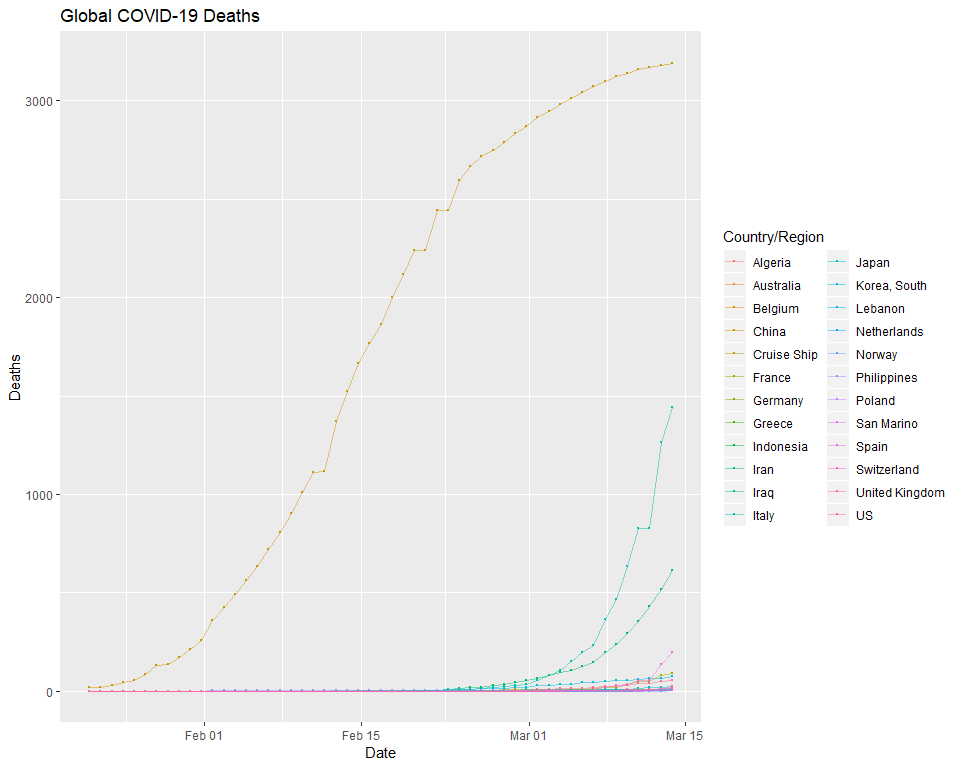

## Analysis of COVID-19 (SARS-CoV-2)

Check back for weekly updates as this is very much a work in progress. 

{r} [Also see the full project on Kaggle] (https://www.kaggle.com/mcnamamj/covid-19-graphing-and-mapping)


### Date Parsing and Formatting

Including the code below as it's nearly boilerplate for date formatting. In some cases the strsplit will need to be adjusted, but I find it much more efficient to parse and reformat a date each time than try to accomodate different date formats across datasets. 


```r
# Date to char for parsing and conversion
data$date <- as.character(data$date)

# Parse the date
data$year<-sapply(data$date, function(x) as.numeric(strsplit(x,"/")[[1]][3]))
data$month<-sapply(data$date, function(x) as.numeric(strsplit(x,"/")[[1]][1]))
data$day<-sapply(data$date, function(x) as.numeric(strsplit(x,"/")[[1]][2]))

# Put us back in the year 2000
data$year <- (data$year + 2000)

# Reformat date into y-m-d 
data$date<-as.Date(paste0(data$year,'-',data$month,'-',data$day), format="%Y-%m-%d")

# Add some weekdays for good measure
data$weekday <- weekdays(as.Date(data$date))

# Put weekdays in order
data$weekday <- ordered(data$weekday, levels=c("Monday", "Tuesday", "Wednesday", "Thursday", "Friday", "Saturday", "Sunday"))


# Set X axis limits ------------------------------------------------------------------------------- Must update with data refresh
time <- as.POSIXct(strptime(c("2020-01-22","2020-03-15"), format = "%y-%m-%d"))
```


## Time Series Heat Plot 

At present, with China as a large confirmed case outlier (over 80,000), I rescaled the confirmed cases using a limit of 10,000 to give greater visibility to lower and emerging counts. 

<!-- -->


<br>
<br>

## Confirmed Cases Trend

Using ggplotly for an interactive plot, here are the Country/Region's in the top 20 for confirmed cases plotted since the pandemic started.

<!-- -->


<br>
<br>

## COVID-19 Death Trend 

Time series plot of top 20 County/Region's with COVID-19 related deaths

<!-- -->

<br>
<br>

## COVID-19 Confirmed Cases and Deaths {.tabset .tabset-fade}

Graphs of relationship between confirmed cases and death for highly impacted countries. 

### China

Example code included, overlaying two area plots from seperate data frames. I wasn't able to identify a straightforward method to include a plot legend-- comment below if you have one!


```r
ggplot() + 
      geom_area(data=(data %>% 
                  filter(`Country/Region` %in% "China") %>%
                  group_by(date, count)), 
                  aes(x=as.POSIXct(date),y=count), color='red', alpha=0.4, fill = 'red') +
      geom_area(data=(death %>% 
                  filter(`Country/Region` %in% "China") %>%
                  group_by(date, count)), 
                  aes(x=as.POSIXct(date),y=count), color='black') +
                  labs(title="China Confirmed Cases and Deaths", 
                       subtitle = " Red is confirmed cases \n Black is number of deaths") +
                  xlab("Date") + 
                  ylab("Count of Cases / Deaths") 
```

<!-- -->

### US

<!-- -->

### Italy

<!-- -->


## World Map of COVID-19 {.tabset .tabset-fade}

Point size reflects number of cases / deaths

### Worldwide Confirmed Cases

<!-- -->

### Worldwide COVID-19 Deaths

<!-- -->


## US Map of COVID-19 {.tabset .tabset-fade}

### US Confirmed Cases

<!-- -->

### US COVID-19 Deaths

<!-- -->


